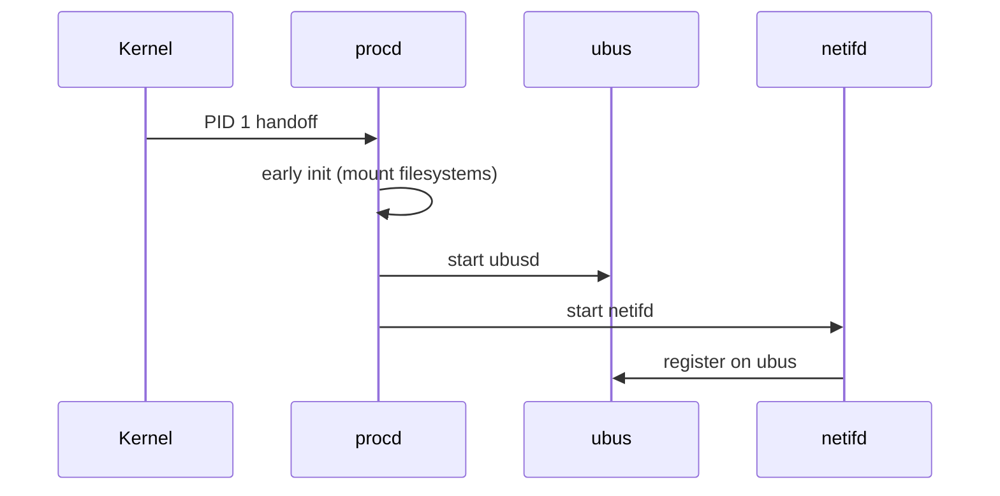

# openwrt-docs4ai v12 — Comprehensive Review & Development Guidance

> **Review Date:** 2026-03-08
> **Reviewer Scope:** Section-by-section deep review of the combined v12 plans, with actionable commentary, expanded specifications, identified gaps, potential pitfalls, and explicit do's/don'ts for each area. This document is intended to be read alongside the original plan and to serve as the authoritative "developer's companion" before any code is written.

---

## Review of Document 1: Documentation Topology & File Format Specification

---

### Section 1: Top-Level Directory and Versioning Strategy

#### Commentary

The plan states a global output path of `openwrt-condensed-docs/` but never explicitly addresses **versioning within that directory**. The title says "Versioning Strategy," but all we get is a single path. This is a critical gap. When developers run the pipeline twice (against two different upstream commits, or during iterative development), what happens to the previous output? Is it clobbered? Archived? Symlinked?

Additionally, the relationship between `tmp/` (used as a working directory in several places later in the document) and `openwrt-condensed-docs/` (the declared output root) is never formally defined. Later sections reference `tmp/.L1-raw/` and `tmp/.L2-semantic/` as working directories, but the final output root is `openwrt-condensed-docs/`. This dual-root ambiguity **will** cause developer confusion and bugs around file paths if left unresolved.

#### Suggestions & Expanded Specification

1. **Define an explicit directory contract.** Establish that `tmp/` is the ephemeral build workspace and `openwrt-condensed-docs/` is the publishable artifact root. Clarify which scripts write to which root, and when/how files are promoted from `tmp/` to the final output.

2. **Introduce a manifest or lockfile.** Consider a `pipeline-state.json` at the root of `openwrt-condensed-docs/` that records the upstream commit hash, pipeline version, timestamp, and layer completeness flags. This prevents partial runs from producing inconsistent output and gives L5 telemetry a reliable anchor point.

3. **Version tagging.** If you intend to support historical comparisons (which L5 telemetry implies), either:
   - Use subdirectories like `openwrt-condensed-docs/v-{commit_hash}/`, or
   - Use Git tags/branches on the output repository itself, or
   - Rely exclusively on GitHub Releases for point-in-time snapshots.
   Pick one and document it. Do not leave this implicit.

4. **`.gitignore` alignment.** Ensure `tmp/` is gitignored and `openwrt-condensed-docs/` is either gitignored (if published via CI artifacts only) or tracked (if committed). This should be stated in the plan.

#### Do's

- **Do** establish a single source of truth for "where is the working directory" vs. "where is the publishable output."
- **Do** create a `pipeline-state.json` manifest that every pipeline stage can read and append to, recording commit hashes, timestamps, and per-stage completion status.
- **Do** document the full directory tree in a dedicated `ARCHITECTURE.md` or equivalent file that is maintained alongside the code.
- **Do** ensure the output path is configurable via environment variable (e.g., `DOCS4AI_OUTPUT_DIR`) with `openwrt-condensed-docs/` as the default, so CI and local dev can diverge cleanly.

#### Don'ts

- **Don't** allow any script to hardcode absolute paths. All paths must be relative to a configurable root or derived from environment variables/config.
- **Don't** assume `openwrt-condensed-docs/` is empty at pipeline start. Scripts must be idempotent — either clean the target directory explicitly at the start of the pipeline, or gracefully overwrite.
- **Don't** mix `tmp/` working files and `openwrt-condensed-docs/` publishable files in the same directory at any point. The promotion from staging to output should be an explicit, auditable step.

---

### Section 2: The Stakeholders

#### Commentary

The stakeholder list is well-conceived and covers a good range of consumers. However, it has two problems:

1. **No mapping to layers.** The stakeholders are listed, and the layers are listed, but the document never creates a formal **Stakeholder → Layer mapping matrix**. A developer reading this has to infer that "The Omniscient Architect" probably wants L4, but there's no definitive statement. This ambiguity will cause developers to make incorrect assumptions about what content each layer should optimize for.

2. **Missing stakeholder: The Pipeline Developer.** The person maintaining and debugging this pipeline is a critical consumer of the output (for validation, testing, and debugging). They need clear error messages, intermediate state inspection, and dry-run capabilities. This stakeholder should influence the design of logging, validation (script `07`), and intermediate file retention.

3. **Missing stakeholder: The Downstream Package Maintainer.** OpenWrt package maintainers who might use this documentation to verify their own package metadata is correctly represented. They care about accuracy of extracted Makefile metadata, UCI schemas, etc.

#### Suggestions & Expanded Specification

Create an explicit mapping table:

| Stakeholder | Primary Layers | Format Preferences | Key Concern |
|:---|:---|:---|:---|
| Raw Analyst | L0, L1 | Raw `.md`, raw source | Completeness, zero transformation artifacts |
| Context Injector | L2 | YAML-fronted `.md` | Atomic files, consistent metadata schema, embedability |
| Omniscient Architect | L4 | Monolithic `.md` | Single-file completeness, token budget awareness |
| Agile Developer | L3, L4 | `llms.txt`, TOC `.md` | Navigability, searchability, human readability |
| Language Server / IDE | L3 | `.d.ts`, `.json` | Schema correctness, type accuracy, no runtime errors |
| CI/CD Security Linter | L5 | `.json`, `.patch` | Machine parseability, diff reliability, API drift detection |
| Pipeline Developer | All (especially `tmp/`) | Logs, intermediate state | Debuggability, idempotency, clear error messages |
| Package Maintainer | L1, L2 | `.md` per-package | Accuracy of extracted metadata against upstream source |

#### Do's

- **Do** reference this stakeholder table when making any formatting decision in any layer. If you can't justify a formatting choice by pointing to a stakeholder need, question whether it belongs.
- **Do** add the Pipeline Developer as a first-class stakeholder. Design logging and intermediate output with their needs in mind.

#### Don'ts

- **Don't** design a layer's format in isolation from its consumers. Every schema decision should trace back to at least one stakeholder's concrete use case.
- **Don't** assume stakeholders consume only one layer. The Agile Developer might use L3 for navigation and then drill into L2 for detail. Cross-layer navigation must work.

---

### Section 3: The L0 → L5 Documentation Layers

This is the most critical section of the entire plan. I will review each layer individually.

---

#### Layer 0 (L0): The Raw Source

##### Commentary

L0 is defined as "Untouched Upstream" living in `tmp/repo-*/`. This is straightforward, but several things need clarification:

1. **Retention policy.** `tmp/` implies ephemeral. Is L0 ever preserved in the final output? The archiving section mentions zipping L1 and L2, but not L0. If L0 is truly ephemeral, state that explicitly. If a consumer (the Raw Analyst) wants L0, how do they get it? By cloning the same upstream repos themselves?

2. **Integrity verification.** The plan mentions commit hashes in L2 metadata (`version: "e87be9d"`). But there's no mechanism described for verifying that the L0 content actually corresponds to that commit hash at extraction time. If the pipeline clones `HEAD` but the hash is recorded later, a race condition during fast-moving upstream development could cause mismatches.

3. **Multiple upstream repos.** The existing code summary shows repos for `ucode`, `luci`, `openwrt`, and `procd`. The plan should enumerate the complete list of upstream sources and their expected directory names under `tmp/repo-*/`.

##### Suggestions & Expanded Specification

- **Enumerate all L0 sources explicitly:**

| Repo Key | Expected Clone Path | Upstream URL | Primary Extractor |
|:---|:---|:---|:---|
| `openwrt` | `tmp/repo-openwrt/` | `https://github.com/openwrt/openwrt.git` | `02d`, `02g`, `02h` |
| `luci` | `tmp/repo-luci/` | `https://github.com/openwrt/luci.git` | `02c`, `02e` |
| `ucode` | `tmp/repo-ucode/` | `https://github.com/jow-/ucode.git` | `02b` |
| `procd` | `tmp/repo-procd/` | `https://github.com/openwrt/procd.git` | `02f` |
| `wiki` | *(N/A — scraped via HTTP)* | `https://openwrt.org/docs/` | `02a` |

- **Pin commit hashes at clone time.** Script `01` should record the exact commit hash of each cloned repo into a `tmp/repo-manifest.json` immediately after cloning. All downstream scripts should read hashes from this manifest, not re-derive them.

##### Do's

- **Do** treat L0 as immutable once cloned. No script should modify files in `tmp/repo-*/`. If a script needs to preprocess a source file, it should copy it to a working area first.
- **Do** record all commit hashes atomically in one manifest file immediately after `01-clone-repos.py` completes.
- **Do** document that the wiki is a special case (HTTP scrape, not git clone) and that its "version" is based on `Last-Modified` headers or page revision IDs, not git commits.

##### Don'ts

- **Don't** allow any `02x` script to shell out to `git log` or `git rev-parse` independently. Centralize hash retrieval through the manifest.
- **Don't** assume network availability after `01` completes. All `02x` scripts (except `02a`, which scrapes the wiki) should operate purely on local cloned content. If `02a` needs network, its failure should not block the rest of the pipeline.
- **Don't** delete `tmp/repo-*/` between pipeline stages. Some developers will want to inspect L0 content when debugging L1 output.

---

#### Layer 1 (L1): The Normalized Payload

##### Commentary

The L1 specification is conceptually sound but underspecified in several critical ways:

1. **"No YAML" rule is clear but incomplete.** The plan says "No YAML" for L1. Good. But what about other metadata? Can L1 files contain HTML? Can they contain Markdown tables? Can they contain Mermaid diagrams? The plan should define a complete whitelist of allowed Markdown features in L1, not just a blacklist of one thing.

2. **File naming convention is undefined.** The directory is `.L1-raw/{module_name}/`, but what are the filenames? Are they derived from the source file path? From the page title? From a slugified function name? Every extractor will invent its own convention unless this is standardized now.

3. **The "pure informational content stripped of source-domain noise" rule is vague.** What constitutes "noise"? Navigation menus from the wiki? Copyright headers in source code? Commented-out code? Each extractor will interpret this differently unless examples of what to strip and what to keep are provided.

4. **Code fence language identifiers.** The schema says ` ```javascript ` but the pipeline extracts C code (`02b`, `02f`), JavaScript (`02c`, `02e`), Makefile syntax (`02d`), UCI configuration syntax (`02g`), and shell scripts (`02h`). The plan should mandate correct language identifiers for each source type.

5. **Leading dot in `.L1-raw`.** This makes the directory hidden on Unix systems. Is that intentional (to signal "internal/intermediate")? If so, document the reasoning. If L1 is a publishable artifact (it is — it gets zipped for GitHub Releases), hidden directories may cause confusion.

##### Suggestions & Expanded Specification

**L1 File Naming Convention (Proposed):**

```
.L1-raw/{module_name}/{source_type}-{slug}.md
```

Where:
- `{module_name}` is one of: `ucode`, `luci`, `luci-examples`, `openwrt-core`, `procd`, `uci`, `hotplug`, `wiki`
- `{source_type}` is one of: `api`, `guide`, `config`, `example`, `header`, `event`
- `{slug}` is a URL-safe, lowercase, hyphenated identifier derived from the primary subject (e.g., `fs-module`, `network-interfaces`, `luci-app-example-view`)

**L1 Allowed Content Whitelist:**

| Markdown Feature | Allowed in L1? | Notes |
|:---|:---|:---|
| ATX Headings (`# H1`) | ✅ Yes | Required. Every L1 file must start with an H1. |
| Paragraphs | ✅ Yes | |
| Fenced code blocks | ✅ Yes | **Must** include language identifier. |
| Inline code | ✅ Yes | |
| Unordered lists | ✅ Yes | |
| Ordered lists | ✅ Yes | |
| Tables | ✅ Yes | For tabular data like function signatures. |
| Block quotes | ⚠️ Conditional | Only for quoting upstream documentation. |
| HTML tags | ❌ No | Strip all raw HTML. |
| YAML frontmatter | ❌ No | Strictly forbidden in L1. |
| Mermaid diagrams | ❌ No | L2/L3 only. |
| Images / media links | ❌ No | Not useful for LLM consumption. |
| Horizontal rules (`---`) | ⚠️ Conditional | Only as section separators within a file, never at the top (conflicts with YAML frontmatter detection). |

**Code Fence Language Identifier Mapping:**

| Extractor | Source Language | Required Fence Identifier |
|:---|:---|:---|
| `02a` (Wiki) | Mixed (depends on page) | Context-dependent: `bash`, `uci`, `text`, etc. |
| `02b` (ucode C) | C | `c` |
| `02c` (JSDoc) | JavaScript | `javascript` |
| `02d` (Makefiles) | Makefile | `makefile` |
| `02e` (LuCI Examples) | JavaScript / ucode | `javascript` or `ucode` |
| `02f` (procd headers) | C | `c` |
| `02g` (UCI schemas) | UCI config | `uci` or `text` |
| `02h` (Hotplug) | Shell | `bash` |

##### Do's

- **Do** enforce the "every L1 file starts with exactly one H1 heading" rule programmatically in `07-validate.py`. This H1 becomes the `title` field in L2.
- **Do** strip wiki navigation, sidebar content, breadcrumbs, "Edit this page" links, and similar chrome during extraction. These are "source-domain noise."
- **Do** preserve copyright/license headers in code blocks if they exist in the upstream source. Stripping legal notices is risky.
- **Do** use the leading dot convention (`.L1-raw`) intentionally and document that it signals "intermediate/internal layer, not for direct human consumption."
- **Do** ensure every code block has a language identifier. Bare ` ``` ` blocks without a language tag should be flagged as validation errors.

##### Don'ts

- **Don't** allow any `02x` script to produce files outside its designated module directory. `02b` writes to `.L1-raw/ucode/`, never to `.L1-raw/luci/`.
- **Don't** allow L1 files to contain cross-references or hyperlinks to other L1 files. Cross-linking is an L2 concern. L1 is pure, isolated content.
- **Don't** use `---` (horizontal rules) at line 1 of any L1 file. Parsers will misinterpret it as the start of YAML frontmatter. If you need a separator, use it after the H1.
- **Don't** embed base64 images or binary content in L1 Markdown. Text only.
- **Don't** allow L1 files to exceed a reasonable size without splitting. Define a soft limit (e.g., 50,000 tokens per file) and a hard limit (e.g., 100,000 tokens). If an extracted source exceeds this, the extractor should split it into multiple files with a consistent naming convention (`-part1`, `-part2`, etc.).

---

#### Layer 2 (L2): The Enriched Domain (The Semantic Mesh)

##### Commentary

This layer is where the most value is added and where the most things can go wrong.

1. **YAML schema is underspecified.** The example shows `title`, `module`, `origin_type`, `token_count`, and `version`. But several critical fields are missing:
   - `source_file`: What L1 file did this derive from? Essential for debugging.
   - `upstream_path`: The original file path in the upstream repo (e.g., `lib/fs.c`). Essential for the Raw Analyst.
   - `last_updated`: When was this file last processed by the pipeline?
   - `tags` or `categories`: For the Context Injector stakeholder doing vector search.
   - `related_modules`: Explicit list of related modules for cross-linking.
   - `language`: The primary programming language of code content in the file.

2. **`origin_type` values are undefined.** The example shows `"c_source"` but what are the valid values? Without an enum, every extractor will invent its own type strings.

3. **`token_count` methodology is unspecified.** Token count by what tokenizer? GPT-4 `cl100k_base`? Word count divided by 0.75? A simple whitespace split? Different methodologies can produce wildly different numbers, and downstream consumers (especially "The Omniscient Architect" managing context windows) need to trust this number.

4. **The cross-linking heuristic is a black box.** The plan says "inject cross-linking heuristics" but doesn't describe what those heuristics are. The existing `03-add-links.py` has an `is_code_symbol(name)` function, suggesting it does symbol-based linking. But the L2 specification should describe the linking strategy: Are we linking function names to their definition files? Module names to module overviews? UCI option names to their schema files?

5. **The L2 schema example's cross-link syntax is ambiguous.** It shows `[fs.open()](./fs-open.md)` — but is this a relative link to another L2 file? What if the target file is in a different module? What's the cross-module linking convention?

##### Suggestions & Expanded Specification

**Complete L2 YAML Frontmatter Schema:**

```yaml
---
# REQUIRED FIELDS (pipeline MUST populate these)
title: "Human-readable title of this document"          # string, derived from L1 H1
module: "ucode"                                          # string, enum: see module list
origin_type: "c_source"                                  # string, enum: see origin_type list
token_count: 840                                         # integer, cl100k_base token count
version: "e87be9d"                                       # string, 7-char git short hash

# RECOMMENDED FIELDS (pipeline SHOULD populate these when data is available)
source_file: ".L1-raw/ucode/api-fs-module.md"           # string, relative path to L1 source
upstream_path: "lib/fs.c"                                # string, path in upstream repo
language: "c"                                            # string, primary language of code content
last_pipeline_run: "2026-03-07T12:00:00Z"                # string, ISO 8601

# OPTIONAL FIELDS (pipeline MAY populate these)
tags:                                                    # list of strings
  - "filesystem"
  - "io"
  - "core"
related:                                                 # list of relative paths to other L2 files
  - "./fs-open.md"
  - "../uloop/api-uloop-module.md"
description: "One-line summary for index generation"     # string, max 160 chars
---
```

**`origin_type` Enum (Proposed):**

| Value | Meaning | Primary Extractor |
|:---|:---|:---|
| `c_source` | Extracted from C source code | `02b`, `02f` |
| `js_source` | Extracted from JavaScript source | `02c`, `02e` |
| `wiki_page` | Scraped from OpenWrt wiki | `02a` |
| `makefile_meta` | Extracted from Makefiles | `02d` |
| `readme` | Extracted from README files | `02d` |
| `uci_schema` | Extracted from UCI config defaults | `02g` |
| `hotplug_event` | Extracted from hotplug scripts | `02h` |
| `example_app` | Complete example application code | `02e` |
| `header_api` | Extracted from C header files | `02f` |

**Token Counting Standard:**

Use `tiktoken` with the `cl100k_base` encoding (GPT-4/GPT-3.5 tokenizer). This is the most widely understood token counting method in the LLM ecosystem. Document this choice in the output and include it in the pipeline manifest.

```python
import tiktoken

def count_tokens(text: str) -> int:
    """Count tokens using cl100k_base encoding (GPT-4 compatible)."""
    enc = tiktoken.get_encoding("cl100k_base")
    return len(enc.encode(text))
```

If `tiktoken` is not available in the CI environment, fall back to `len(text.split()) * 4 // 3` as an approximation, but flag the output with `token_count_method: "approximate"` in the YAML.

**Cross-Linking Strategy:**

Define three categories of cross-links:

1. **Intra-module links:** Links between files in the same module directory. Use relative paths: `[fs.open()](./fs-open.md)`.
2. **Inter-module links:** Links between files in different modules. Use relative paths with parent traversal: `[uloop.init()](../uloop/api-uloop-module.md)`.
3. **External links:** Links to upstream documentation or source code. Use absolute URLs: `[upstream source](https://github.com/jow-/ucode/blob/main/lib/fs.c)`.

The heuristic for auto-linking should be:
- Scan the body text for known function signatures (extracted during L1 phase and stored in a lookup table).
- If a function name like `fs.open()` appears in prose and a corresponding L2 file exists, wrap it in a Markdown link.
- **Never** auto-link inside code blocks. Only link prose text.
- Maintain a `cross-link-registry.json` in `tmp/` that maps symbol names to their L2 file paths. Script `03` builds this registry on its first pass, then applies links on its second pass (two-pass approach).

##### Do's

- **Do** validate YAML frontmatter schema in `07-validate.py` using a JSON Schema or a Python `dataclass`/`pydantic` model. Reject files with missing required fields.
- **Do** use a two-pass approach for cross-linking: first pass builds the symbol registry, second pass applies links. This avoids ordering dependencies.
- **Do** preserve the original L1 body text verbatim in L2 (aside from injected links). L2 is L1 + metadata + links, not L1 rewritten.
- **Do** store the `cross-link-registry.json` in `tmp/` for debugging and for use by L3 generators.
- **Do** handle YAML special characters in titles. Titles containing colons, quotes, or other YAML-significant characters must be properly quoted in the frontmatter.

##### Don'ts

- **Don't** invent `origin_type` values ad-hoc in extractor scripts. Define the enum in one shared constants file and import it.
- **Don't** count tokens on the YAML frontmatter itself. Count tokens only on the body content (everything after the closing `---`). This is what matters for LLM context windows.
- **Don't** allow cross-links to point to nonexistent files. The validation step must check that all relative links in L2 files resolve to actual files.
- **Don't** auto-link aggressively. Common words like `open`, `read`, `write` may collide with natural language. Only link when the match is a fully-qualified symbol (e.g., `fs.open()`, not just `open`).
- **Don't** modify L1 files during the L2 enrichment process. L1 is immutable once produced. L2 is a new copy with additions.

---

#### Layer 3 (L3): Navigational Maps & Operational Indexes

##### Commentary

L3 is the most diverse layer (multiple output formats) and the most likely to have inconsistencies between its sub-artifacts.

1. **`llms.txt` spec needs more rigor.** The example shows a "Decision Tree" format, but the `llms.txt` convention (as popularized by various AI projects) has a loosely defined but expected structure. The plan should cite the specific convention being followed or explicitly state "we define our own format."

2. **The `.d.ts` generation is extremely ambitious and underspecified.** Generating TypeScript type definitions from C source code and JavaScript documentation is a non-trivial task. The plan doesn't address:
   - How function parameter types will be inferred from C code (C doesn't have the same type system as TypeScript).
   - How ucode-specific types (which are dynamically typed) will be represented.
   - Whether these `.d.ts` files are intended to actually compile with `tsc` or are purely informational.
   - How overloaded functions or variadic arguments will be handled.

3. **`llms-full.txt` is mentioned in Document 2 but not specified here.** The "Dual-Faceted Routing" feature mentions both `llms.txt` (Decision Tree) and `llms-full.txt` (Flat catalog), but only `llms.txt` has a schema example.

4. **Skeleton files (`*-skeleton.md`) are mentioned in format list but not specified.** What is a skeleton file? How does it differ from `llms.txt`? From L4?

##### Suggestions & Expanded Specification

**`llms.txt` Full Specification:**

```markdown
# {project_name}

> {one-line project description}

## Overview

{2-3 sentence project summary for LLM orientation}

## Documentation Map

### {Category Name}
- [{Module Name}]({relative_path}): {one-line description} (~{token_count} tokens)
- [{Module Name}]({relative_path}): {one-line description} (~{token_count} tokens)

### {Category Name}
- ...

## Quick Reference

- Total modules: {count}
- Total tokens: {sum}
- Pipeline version: {version}
- Upstream commit: {hash}
```

**`llms-full.txt` Specification (Flat Catalog):**

```markdown
# {project_name} - Complete File Catalog

> Every document in this collection, listed alphabetically.

| File | Module | Type | Tokens | Description |
|:---|:---|:---|:---|:---|
| [{filename}]({path}) | {module} | {origin_type} | {token_count} | {description} |
| ... | ... | ... | ... | ... |

Total: {file_count} files, ~{total_tokens} tokens
```

**`.d.ts` Generation — Scope Limitation:**

Given the complexity, I strongly recommend scoping the `.d.ts` generation to **ucode API functions only** for v12, with a documented path for expanding to LuCI JavaScript APIs in v13. The rationale:

- ucode functions extracted from C source have relatively predictable signatures (`function_name(param1, param2) -> return_type`).
- LuCI JavaScript already has JSDoc annotations that could inform types, but the extraction is more complex.
- Generating `.d.ts` for UCI configuration schemas is a fundamentally different problem (configuration schema, not API schema) and should be a separate `.d.ts` category.

**Proposed `.d.ts` Type Mapping for ucode:**

| ucode Type | TypeScript Type |
|:---|:---|
| `string` | `string` |
| `int` / `double` | `number` |
| `bool` | `boolean` |
| `array` | `any[]` (or typed if inferrable) |
| `object` | `Record<string, any>` |
| `resource` | `object` (opaque handle) |
| `null` | `null` |
| `function` | `(...args: any[]) => any` |
| Unknown / untyped | `any` |

**Skeleton File Specification:**

Define what a skeleton file is:

```markdown
# {Module Name} — API Skeleton

> Compact function listing with signatures only. No descriptions.
> Use this for rapid scanning or context-constrained LLM prompts.

## Functions

- `fs.open(path: string, mode?: string): resource`
- `fs.close(fd: resource): boolean`
- `fs.read(fd: resource, length?: number): string`
- ...

## Constants

- `fs.SEEK_SET`: `0`
- `fs.SEEK_CUR`: `1`
- ...
```

This is distinct from `llms.txt` (which is a routing/navigation index) and from L4 (which is full content). The skeleton is a **compressed API reference** — signatures without prose.

##### Do's

- **Do** generate `llms.txt` and `llms-full.txt` as two distinct files with distinct purposes. `llms.txt` is a tree for decision-making; `llms-full.txt` is a flat table for exhaustive lookup.
- **Do** include token counts in both index files. This is critical for LLM users managing context windows.
- **Do** scope `.d.ts` generation conservatively for v12. Ship something correct and limited rather than something ambitious and broken.
- **Do** validate that every `.d.ts` file can be parsed by `tsc --noEmit`. If it can't, it's not a valid TypeScript declaration file and will frustrate IDE users.
- **Do** generate skeleton files per module, not just per-project. Each module directory should have its own `{module}-skeleton.md`.

##### Don'ts

- **Don't** generate `.d.ts` files with `any` types everywhere. That's worse than no type definitions at all. If you can't infer a type, omit the declaration and add a `// TODO: type unknown` comment.
- **Don't** assume `llms.txt` consumers will follow links. Some LLMs will receive `llms.txt` as their entire context. Make sure it's self-contained enough to be useful even without following any links.
- **Don't** hardcode category names in the `llms.txt` generator. Derive categories from `module` and `origin_type` fields in L2 YAML. New modules should appear automatically.
- **Don't** mix L3 generation concerns with L2 enrichment. Script `06` reads L2 but never modifies it.

---

#### Layer 4 (L4): The Assembled Monoliths

##### Commentary

1. **The schema example has a critical YAML frontmatter error.** The example shows two YAML frontmatter blocks in sequence within a single file:

```markdown
---
title: "ucode fs module"
...
---
# ucode fs module
...
---
title: "ucode uloop module"
...
---
```

This is invalid Markdown. YAML frontmatter is only recognized at the very beginning of a file. The second `---` block mid-file will be rendered as a horizontal rule followed by literal text. This must be fixed.

**Options for L4 format:**
- **Option A (Recommended):** Single YAML frontmatter block at the top with aggregated metadata, then sections separated by Markdown headings (not YAML blocks).
- **Option B:** Strip all YAML from individual sections and use only Markdown structural elements (headings, horizontal rules) as separators.
- **Option C:** Use a non-YAML separator convention (e.g., `<!-- SECTION: module_name -->` HTML comments).

2. **Token budget is unaddressed.** L4 is for "Frontier LLMs." But frontier LLM context windows range from 128K to 2M+ tokens. Should L4 produce one monolith per module? Per category? One giant file for everything? The plan should define the aggregation granularity and maximum file size.

3. **Ordering within the monolith is undefined.** When concatenating L2 files, what order? Alphabetical by filename? By dependency graph? By token count (smallest first)? The order matters for LLMs that have recency bias or attention falloff.

##### Suggestions & Expanded Specification

**Corrected L4 Schema (Option A):**

```markdown
---
title: "ucode — Complete API Reference"
module: "ucode"
total_token_count: 1460
section_count: 2
generated_by: "openwrt-docs4ai v12"
pipeline_date: "2026-03-07T12:00:00Z"
upstream_version: "e87be9d"
---

# ucode — Complete API Reference

> This monolithic reference contains all documented APIs for the ucode module.
> Total estimated tokens: ~1460 (cl100k_base)

## Table of Contents

1. [fs module](#ucode-fs-module) (~840 tokens)
2. [uloop module](#ucode-uloop-module) (~620 tokens)

---

## ucode fs module

The `fs` module provides file system operations.

---

## ucode uloop module

The `uloop` module provides the event loop implementation.
```

**Aggregation Strategy:**

| Granularity | File Name | Contents |
|:---|:---|:---|
| Per-module | `{module}-complete-reference.md` | All L2 files for that module |
| Per-category | `{category}-complete-reference.md` | All L2 files of a given `origin_type` |
| All-in-one | `openwrt-complete-reference.md` | Everything (use with caution — may exceed context limits) |

For v12, produce **per-module monoliths** as the primary L4 output. Optionally produce an all-in-one file, but flag it with a prominent warning if it exceeds 100K tokens.

**Ordering Strategy:** Sort sections within a monolith by:
1. Overview/introduction files first (if any).
2. Then alphabetically by title.

This provides predictability and is easy to implement.

##### Do's

- **Do** fix the YAML frontmatter issue before any developer starts coding L4 assembly. This is a showstopper bug in the specification.
- **Do** include a table of contents with token counts at the top of every L4 file. This helps LLM users decide whether to inject the whole file or specific sections.
- **Do** include anchor links in the TOC that correspond to actual heading IDs. Test that they work in common Markdown renderers (GitHub, VS Code preview).
- **Do** add a header comment/note in the L4 file indicating it was auto-generated and should not be manually edited.

##### Don'ts

- **Don't** produce L4 files that can't be loaded into a single LLM context. If a module is so large that its monolith exceeds 200K tokens, split it into volumes (`ucode-complete-reference-vol1.md`, `ucode-complete-reference-vol2.md`) and document the split points.
- **Don't** include the full YAML frontmatter from each L2 section in the L4 body. Strip it. The L4 file has its own top-level YAML; embedding L2 YAML as visible text is confusing.
- **Don't** rely on `---` (horizontal rules) as section separators if they could be confused with YAML frontmatter boundaries. Use `## Heading` as the section boundary instead.

---

#### Layer 5 (L5): Telemetry & Differential Flow

##### Commentary

1. **Diff baseline is undefined.** The `changelog.json` shows `dropped_signatures` and `added_signatures`, but compared to what? The previous pipeline run? The previous release? A pinned baseline? The plan must define where the "previous state" is stored and how it's retrieved.

2. **`CHANGES.md` format is unspecified.** The plan mentions it as an output but provides no schema example.

3. **`.patch` format is mentioned but never explained.** What are these patches? Unified diffs of the documentation? API signature diffs? Git-format patches? Who consumes them?

4. **`drift` terminology needs clarification.** The example shows `drift.ucode.dropped_signatures`. Is "drift" the right word? In most software contexts, "drift" implies unintentional deviation. Here, it's intentional upstream changes. Consider "changes" or "delta" instead, or at least define what "drift" means in this context.

##### Suggestions & Expanded Specification

**Diff Baseline Strategy:**

- Store the previous pipeline's `cross-link-registry.json` and a `signature-inventory.json` as release artifacts or in a dedicated `baseline/` branch.
- At the start of the next pipeline run, download the previous `signature-inventory.json` from the latest GitHub Release.
- Compare current signatures against previous signatures to compute the delta.
- If no previous baseline exists (first run), skip diff generation and emit a note in `changelog.json`: `"baseline": "none — first run"`.

**`signature-inventory.json` Schema (New Artifact):**

```json
{
  "generated_at": "2026-03-07T12:00:00Z",
  "upstream_version": "e87be9d",
  "modules": {
    "ucode": {
      "fs": {
        "functions": ["open(path, flags)", "close(fd)", "read(fd, length)"],
        "constants": ["SEEK_SET", "SEEK_CUR", "SEEK_END"]
      }
    }
  }
}
```

**`changelog.json` Expanded Schema:**

```json
{
  "pipeline_version": "v12",
  "pipeline_date": "2026-03-07T12:00:00Z",
  "current_commit": "e87be9d",
  "previous_commit": "a1b2c3d",
  "baseline_source": "github-release:v11.2",
  "changes": {
    "ucode": {
      "dropped_signatures": [
        {
          "symbol": "fs.deprecated_function()",
          "last_seen_version": "a1b2c3d",
          "file": ".L2-semantic/ucode/api-fs-module.md"
        }
      ],
      "added_signatures": [
        {
          "symbol": "fs.new_feature(param)",
          "first_seen_version": "e87be9d",
          "file": ".L2-semantic/ucode/api-fs-module.md"
        }
      ],
      "modified_files": [
        {
          "file": ".L2-semantic/ucode/api-fs-module.md",
          "previous_token_count": 800,
          "current_token_count": 840,
          "change_type": "content_expanded"
        }
      ]
    }
  },
  "summary": {
    "total_added": 1,
    "total_dropped": 1,
    "total_modified": 1,
    "modules_affected": ["ucode"]
  }
}
```

**`CHANGES.md` Schema:**

```markdown
# openwrt-docs4ai Changelog

## [e87be9d] — 2026-03-07

### Added
- `fs.new_feature(param)` in ucode fs module

### Removed
- `fs.deprecated_function()` in ucode fs module (deprecated upstream)

### Changed
- ucode fs module documentation expanded (+40 tokens)

### Pipeline
- Generated by openwrt-docs4ai v12
- Previous baseline: a1b2c3d (v11.2 release)
```

##### Do's

- **Do** design the diff system to be resilient to missing baselines. The first run and runs after a format change should gracefully degrade, not crash.
- **Do** include both the human-readable `CHANGES.md` and the machine-readable `changelog.json`. They serve different stakeholders.
- **Do** version the `changelog.json` schema itself (e.g., `"schema_version": "1.0"`). Downstream CI/CD consumers need to know if the format changes.
- **Do** store `signature-inventory.json` as a release artifact so future pipeline runs can diff against it.

##### Don'ts

- **Don't** compute diffs by comparing rendered Markdown text. Compare structured data (signature lists, YAML metadata). Text diffs are noisy and unreliable.
- **Don't** report every token count change as a "modification." Set a threshold (e.g., >5% change or >50 tokens) to filter noise.
- **Don't** block the pipeline if diff generation fails. Diff is informational, not critical. Log a warning and continue.
- **Don't** use the word "drift" if you mean "changes." Drift implies a problem; upstream API evolution is expected behavior. Use "changes" or "delta" in the schema. (If you do keep "drift," define it explicitly in a glossary.)

---

### Section 4: Archiving & Artifact Release Strategy

#### Commentary

1. **L0 archiving is conspicuously absent.** The plan zips L1 and L2, but not L0 (raw clones). This is probably intentional (L0 is large and available from upstream), but it should be stated explicitly.

2. **L3, L4, L5 on GitHub Pages but not in ZIPs?** Users who want offline access to the full output need all layers. Consider offering an `openwrt-docs4ai-complete.zip` that bundles everything.

3. **GitHub Pages deployment details are missing.** What static site generator (if any)? What's the directory structure of the deployed site? Is there an `index.html`? The existing code summary shows `06-generate-index.py` produces `index.html`, but the specification doesn't describe its content or style.

4. **No mention of artifact size limits.** GitHub Releases have a 2GB per-file limit. GitHub Pages has a 1GB site limit. If the monolithic L4 files or the L2 collection are large, this could be a problem. What are the expected sizes?

#### Suggestions & Expanded Specification

**Complete Artifact Matrix:**

| Artifact | Contents | Distribution Channel | Audience |
|:---|:---|:---|:---|
| `openwrt-docs4ai-L1-raw.zip` | `.L1-raw/` directory tree | GitHub Releases | Raw Analyst, Package Maintainer |
| `openwrt-docs4ai-L2-semantic.zip` | `.L2-semantic/` directory tree | GitHub Releases | Context Injector |
| `openwrt-docs4ai-complete.zip` | L1 + L2 + L3 + L4 + L5 | GitHub Releases | Offline users |
| L3 index files | `llms.txt`, `llms-full.txt`, skeletons, `.d.ts` | GitHub Pages | LLM users, IDE users |
| L4 monoliths | `*-complete-reference.md` | GitHub Pages | Omniscient Architect |
| L5 telemetry | `CHANGES.md`, `changelog.json` | GitHub Pages + Releases | CI/CD Linter, Pipeline Developer |
| `index.html` | Landing page with links to all artifacts | GitHub Pages | All human stakeholders |

**GitHub Pages Structure:**

```
/ (gh-pages branch root)
├── index.html              # Landing page
├── llms.txt                # Root LLM routing index
├── llms-full.txt           # Flat file catalog
├── CHANGES.md              # Human-readable changelog
├── changelog.json          # Machine-readable changelog
├── AGENTS.md               # AI agent instructions
├── ucode/
│   ├── llms.txt            # Module-level LLM index
│   ├── ucode-skeleton.md   # Module skeleton
│   ├── ucode-complete-reference.md  # L4 monolith
│   └── ucode.d.ts          # IDE schema
├── luci/
│   ├── ...
└── ...
```

#### Do's

- **Do** test ZIP file integrity as part of the pipeline. Generate, then unzip and verify file counts match expectations.
- **Do** add file size estimates to the plan. Measure the current v11 output and extrapolate. This helps identify sizing issues before they become deployment blockers.
- **Do** include a `manifest.json` inside each ZIP listing all files, their sizes, and their checksums (SHA-256). This enables integrity verification by downstream consumers.
- **Do** set up GitHub Pages with a `CNAME` or clear URL scheme so that consumers can build stable URLs to specific artifacts (e.g., `https://user.github.io/openwrt-docs4ai/ucode/llms.txt`).

#### Don'ts

- **Don't** publish L1 or L2 on GitHub Pages. These are raw/intermediate and are distributed via ZIP downloads only. L3+ is the "website."
- **Don't** forget to set the GitHub Pages source branch in the CI pipeline. This is a common oversight that causes deployments to silently fail.
- **Don't** deploy to GitHub Pages on every push. Deploy only on tagged releases or on merges to `main`, to avoid publishing incomplete pipeline runs.

---

## Review of Document 2: Pipeline Implementation Technical Specification

---

### Section 2.1: Standardizing the Extractors (L1 Target)

#### Commentary

1. **"Strip all YAML frontmatter injection" needs qualification.** Some extractors may currently generate useful metadata that is embedded as YAML. When stripping YAML, ensure the valuable information (e.g., page titles, last-modified dates) is not lost entirely — it should instead be captured in a side-channel (e.g., a metadata JSON file per L1 output) or encoded into the filename or H1 heading.

2. **No mention of error handling per extractor.** What happens when `02b` encounters a C file it can't parse? When `02a` gets a 404 from the wiki? When `02e` finds a LuCI example app with no JavaScript files? Each extractor needs a defined failure mode.

3. **Output path inconsistency.** Document 1 says `.L1-raw/` is under `openwrt-condensed-docs/`. Document 3 (Checkpoint 1, step 3) says `tmp/.L1-raw/`. These must be reconciled. My recommendation: extractors write to `tmp/.L1-raw/` (working directory), and a later step copies/moves to `openwrt-condensed-docs/.L1-raw/` (publishable output).

#### Suggestions & Expanded Specification

**Per-Extractor Failure Mode Table:**

| Script | Possible Failure | Behavior | Severity |
|:---|:---|:---|:---|
| `02a` | HTTP 404/timeout on wiki page | Log warning, skip page, continue | Soft (partial output OK) |
| `02a` | Wiki returns unchanged content (304) | Skip file, reuse cached version | Expected (not a failure) |
| `02b` | Unparseable C source file | Log error with file path, skip file | Soft |
| `02c` | JavaScript file with no JSDoc comments | Produce minimal L1 file with code only | Soft |
| `02d` | Package directory with no Makefile | Skip package, log | Soft |
| `02e` | Example app with no `.uc`/`.js` files | Skip app, log | Soft |
| `02f` | Header file with no function declarations | Produce minimal L1 file | Soft |
| `02g` | UCI config with unknown format | Log warning, write raw content | Soft |
| `02h` | Hotplug script with no parseable events | Skip file, log | Soft |
| Any `02x` | Target directory `tmp/repo-*` doesn't exist | **Hard fail** — indicates `01` didn't complete | Hard |

**Metadata Side-Channel:**

When stripping YAML from extractors, have each extractor optionally produce a companion `{filename}.meta.json`:

```json
{
  "original_source": "tmp/repo-ucode/lib/fs.c",
  "extraction_timestamp": "2026-03-07T12:00:00Z",
  "extractor": "02b-scrape-ucode.py",
  "notes": "Extracted 14 function definitions"
}
```

This metadata is consumed by the L2 enricher (`03`) to populate fields like `upstream_path` and `origin_type` without the L2 script needing to re-derive this information.

#### Do's

- **Do** make every `02x` script follow a common argument convention. Consider `--input-dir`, `--output-dir`, `--repo-manifest` as standard arguments.
- **Do** have each extractor log its own start/end with file counts: `"02b: Extracted 14 files from tmp/repo-ucode/ → tmp/.L1-raw/ucode/"`.
- **Do** make extractors idempotent. Running `02b` twice on the same input should produce identical output.
- **Do** create a shared utility module (`lib/extractor_utils.py` or similar) for common operations: writing L1 files, wrapping code in fences, generating filenames from paths, etc.

#### Don'ts

- **Don't** let an extractor failure in one module prevent other extractors from running. The pipeline should be fault-tolerant at the extractor level.
- **Don't** allow extractors to import or depend on each other's code. They should be independently executable, sharing only utility libraries.
- **Don't** hardcode upstream paths within extractors. Use the repo manifest from `01` to locate cloned directories.
- **Don't** let extractors write to any directory outside `tmp/.L1-raw/{their_module}/`. Enforce this with a path validation check.

---

### Section 2.2: The Normalization Engine (L2 Target)

#### Commentary

1. **Renaming `03-add-links.py` is good, but execute it.** The plan says "renamed conceptually to semantic enricher." Do the actual rename in v12 to reduce confusion. Suggest: `03-enrich-semantics.py`.

2. **"Procedurally paints the exact L2 Semantic Schema metadata array"** — this implies a single pass. But as discussed in the L2 section, cross-linking requires two passes (build registry, then apply links). This needs to be architecturally planned.

3. **How does `03` know what `module` and `origin_type` to assign?** If the L1 files don't have YAML, the L2 enricher needs another source of truth. Options:
   - Derive from directory path: `.L1-raw/ucode/` → `module: "ucode"`.
   - Read from the `.meta.json` side-channel files.
   - Use filename conventions.

   The directory-based approach is simplest and should be the primary method, with `.meta.json` as supplemental.

4. **Version field population.** The L2 schema includes `version: "e87be9d"`. This is the upstream commit hash. The enricher needs access to the repo manifest produced by `01`. Ensure this dependency is documented and the file path is not hardcoded.

#### Suggestions & Expanded Specification

**Two-Pass Architecture for Script `03`:**

```
Pass 1: Metadata Stamping & Registry Building
  For each file in tmp/.L1-raw/{module}/:
    1. Read file content.
    2. Derive module from directory name.
    3. Derive origin_type from .meta.json or filename convention.
    4. Derive title from H1 heading in file.
    5. Count tokens (body only, not metadata).
    6. Read version from repo-manifest.json.
    7. Write YAML frontmatter + body to tmp/.L2-semantic/{module}/.
    8. Extract function signatures, symbol names → append to cross-link-registry.json.

Pass 2: Cross-Linking
  Load cross-link-registry.json.
  For each file in tmp/.L2-semantic/{module}/:
    1. Scan body text (NOT code blocks) for known symbols.
    2. Replace symbol references with Markdown links.
    3. Overwrite the file in-place (or write to a final location).
```

**Module Derivation Logic:**

```python
def derive_module(l1_path: str) -> str:
    """Extract module name from L1 directory structure.
    
    Example: 'tmp/.L1-raw/ucode/api-fs-module.md' → 'ucode'
    """
    parts = Path(l1_path).parts
    # Find the part after '.L1-raw'
    idx = parts.index('.L1-raw')
    return parts[idx + 1]
```

**`origin_type` Derivation Logic:**

```python
# Priority order for determining origin_type:
# 1. .meta.json file (if extractor produced one) — most reliable
# 2. Filename prefix convention (e.g., 'api-' → c_source or js_source depending on module)
# 3. Module default (e.g., module 'wiki' → origin_type 'wiki_page')

MODULE_DEFAULT_ORIGIN = {
    "wiki": "wiki_page",
    "ucode": "c_source",
    "luci": "js_source",
    "luci-examples": "example_app",
    "openwrt-core": "makefile_meta",
    "procd": "header_api",
    "uci": "uci_schema",
    "hotplug": "hotplug_event",
}
```

#### Do's

- **Do** rename the script file, not just conceptually. `03-enrich-semantics.py` is clearer than `03-add-links.py` for what v12 needs it to do.
- **Do** implement the two-pass approach. Single-pass cross-linking will miss forward references (file A references a symbol defined in file B, but file B hasn't been processed yet).
- **Do** log every YAML field derivation decision. When debugging, developers need to know "why did this file get `origin_type: c_source`?"
- **Do** make the token counting function a shared utility, not inline code. It will be used by both `03` and `06`.
- **Do** validate that the H1 heading exists before using it as the title. If an L1 file has no H1, log an error and use the filename as a fallback.

#### Don'ts

- **Don't** make `03` depend on the filesystem ordering of files. Use `sorted()` on file lists for deterministic output.
- **Don't** inject cross-links into code blocks. Use a Markdown parser (or at least a state machine) to detect when you're inside a fenced code block and skip link injection there.
- **Don't** fail silently when a `.meta.json` is missing. Fall back to directory-based derivation, but log a warning.
- **Don't** write L2 files atomically without flushing/syncing. In CI environments, partial writes can cause downstream scripts to read incomplete files. Use write-to-temp-then-rename pattern.

---

### Section 2.3: Formalizing the Indexes (L3 & L5 Targets)

#### Commentary

1. **"Blindly aggregates YAML metadata" is concerning language.** The word "blindly" suggests no validation of the YAML data being consumed. This should be "validates and aggregates." If an L2 file has malformed YAML, the index generator should skip it and log an error, not crash or produce garbage.

2. **Script `06` is overloaded.** It's currently responsible for `llms.txt`, `index.html`, `CHANGES.md`, and now also `.d.ts` generation and `changelog.json`. This is too many responsibilities for one script. Consider splitting:
   - `06a-generate-llms-txt.py` — produces `llms.txt` and `llms-full.txt`
   - `06b-generate-agents-md.py` — produces `AGENTS.md` (already planned)
   - `06c-generate-ide-schemas.py` — produces `.d.ts` files
   - `06d-generate-changelog.py` — produces `CHANGES.md` and `changelog.json`
   - `06e-generate-index-html.py` — produces `index.html` for GitHub Pages

3. **`.d.ts` generation from YAML metadata alone is insufficient.** The YAML frontmatter doesn't contain function signatures with parameter types. The `.d.ts` generator needs access to the actual L2 file body content to extract signatures. This means it's not purely a "YAML aggregator" — it's a content parser.

4. **L5 diff logic depends on external state (previous baseline).** This is the most operationally complex part of the pipeline. The plan should address:
   - Where the previous baseline is fetched from (GitHub Releases API? A checked-in file? An artifact from the previous CI run?).
   - What happens on the first run (no baseline exists).
   - Authentication requirements for fetching previous release artifacts in CI.

#### Suggestions & Expanded Specification

**Recommended Script Split:**

```
06a-generate-llms-txt.py
    Inputs: tmp/.L2-semantic/**/*.md (reads YAML frontmatter only)
    Outputs: 
      - openwrt-condensed-docs/llms.txt
      - openwrt-condensed-docs/llms-full.txt
      - openwrt-condensed-docs/{module}/llms.txt (per-module)

06b-generate-agents-md.py
    Inputs: pipeline-state.json, template
    Outputs:
      - openwrt-condensed-docs/AGENTS.md

06c-generate-ide-schemas.py
    Inputs: tmp/.L2-semantic/**/*.md (reads YAML + body for signatures)
    Outputs:
      - openwrt-condensed-docs/{module}/{module}.d.ts

06d-generate-changelog.py
    Inputs: 
      - tmp/.L2-semantic/**/*.md (current state)
      - baseline/signature-inventory.json (previous state, fetched from GH Releases)
    Outputs:
      - openwrt-condensed-docs/CHANGES.md
      - openwrt-condensed-docs/changelog.json
      - openwrt-condensed-docs/signature-inventory.json (for next run's baseline)

06e-generate-index-html.py
    Inputs: openwrt-condensed-docs/llms.txt, other L3 artifacts
    Outputs:
      - openwrt-condensed-docs/index.html
```

**Function Signature Extraction for `.d.ts` Generation:**

The `.d.ts` generator needs a regex or parser to extract signatures from L2 body content. Since different origin types have different signature formats, define extraction patterns:

```python
# For ucode C source documentation (origin_type: c_source)
# Expected format in L2 body: "### fs.open(path, flags)" or similar heading
UCODE_SIGNATURE_PATTERN = r'^###?\s+(\w+)\.(\w+)\(([^)]*)\)'

# For LuCI JavaScript (origin_type: js_source)  
# Expected format: JSDoc @param tags extracted by 02c
JSDOC_PARAM_PATTERN = r'@param\s+\{(\w+)\}\s+(\w+)\s+-\s+(.*)'
```

**Baseline Fetching Strategy:**

```python
def fetch_previous_baseline():
    """Fetch signature-inventory.json from the latest GitHub Release."""
    # 1. Try to download from latest release
    release_url = f"https://api.github.com/repos/{OWNER}/{REPO}/releases/latest"
    # 2. Look for signature-inventory.json in release assets
    # 3. If not found, check for a local baseline file
    # 4. If nothing exists, return None (first run)
    pass
```

#### Do's

- **Do** split `06` into multiple focused scripts. This improves testability, reduces cognitive load, and allows individual generators to be re-run independently during development.
- **Do** use a proper YAML parser (`pyyaml` or `ruamel.yaml`) for reading L2 frontmatter, not regex. Regex-based YAML parsing is fragile and will break on edge cases (multi-line values, special characters, etc.).
- **Do** handle the "first run" case gracefully in the changelog generator. Output a `changelog.json` with `"baseline": null` and a `CHANGES.md` that says "Initial generation — no previous baseline for comparison."
- **Do** cache the GitHub API response when fetching the previous baseline. Rate limits can cause CI failures if the pipeline retries frequently.

#### Don'ts

- **Don't** keep `06` as a single monolithic script. The responsibilities are too diverse and the failure modes are too different. A crash in `.d.ts` generation shouldn't prevent `llms.txt` from being produced.
- **Don't** parse Markdown body content for function signatures using string splitting or simple regex alone. Use a Markdown parser (like `mistune` or `markdown-it-py`) to properly identify headings and code blocks, then apply signature extraction within the appropriate context.
- **Don't** assume the GitHub API will always be available in CI. Implement a fallback that uses a locally checked-in baseline file (e.g., `baseline/signature-inventory.json` committed to the repo).
- **Don't** make the changelog generator a hard dependency for the rest of the pipeline. If it fails, all other artifacts should still be produced and published.

---

### Section 3: Agentic Web Enhancements

#### Commentary

1. **`AGENTS.md` is mentioned but not specified.** What goes in this file? The `AGENTS.md` convention (from Anthropic/OpenAI) typically includes:
   - Project description
   - Repository structure
   - Key conventions
   - How to use the documentation
   - Do's and don'ts for AI agents interacting with the codebase

   The plan should provide at least an outline.

2. **Mermaid.js injection scope is unclear.** "Automatically inject Mermaid sequence diagrams into core daemon headers" — which daemons? How are the diagrams generated? Are they hardcoded templates or dynamically derived from the code? If dynamic, what's the extraction algorithm?

   Mermaid injection is a high-risk, high-reward feature. If the diagrams are wrong, they actively harm understanding. If they're manually curated and injected via templates, say so.

3. **"Dual-Faceted Routing" is a good idea but needs user guidance.** How does a consumer know which file to use? Add a brief comment at the top of each file pointing to the other:

   ```markdown
   # llms.txt — Decision Tree
   > For a flat file listing, see [llms-full.txt](./llms-full.txt)
   ```

#### Suggestions & Expanded Specification

**`AGENTS.md` Template:**

```markdown
# AGENTS.md — AI Agent Instructions for openwrt-docs4ai

## What This Repository Contains

This repository provides comprehensive, machine-optimized documentation 
for the OpenWrt ecosystem, including ucode, LuCI, UCI, procd, and core 
packages.

## Repository Structure

- `llms.txt` — Start here. Hierarchical index of all documentation.
- `llms-full.txt` — Flat listing of every document with token counts.
- `{module}/` — Per-module directories containing:
  - `llms.txt` — Module-specific index
  - `*-complete-reference.md` — Full module documentation (L4)
  - `*-skeleton.md` — Compact API signature listing
  - `*.d.ts` — TypeScript type definitions (where available)

## How to Use This Documentation

1. **For quick answers:** Read `llms.txt` to find the relevant module, 
   then read the module's `-skeleton.md`.
2. **For deep context:** Load the module's `-complete-reference.md` 
   into your context window.
3. **For code completion:** Reference the `.d.ts` files.

## Conventions

- All token counts use cl100k_base encoding (GPT-4 compatible).
- Cross-references between documents use relative Markdown links.
- Code blocks always specify the language identifier.

## Do Not

- Do not assume function signatures include full type information. 
  ucode is dynamically typed.
- Do not treat this documentation as a substitute for the upstream 
  OpenWrt source code. It is a processed, condensed representation.
```

**Mermaid Injection Strategy:**

For v12, I recommend **template-based Mermaid diagrams only** for the following core daemons:

| Daemon | Diagram Type | Content |
|:---|:---|:---|
| `procd` | Sequence diagram | Init sequence: early → preinit → init → running |
| `ubus` | Component diagram | ubus message bus connections between daemons |
| `netifd` | State diagram | Interface states: down → setup → up → teardown |

These diagrams should be stored as Mermaid templates in `templates/mermaid/` and injected by `03` during L2 enrichment. They should NOT be dynamically generated from code analysis in v12 — that's a v13+ feature.



#### Do's

- **Do** ship `AGENTS.md` with substantive content. An empty or placeholder `AGENTS.md` is worse than none — it signals to AI agents that the file is authoritative, so it must be accurate.
- **Do** make Mermaid diagrams optional. If the rendering environment doesn't support Mermaid (e.g., raw text LLM context), the surrounding text should still be understandable without the diagram.
- **Do** add `> For a flat listing, see [llms-full.txt](./llms-full.txt)` at the top of `llms.txt` and vice versa.

#### Don'ts

- **Don't** auto-generate Mermaid diagrams from code in v12. The risk of incorrect diagrams is too high. Use curated templates.
- **Don't** embed Mermaid in L1 files. Mermaid is an enrichment, not raw content. It belongs in L2 or L3.
- **Don't** forget to validate Mermaid syntax. Invalid Mermaid blocks will render as error messages in GitHub's Markdown preview, which is embarrassing. Use `mmdc` (Mermaid CLI) in CI to validate.

---

### Section 4: Execution & Delivery Updates

#### Commentary

1. **"Wiki Scraping Cache (`If-Modified-Since`)" — this is a critical performance optimization** but has implementation subtleties. The existing `02a` script already has `get_existing_lastmod()` and `fetch_page_lastmod()` functions, suggesting some caching exists. But the plan should clarify:
   - Where is the cache stored? In `tmp/`? (Ephemeral — lost between CI runs.) In a persistent location?
   - Is the cache per-page or a single manifest?
   - What happens when the cache is corrupted or missing?

2. **"Push Trigger Limitation: Restrict triggers to `.github/scripts/**`"** — this is a good idea to prevent unnecessary pipeline runs, but be careful about edge cases:
   - What if the workflow YAML itself changes? That should trigger a run.
   - What if `templates/mermaid/` changes? That should trigger a run.
   - Consider using a path include list, not just `.github/scripts/**`.

3. **"The AST Linter Guardrail" is ambitious.** Running `ucode -c` to validate embedded ucode is great in theory, but:
   - Is `ucode` available in the CI environment (Ubuntu runner)?
   - What about JavaScript validation? (`node --check`?)
   - What about C code? (Can't compile C snippets without headers.)
   - This should be a best-effort validation, not a hard gate.

#### Suggestions & Expanded Specification

**Wiki Scraping Cache Architecture:**

```
Cache storage: .cache/wiki-lastmod.json (committed to repo or stored as CI cache)

Structure:
{
  "pages": {
    "/docs/guide-user/network/basics": {
      "last_modified": "2026-02-15T10:30:00Z",
      "last_fetched": "2026-03-01T12:00:00Z",
      "output_file": "tmp/.L1-raw/wiki/guide-network-basics.md"
    },
    ...
  }
}

Behavior:
1. Load cache from .cache/wiki-lastmod.json (if exists)
2. For each wiki page URL:
   a. Send HTTP HEAD request with If-Modified-Since header
   b. If 304 Not Modified: skip, reuse cached file
   c. If 200 OK: fetch full page, update cache, write new L1 file
   d. If error: log warning, use cached file if available, skip otherwise
3. Save updated cache
```

**CI Workflow Trigger Paths:**

```yaml
on:
  push:
    paths:
      - '.github/scripts/**'
      - '.github/workflows/openwrt-docs4ai-*.yml'
      - 'templates/**'
      - 'lib/**'
      - 'requirements.txt'
  schedule:
    - cron: '0 6 * * 1'  # Weekly Monday 6am UTC
  workflow_dispatch:        # Manual trigger
```

**AST Linter Scope:**

| Language | Validation Tool | Available in CI? | Gate Type |
|:---|:---|:---|:---|
| ucode | `ucode -c` (syntax check) | Requires installation | Soft (warn only) |
| JavaScript | `node --check` | ✅ (Node.js available) | Soft (warn only) |
| Shell/Bash | `bash -n` | ✅ (Bash available) | Soft (warn only) |
| C | N/A (can't compile snippets) | N/A | Skip |
| Makefile | N/A (context-dependent) | N/A | Skip |
| UCI config | Custom syntax check | Possible | Soft (warn only) |

#### Do's

- **Do** implement the wiki cache and store it as a GitHub Actions cache artifact (using `actions/cache`). This persists between CI runs without committing to the repo.
- **Do** include `workflow_dispatch` as a trigger so developers can manually re-run the pipeline during development.
- **Do** implement AST linting as a soft warning, not a hard gate. Code snippets extracted from documentation may be incomplete (e.g., missing context, imports) and will often fail strict validation.
- **Do** add a `schedule` trigger (weekly or daily) to catch upstream changes even when no pipeline code changes.

#### Don'ts

- **Don't** store the wiki cache in `tmp/` — it will be lost between CI runs, defeating its purpose.
- **Don't** restrict CI triggers so aggressively that template changes, dependency updates, or config changes don't trigger a run. Use a generous path include list.
- **Don't** install `ucode` from source in CI unless you're confident the build time is acceptable. An alternative is to maintain a pre-built binary or Docker image.
- **Don't** make the AST linter a blocking step in the pipeline. It should run in parallel or at the end, and its failures should be reported but not prevent artifact publication.

---

## Review of Document 3: Development Plan & Execution Strategy

---

### Checkpoint 1: The L1 Extractor Refactor (Scripts `02a` to `02h`)

#### Commentary

1. **The ordering is wrong.** The plan starts with `02e` (LuCI Examples), then `02a` (Wiki Scraper), then "remaining." This is backwards. The wiki scraper (`02a`) is the most complex extractor and should be refactored first, as it has the most existing logic (5 named functions) and the most edge cases. `02e` is simpler and should come later.

   **Recommended order:**
   1. `02a` — Wiki Scraper (most complex, most existing code, sets the pattern)
   2. `02b` — ucode C source (second most important data source)
   3. `02d` — Core packages (has existing function definitions to refactor)
   4. `02c` — JSDoc (similar to `02b` but JavaScript)
   5. `02f` — procd headers
   6. `02g` — UCI schemas
   7. `02h` — Hotplug events
   8. `02e` — LuCI examples (simplest — mostly raw code wrapping)

2. **"Do NOT allow any script to inject YAML" — this should be enforced programmatically, not just by convention.** Add a post-extraction validation step that scans all `.L1-raw/` files for YAML frontmatter and fails if found. This can be a simple grep or a check in `07-validate.py`.

3. **No mention of testing individual extractors.** Each `02x` script should be testable in isolation. Define a testing strategy:
   - Provide sample upstream input (a small subset of the real repo) in `tests/fixtures/`.
   - Assert that the L1 output matches expected files in `tests/expected/`.
   - Run these tests in CI on every push to the pipeline code.

#### Suggestions & Expanded Specification

**Pre-Refactoring Checklist for Each `02x` Script:**

Before modifying any extractor, the developer should:

1. ☐ Run the current script and capture its output as a "before" snapshot.
2. ☐ Identify all existing YAML injection points in the code.
3. ☐ Identify all output path hardcodes and replace with configurable paths.
4. ☐ Identify any code that modifies files in `tmp/repo-*/` (L0 mutation) and remove it.
5. ☐ Ensure the script reads from `tmp/repo-*/` (or wiki URLs) and writes to `tmp/.L1-raw/{module}/`.
6. ☐ Add `.meta.json` output for each generated L1 file.
7. ☐ Add logging: script name, input count, output count, error count, elapsed time.
8. ☐ Test manually against a full upstream clone.
9. ☐ Capture output as an "after" snapshot and diff against "before" for review.

**L1 YAML Detection Guard (for `07-validate.py`):**

```python
import re

def check_no_yaml_frontmatter(filepath: str) -> bool:
    """Return True if file does NOT contain YAML frontmatter."""
    with open(filepath) as f:
        first_line = f.readline().strip()
    if first_line == '---':
        return False  # YAML frontmatter detected!
    return True
```

#### Do's

- **Do** refactor extractors in dependency order, starting with the most impactful and most complex.
- **Do** create a shared extractor utility module before starting individual refactors. Functions like `write_l1_file(module, slug, content, meta)`, `wrap_code(code, language)`, and `slugify(title)` should be written once.
- **Do** add a file count assertion at the end of each extractor: "Expected at least N files, produced M files." This catches silent failures where an extractor runs but produces no output due to a path error.
- **Do** commit each extractor refactor as a separate, reviewable PR. Don't bundle all 8 refactors into one PR.

#### Don'ts

- **Don't** refactor an extractor and the L2 enricher at the same time. Finish all L1 refactors first, validate the L1 output, then move to L2. This reduces debugging surface area.
- **Don't** delete the old output path logic until the new path is confirmed working in CI. Consider a transition period where the script writes to both old and new paths, allowing the rest of the pipeline to continue working during the refactor.
- **Don't** skip testing `02a`'s cache/conditional logic during refactoring. The wiki scraper's `If-Modified-Since` behavior is the most likely source of subtle bugs.
- **Don't** assume all `02x` scripts labeled as "Inline scripting / execution" are simple. Some may have complex logic that wasn't factored into named functions. Read the entire script before planning the refactor.

---

### Checkpoint 2: The L2 Normalization Engine (Script `03`)

#### Commentary

1. **"Token Counting: Add internal logic to calculate word/token count during iteration"** — "internal logic" is too vague. Specify the tokenizer. Commit to `tiktoken` with `cl100k_base` (as discussed in the L2 review above) and add it to `requirements.txt`.

2. **"Re-apply the hyperlinking over the bodies"** — "re-apply" implies this was done before and is being redone. In the new architecture, cross-linking is a fresh L2 concern, not a "re-application." The language should reflect this.

3. **"Save to L2: Output into `tmp/.L2-semantic/`"** — This is a staging area. The plan needs a step (in Checkpoint 6 or elsewhere) that copies the final L2 from `tmp/.L2-semantic/` to `openwrt-condensed-docs/.L2-semantic/` for publication.

4. **Missing: Description field generation.** The L2 schema (expanded above) includes a `description` field. How is this generated? Options:
   - First sentence of the body text.
   - Extracted from H1 heading.
   - Generated by an LLM (probably overkill for v12).

   Recommend: Use the first non-heading paragraph, truncated to 160 characters.

#### Suggestions & Expanded Specification

**Script `03` Pseudocode:**

```python
#!/usr/bin/env python3
"""03-enrich-semantics.py — L1 → L2 Normalization Engine"""

import tiktoken
from pathlib import Path
import yaml
import json
import re

L1_ROOT = Path("tmp/.L1-raw")
L2_ROOT = Path("tmp/.L2-semantic")
MANIFEST = json.load(open("tmp/repo-manifest.json"))
REGISTRY = {}  # symbol → L2 file path

def count_tokens(text: str) -> int:
    enc = tiktoken.get_encoding("cl100k_base")
    return len(enc.encode(text))

def extract_title(content: str) -> str:
    """Extract H1 heading from Markdown content."""
    match = re.match(r'^#\s+(.+)$', content, re.MULTILINE)
    return match.group(1) if match else "Untitled"

def extract_description(content: str) -> str:
    """Extract first non-heading paragraph, truncated to 160 chars."""
    for line in content.split('\n'):
        line = line.strip()
        if line and not line.startswith('#') and not line.startswith('```'):
            return line[:160]
    return ""

def extract_signatures(content: str, module: str) -> list:
    """Extract function signatures for cross-link registry."""
    signatures = []
    # Module-specific extraction logic
    # ...
    return signatures

def stamp_yaml(l1_path: Path, content: str, module: str) -> str:
    """Prepend L2 YAML frontmatter to content."""
    meta_path = l1_path.with_suffix('.meta.json')
    meta = json.load(open(meta_path)) if meta_path.exists() else {}
    
    body = content  # everything after potential H1
    frontmatter = {
        'title': extract_title(content),
        'module': module,
        'origin_type': meta.get('origin_type', MODULE_DEFAULT_ORIGIN.get(module, 'unknown')),
        'token_count': count_tokens(body),
        'version': MANIFEST.get(module, {}).get('commit', 'unknown'),
        'source_file': str(l1_path),
        'upstream_path': meta.get('original_source', ''),
        'last_pipeline_run': datetime.utcnow().isoformat() + 'Z',
        'description': extract_description(content),
    }
    
    yaml_block = yaml.dump(frontmatter, default_flow_style=False, sort_keys=False)
    return f"---\n{yaml_block}---\n{content}"

# PASS 1: Stamp metadata, build registry
for module_dir in sorted(L1_ROOT.iterdir()):
    if not module_dir.is_dir():
        continue
    module = module_dir.name
    out_dir = L2_ROOT / module
    out_dir.mkdir(parents=True, exist_ok=True)
    
    for l1_file in sorted(module_dir.glob("*.md")):
        content = l1_file.read_text()
        enriched = stamp_yaml(l1_file, content, module)
        out_path = out_dir / l1_file.name
        out_path.write_text(enriched)
        
        # Build registry
        sigs = extract_signatures(content, module)
        for sig in sigs:
            REGISTRY[sig] = str(out_path.relative_to(L2_ROOT))

# Save registry
json.dump(REGISTRY, open("tmp/cross-link-registry.json", "w"), indent=2)

# PASS 2: Apply cross-links
# ... (iterate L2 files, inject links using REGISTRY)
```

#### Do's

- **Do** add `tiktoken` to `requirements.txt` immediately. Don't leave the tokenizer choice as an open question.
- **Do** generate the `description` field automatically using the first-sentence heuristic. It's used by `llms-full.txt` and `AGENTS.md`.
- **Do** make the two-pass architecture explicit in the code structure (separate functions, clear comments).
- **Do** sort files before processing for deterministic output. This makes diffs between pipeline runs meaningful.

#### Don'ts

- **Don't** count tokens on the YAML frontmatter. The `token_count` field should reflect body content only.
- **Don't** inject links into code blocks, inline code, headings, or YAML frontmatter. Only inject links into body paragraph text.
- **Don't** fail the entire L2 enrichment if one file has an issue. Log the error, skip the file, continue.
- **Don't** store the cross-link registry in the published output. It's an internal build artifact, not a consumer-facing file.

---

### Checkpoint 3: The L3 & L5 Map Generators (Script `06`)

#### Commentary

1. **"Write a core parser testing the L3 Decision Tree Schema"** — "testing" is the wrong word here. It should be "generating" or "conforming to." The parser doesn't test the schema; it generates output that conforms to it.

2. **"Develop a routine to extract function signatures and print the L3 IDE Schema"** — This duplicates work done in the L2 enricher's signature extraction (for the cross-link registry). Avoid reimplementing signature extraction. The `.d.ts` generator should read from the `cross-link-registry.json` or from the L2 YAML/body, not re-parse L1 content.

3. **"Write the differential tracker logic"** — This is the most complex subtask in the checkpoint and needs its own detailed sub-plan. Consider making it Checkpoint 3b or Checkpoint 5 (its own checkpoint).

4. **Missing: Per-module `llms.txt` generation.** The plan only mentions the root `llms.txt`, but each module directory should also have its own `llms.txt` that catalogs its internal files.

#### Suggestions & Expanded Specification

**L3 Generation Data Flow:**

```
cross-link-registry.json ──┐
                            ├──→ 06a-generate-llms-txt.py ──→ llms.txt, llms-full.txt
tmp/.L2-semantic/**/*.md ───┤
                            ├──→ 06c-generate-ide-schemas.py ──→ *.d.ts
                            │
                            ├──→ 06d-generate-changelog.py ──→ CHANGES.md, changelog.json
baseline/sig-inventory.json ┘
```

**Testing Strategy for L3 Generators:**

Create a `tests/fixtures/l2-sample/` directory with 5-10 sample L2 files and expected L3 outputs. Run generators against samples in CI:

```python
def test_llms_txt_generation():
    generate_llms_txt("tests/fixtures/l2-sample/", "tests/output/")
    actual = open("tests/output/llms.txt").read()
    expected = open("tests/expected/llms.txt").read()
    assert actual == expected
```

#### Do's

- **Do** split `06` into multiple scripts as recommended in the Document 2 review.
- **Do** reuse the `cross-link-registry.json` from the L2 pass for `.d.ts` generation. Don't re-extract signatures.
- **Do** generate per-module `llms.txt` files, not just the root one. This enables consumers to get context about a specific module without loading the entire index.
- **Do** make the changelog generator resilient to schema changes between pipeline versions. If the previous `signature-inventory.json` has a different schema version, handle it gracefully.

#### Don'ts

- **Don't** assume the L2 YAML will always be well-formed. Use `yaml.safe_load()` with error handling.
- **Don't** generate empty `llms.txt` files for modules with no L2 content. Skip them entirely.
- **Don't** compute token counts in L3 generators — read them from L2 YAML. The L3 layer is a consumer of L2 metadata, not a producer.
- **Don't** commit generated L3 files to the source repository. They are build artifacts, not source code.

---

### Checkpoint 4: The L4 Monolithic Assembler (Script `05`)

#### Commentary

1. **The step is straightforward but the L4 schema issue (broken YAML frontmatter in concatenated files) must be resolved before implementation.** See the L4 review above.

2. **Missing: Sorting and TOC generation.** The plan says "concatenate modules" but doesn't mention:
   - Sorting order of sections within the monolith.
   - Auto-generation of a table of contents at the top.
   - Whether to include the L2 YAML frontmatter inline or strip it.

3. **Missing: Size monitoring.** The assembler should warn if a monolith exceeds a configurable token limit. This is critical for the "Omniscient Architect" stakeholder.

#### Suggestions & Expanded Specification

**Script `05` Pseudocode:**

```python
#!/usr/bin/env python3
"""05-assemble-references.py — L2 → L4 Monolithic Assembler"""

from pathlib import Path
import yaml
import re

L2_ROOT = Path("tmp/.L2-semantic")
L4_ROOT = Path("openwrt-condensed-docs")
MAX_TOKENS_WARNING = 100_000
MAX_TOKENS_SPLIT = 200_000

def strip_yaml_frontmatter(content: str) -> tuple[dict, str]:
    """Remove YAML frontmatter, return (metadata_dict, body_text)."""
    if content.startswith('---'):
        _, yaml_block, body = content.split('---', 2)
        meta = yaml.safe_load(yaml_block)
        return meta, body.strip()
    return {}, content

def assemble_module(module_dir: Path) -> None:
    module = module_dir.name
    sections = []
    total_tokens = 0
    
    for l2_file in sorted(module_dir.glob("*.md")):
        meta, body = strip_yaml_frontmatter(l2_file.read_text())
        title = meta.get('title', l2_file.stem)
        tokens = meta.get('token_count', 0)
        total_tokens += tokens
        sections.append({'title': title, 'tokens': tokens, 'body': body})
    
    if not sections:
        return
    
    # Build TOC
    toc_lines = [f"{i+1}. [{s['title']}](#{slugify(s['title'])}) (~{s['tokens']} tokens)" 
                 for i, s in enumerate(sections)]
    
    # Build monolith
    monolith_meta = {
        'title': f"{module} — Complete API Reference",
        'module': module,
        'total_token_count': total_tokens,
        'section_count': len(sections),
    }
    
    header = f"---\n{yaml.dump(monolith_meta, sort_keys=False)}---\n\n"
    header += f"# {module} — Complete API Reference\n\n"
    header += f"> Total estimated tokens: ~{total_tokens}\n\n"
    header += "## Table of Contents\n\n" + "\n".join(toc_lines) + "\n\n---\n\n"
    
    body_parts = [f"## {s['title']}\n\n{s['body']}\n\n---\n\n" for s in sections]
    
    output = header + "".join(body_parts)
    
    if total_tokens > MAX_TOKENS_WARNING:
        print(f"⚠️  {module} monolith exceeds {MAX_TOKENS_WARNING} tokens ({total_tokens})")
    
    out_path = L4_ROOT / f"{module}-complete-reference.md"
    out_path.write_text(output)
```

#### Do's

- **Do** strip L2 YAML frontmatter from individual sections when assembling L4. The monolith has its own top-level YAML.
- **Do** add a table of contents with token counts per section.
- **Do** warn (loudly, in CI logs) if any monolith exceeds 100K tokens.
- **Do** use `## Heading` (not `---`) as section separators within the monolith.

#### Don'ts

- **Don't** produce L4 by concatenating raw files with `cat`. Use a Python script that properly strips frontmatter, adds TOC, and validates structure.
- **Don't** include the `source_file`, `upstream_path`, or other internal metadata in the L4 monolith's section bodies. Keep it clean.
- **Don't** produce an "all modules" monolith in v12 unless you've verified it fits within reasonable bounds. Start with per-module monoliths only.

---

### Checkpoint 5: The Agentic Web File

#### Commentary

Minimal checkpoint, but important. See the expanded `AGENTS.md` template in the "Agentic Web Enhancements" review above.

One concern: the script is called `06b-generate-agents-md.py`, suggesting it runs after `06a`. But `AGENTS.md` doesn't depend on L3 artifacts — it's mostly static content with a few dynamic fields (version, module list, token counts). It could run at any point after L2 is complete.

#### Suggestions

- **Consider making `AGENTS.md` a template file** (e.g., `templates/AGENTS.md.template`) with `{placeholders}` that are filled in by the script. This makes it easy for non-developers to update the prose.
- **Include a "Last Updated" timestamp** in `AGENTS.md` so AI agents know how fresh the documentation is.
- **Keep `AGENTS.md` under 2000 tokens.** It's the entry point for AI agents and should be concise.

#### Do's

- **Do** validate that all module links in `AGENTS.md` actually resolve to existing files.
- **Do** update `AGENTS.md` on every pipeline run (it should reflect current module inventory).

#### Don'ts

- **Don't** include raw API documentation in `AGENTS.md`. It's a routing document, not a reference.
- **Don't** hardcode module names. Generate the module list from the L2 directory structure.

---

### Checkpoint 6: CI/CD Pipeline Configuration

#### Commentary

This checkpoint is the most underspecified and arguably the most critical for production reliability.

1. **"Update `.github/workflows/openwrt-docs4ai-00-pipeline.yml`"** — the plan mentions the workflow file but provides zero detail about:
   - Job structure (single job or multiple jobs with dependencies?)
   - Runner environment (Ubuntu version, Python version, Node.js version)
   - Secrets required (GitHub token for Pages deployment, API access)
   - Timeout limits
   - Caching strategy (pip cache, repo cache, wiki cache)
   - Failure notification

2. **"Zip artifacts and alter Push dependencies"** — how are artifacts uploaded? `actions/upload-artifact`? Direct push to a release? The mechanism matters.

3. **No mention of the deployment step for GitHub Pages.** This is a distinct CI job that needs its own specification.

#### Suggestions & Expanded Specification

**Workflow Architecture:**

```yaml
name: openwrt-docs4ai Pipeline

on:
  push:
    paths: ['.github/scripts/**', '.github/workflows/openwrt-docs4ai-*.yml', 'templates/**', 'lib/**']
  schedule:
    - cron: '0 6 * * 1'
  workflow_dispatch:

env:
  PYTHON_VERSION: '3.11'
  OUTPUT_DIR: 'openwrt-condensed-docs'

jobs:
  clone:
    runs-on: ubuntu-22.04
    timeout-minutes: 10
    steps:
      - uses: actions/checkout@v4
      - uses: actions/setup-python@v5
        with: { python-version: '${{ env.PYTHON_VERSION }}' }
      - run: python .github/scripts/01-clone-repos.py
      - uses: actions/upload-artifact@v4
        with: { name: repos, path: tmp/repo-* }

  extract:
    needs: clone
    runs-on: ubuntu-22.04
    timeout-minutes: 30
    strategy:
      fail-fast: false
      matrix:
        script: [02a, 02b, 02c, 02d, 02e, 02f, 02g, 02h]
    steps:
      - uses: actions/checkout@v4
      - uses: actions/download-artifact@v4
        with: { name: repos, path: tmp/ }
      - run: python .github/scripts/${{ matrix.script }}-*.py
      - uses: actions/upload-artifact@v4
        with: { name: l1-${{ matrix.script }}, path: tmp/.L1-raw/ }

  enrich:
    needs: extract
    runs-on: ubuntu-22.04
    timeout-minutes: 15
    steps:
      - uses: actions/checkout@v4
      - uses: actions/download-artifact@v4  # download all l1-* artifacts
      - run: python .github/scripts/03-enrich-semantics.py
      - uses: actions/upload-artifact@v4
        with: { name: l2, path: tmp/.L2-semantic/ }

  generate:
    needs: enrich
    runs-on: ubuntu-22.04
    timeout-minutes: 10
    steps:
      - run: python .github/scripts/05-assemble-references.py
      - run: python .github/scripts/06a-generate-llms-txt.py
      - run: python .github/scripts/06b-generate-agents-md.py
      - run: python .github/scripts/06c-generate-ide-schemas.py
      - run: python .github/scripts/06d-generate-changelog.py
      - run: python .github/scripts/06e-generate-index-html.py

  validate:
    needs: generate
    runs-on: ubuntu-22.04
    steps:
      - run: python .github/scripts/07-validate.py

  deploy:
    needs: validate
    if: github.ref == 'refs/heads/main'
    runs-on: ubuntu-22.04
    permissions:
      pages: write
      id-token: write
    steps:
      - uses: actions/deploy-pages@v4
```

**Note:** The matrix strategy for extractors allows them to run in parallel, significantly reducing total pipeline time. The `fail-fast: false` ensures one extractor failure doesn't block others.

#### Do's

- **Do** run extractors in parallel using a matrix strategy. They're independent and this can cut pipeline time by 50%+.
- **Do** use `actions/cache` for pip dependencies, wiki scraping cache, and potentially cloned repos (if they don't change often).
- **Do** set explicit `timeout-minutes` on every job to prevent runaway processes.
- **Do** use `fail-fast: false` on the extractor matrix so that one broken extractor doesn't prevent the rest from producing output.
- **Do** gate the deploy job on `github.ref == 'refs/heads/main'` to prevent PR builds from deploying.
- **Do** add a manual `workflow_dispatch` trigger for development and debugging.

#### Don'ts

- **Don't** deploy to GitHub Pages from PR branches. Only deploy from `main` after validation passes.
- **Don't** use `actions/upload-artifact` with overlapping paths. If two matrix jobs write to the same `tmp/.L1-raw/` root, use unique artifact names and merge them in the download step.
- **Don't** store secrets in the workflow file. Use GitHub Secrets for any API tokens.
- **Don't** skip the validation step (`07-validate.py`) even in development. Bad output deployed to Pages undermines consumer trust.
- **Don't** let the pipeline run for more than 60 minutes total. If it does, something is wrong with the scraping or processing logic. Set a workflow-level timeout.

---

## Review of the Project Code Summary

### Commentary

1. **Many scripts are marked as "(Inline scripting / execution)"** — meaning they lack named function definitions and are essentially top-level scripts. For v12, every script should be refactored to have at least a `main()` function and any reusable logic should be factored into named functions. This improves testability and readability.

2. **`04-generate-summaries.py` is not mentioned in the development plan.** The Code Summary shows it exists (`summarize(content, fname)`), but none of the three documents discuss its role in v12. Questions:
   - Is it still needed? L2 enrichment now adds metadata, and L4 is a raw concatenation. Where do summaries fit?
   - If it's still needed, which layer does it feed? Is it an L2.5 (enrichment enhancement)?
   - If it's deprecated, say so explicitly and remove it from the pipeline.

3. **`07-validate.py` is underspecified.** It has `hard_fail(msg)` and `soft_warn(msg)`, but what does it validate? The plan should define a complete validation checklist:

   | Check | Severity | Description |
   |:---|:---|:---|
   | L1 files have no YAML frontmatter | Hard | Scan all `.L1-raw/` files for `---` at line 1 |
   | L1 files have exactly one H1 | Hard | Scan for `# ` headings, require exactly one |
   | L1 code blocks have language identifiers | Soft | Scan for bare ` ``` ` blocks |
   | L2 files have valid YAML frontmatter | Hard | Parse YAML, check required fields |
   | L2 `token_count` is > 0 | Hard | Zero-length documents indicate extraction failure |
   | L2 cross-links resolve to existing files | Soft | Parse Markdown links, check file existence |
   | L3 `llms.txt` exists and is non-empty | Hard | Check file existence and minimum size |
   | L3 `.d.ts` files parse without errors | Soft | Run `tsc --noEmit` if available |
   | L4 monoliths have valid top-level YAML | Hard | Parse YAML frontmatter |
   | L4 monolith token counts match sum of sections | Soft | Compare `total_token_count` vs sum |
   | L5 `changelog.json` is valid JSON | Hard | `json.load()` without exception |
   | No file exceeds 500KB | Soft | Flag unusually large files |
   | No empty directories in output | Soft | Check for dirs with no files |

4. **The table doesn't show dependencies between scripts.** A visual dependency graph would help developers understand the execution order:

```
01 ──→ 02a ──┐
  ├──→ 02b ──┤
  ├──→ 02c ──┤
  ├──→ 02d ──┤
  ├──→ 02e ──┼──→ 03 ──→ 04? ──→ 05 ──→ 06a ──→ 07
  ├──→ 02f ──┤                         ├──→ 06b ──┤
  ├──→ 02g ──┤                         ├──→ 06c ──┤
  └──→ 02h ──┘                         ├──→ 06d ──┤
                                        └──→ 06e ──┘
```

5. **Missing: `requirements.txt` review.** What Python dependencies are currently used? What needs to be added for v12? At minimum:
   - `pyyaml` or `ruamel.yaml` (YAML parsing)
   - `tiktoken` (token counting)
   - `requests` (HTTP for wiki scraping)
   - `beautifulsoup4` / `lxml` (HTML parsing for wiki)
   - `markdownify` or similar (HTML→Markdown conversion)

#### Suggestions & Expanded Specification

**Refactoring Template for Inline Scripts:**

Every `02x` script currently marked as "(Inline scripting / execution)" should be refactored to this structure:

```python
#!/usr/bin/env python3
"""02x-scrape-{source}.py — Extract {source} documentation to L1 format.

Inputs:  tmp/repo-{source}/  (cloned upstream repository)
Outputs: tmp/.L1-raw/{module}/  (normalized Markdown files)
"""

import sys
import json
import logging
from pathlib import Path

# Import shared utilities
sys.path.insert(0, str(Path(__file__).parent / 'lib'))
from extractor_utils import write_l1_file, wrap_code, slugify, load_repo_manifest

logging.basicConfig(level=logging.INFO, format='%(name)s: %(message)s')
log = logging.getLogger('02x')

# Constants
MODULE = '{module_name}'
INPUT_DIR = Path('tmp/repo-{source}')
OUTPUT_DIR = Path('tmp/.L1-raw') / MODULE


def extract_{thing}(source_path: Path) -> tuple[str, str]:
    """Extract content from a single source file.
    
    Returns:
        (slug, markdown_content) tuple
    """
    # ... extraction logic ...
    pass


def main():
    """Main entry point."""
    if not INPUT_DIR.exists():
        log.error(f"Input directory not found: {INPUT_DIR}")
        sys.exit(1)
    
    OUTPUT_DIR.mkdir(parents=True, exist_ok=True)
    manifest = load_repo_manifest()
    
    file_count = 0
    error_count = 0
    
    for source_file in sorted(INPUT_DIR.rglob('*.c')):  # adjust pattern
        try:
            slug, content = extract_{thing}(source_file)
            write_l1_file(OUTPUT_DIR, slug, content, meta={
                'original_source': str(source_file),
                'extractor': '02x',
                'origin_type': '{type}',
            })
            file_count += 1
        except Exception as e:
            log.warning(f"Failed to extract {source_file}: {e}")
            error_count += 1
    
    log.info(f"Extracted {file_count} files ({error_count} errors) → {OUTPUT_DIR}")
    
    if file_count == 0:
        log.error("No files extracted! Check input directory and patterns.")
        sys.exit(1)


if __name__ == '__main__':
    main()
```

**Script `04-generate-summaries.py` Disposition:**

This script needs a clear decision. My recommendation for v12:

- **Option A (Recommended): Deprecate and remove.** L2 enrichment now provides metadata and descriptions. L4 monoliths are direct concatenations of L2. Summaries were needed in the old pipeline where L4 had to be condensed. In the new architecture, the "summarization" function is effectively replaced by the L3 skeletons and `llms.txt` routing.
- **Option B: Reposition as an L2 enhancement.** If summaries are still valuable, integrate summarization into `03-enrich-semantics.py` as an additional YAML field (`summary: "..."`) derived from the first paragraph or from an extractive summary algorithm.

If deprecated, the pipeline flow simplifies to:
```
01 → 02x → 03 → 05 → 06x → 07
```

#### Do's

- **Do** refactor all "(Inline scripting / execution)" scripts to have a `main()` function and named helper functions.
- **Do** create a shared `lib/` directory with utility functions used by multiple scripts.
- **Do** make an explicit decision about `04-generate-summaries.py` and document it. Don't leave orphaned scripts in the pipeline.
- **Do** create the dependency graph and include it in the project's `ARCHITECTURE.md`.
- **Do** update `requirements.txt` with all dependencies needed for v12, with pinned versions.
- **Do** add `if __name__ == '__main__': main()` to every script so they can be imported for testing without side effects.

#### Don'ts

- **Don't** leave any script as "inline execution" in v12. Every script must have structured functions.
- **Don't** let scripts silently produce zero output. A script that completes with zero output files should exit with a non-zero status code.
- **Don't** keep `04-generate-summaries.py` in the pipeline without a clear purpose and layer assignment. Orphaned scripts confuse developers.
- **Don't** skip the `requirements.txt` update. Missing dependencies will cause CI failures on the first run.

---

## Cross-Cutting Concerns Not Addressed in Any Document

### 1. Logging & Observability

The plan never mentions a logging standard. For a pipeline with 10+ scripts, consistent logging is essential.

**Recommendation:**

```python
# Every script should use:
import logging
logging.basicConfig(
    level=logging.INFO,
    format='%(asctime)s [%(name)s] %(levelname)s: %(message)s',
    datefmt='%H:%M:%S'
)
```

Produce a `pipeline.log` concatenating all script logs for debugging CI failures.

### 2. Encoding & Character Set

The plan never mentions text encoding. All files should be UTF-8. All file I/O should specify `encoding='utf-8'`. This is especially critical for wiki scraping, which may encounter non-ASCII characters in OpenWrt documentation (device names, contributor names, etc.).

### 3. Concurrency & Race Conditions

If extractors run in parallel (recommended), ensure they write to non-overlapping directories. Two extractors writing to the same directory could cause data loss. The per-module directory structure (`tmp/.L1-raw/{module}/`) naturally prevents this, but only if module names are unique per extractor.

### 4. Reproducibility

For the pipeline to be trustworthy, running it twice on the same input should produce byte-identical output. This requires:
- Sorted file iteration everywhere.
- Deterministic YAML serialization (key ordering).
- Timestamps that are either omitted or derived from input data (not wall clock time).

**Consider:** Using the upstream commit timestamp instead of `datetime.now()` for `last_pipeline_run`. This makes the output reproducible.

### 5. Error Budget & Partial Failure Policy

Define how many extractor failures are acceptable before the pipeline is considered failed. Recommendation:
- 0-2 extractor failures: Pipeline succeeds with warnings.
- 3+ extractor failures: Pipeline fails.
- Any failure in `03`, `05`, or `06x`: Pipeline fails.
- Any failure in `07`: Pipeline fails (by definition — validation failure means bad output).

### 6. Documentation of the Documentation Pipeline

The pipeline itself needs documentation:
- `README.md`: What this project does, how to run it locally, how to contribute.
- `ARCHITECTURE.md`: Directory structure, layer definitions, script dependency graph.
- `CONTRIBUTING.md`: How to add a new extractor, how to add a new module.

These files should be written as part of v12, not deferred to v13.

---

## Summary of Critical Actions Before Development Begins

| Priority | Action | Risk if Skipped |
|:---|:---|:---|
| 🔴 Critical | Fix L4 YAML frontmatter schema (broken in spec) | Developers will implement a broken format |
| 🔴 Critical | Reconcile `tmp/` vs `openwrt-condensed-docs/` path ambiguity | Every script will have path bugs |
| 🔴 Critical | Define `origin_type` enum as shared constant | Inconsistent metadata across modules |
| 🔴 Critical | Decide disposition of `04-generate-summaries.py` | Orphaned script causes confusion |
| 🟡 High | Define L1 file naming convention | Extractors produce inconsistent filenames |
| 🟡 High | Specify token counting method (`tiktoken` + `cl100k_base`) | Unreliable token counts undermine consumer trust |
| 🟡 High | Split `06` into multiple scripts | Monolithic script is untestable and fragile |
| 🟡 High | Create shared `lib/extractor_utils.py` | Code duplication across 8 extractors |
| 🟡 High | Define L5 baseline retrieval strategy | Changelog generator crashes on first run |
| 🟠 Medium | Create stakeholder → layer mapping matrix | Developers make format decisions without rationale |
| 🟠 Medium | Define per-extractor failure modes | Silent failures produce incomplete output |
| 🟠 Medium | Scope `.d.ts` generation to ucode only for v12 | Ambitious scope delays entire v12 release |
| 🟠 Medium | Design CI workflow with parallel extractors | 4x longer pipeline if run sequentially |
| 🟢 Low | Add Mermaid templates (not auto-generation) | Can be deferred if timeline is tight |
| 🟢 Low | Create `ARCHITECTURE.md` | Helpful but not blocking |

---

*End of review. This document should be revisited after each checkpoint is completed to verify that the implemented solution matches the guidance provided here.*


# Addendum: Inherited Architecture, Patterns & Tribal Knowledge from v9/v10+ Specifications

> **Purpose:** This addendum extracts critical implementation details, proven patterns, known pitfalls, and deferred-but-relevant ideas from the v9 Technical Design Document and the v10+ Extended Future Roadmap. Everything here is intended to supplement the main review document and prevent developers from re-discovering problems that were already solved or documented in prior versions.

> **Reading Guide:** Sections marked with 🔴 are **must-read before writing any code**. Sections marked with 🟡 are **should-read during implementation**. Sections marked with 🟢 are **reference material** to consult when relevant.

---

## 🔴 A1. The Staging-Then-Promote Architecture (OUTDIR / WORKDIR)

### Why This Section Exists

The v12 plan and my main review document both discuss `tmp/` vs `openwrt-condensed-docs/` but never formally define the **staging-then-promote** pattern that was the centerpiece of the v9 architecture. This pattern is the single most important operational safeguard in the pipeline. It ensures that a broken scrape, a failed enrichment, or a malformed index **never overwrites the last known good documentation** in the committed output directory. The v9 document established this pattern rigorously, and v12 must inherit it — not re-invent it with ambiguity.

### The Two-Variable Contract

Every script in the pipeline operates under two configurable root paths:

```python
# At the top of every script — this is non-negotiable:
import os

WORKDIR = os.environ.get("WORKDIR", os.path.join(os.getcwd(), "tmp"))
OUTDIR  = os.environ.get("OUTDIR",  os.path.join(os.getcwd(), "openwrt-condensed-docs"))
```

| Variable | Purpose | Local Dev Default | CI Value | Contents |
|:---|:---|:---|:---|:---|
| `WORKDIR` | Ephemeral working area for cloned repos and intermediate build artifacts | `./tmp` | `${{ runner.temp }}/work` | `repo-ucode/`, `repo-luci/`, `repo-openwrt/`, `repo-procd/`, `.L1-raw/`, `.L2-semantic/`, `cross-link-registry.json`, `repo-manifest.json` |
| `OUTDIR` | Destination for all publishable documentation artifacts | `./openwrt-condensed-docs` | `${{ runner.temp }}/staging` | Everything that will ultimately be committed or deployed |

### The Critical Distinction: Local Dev vs CI

**In local development**, `OUTDIR` points directly to `./openwrt-condensed-docs/`, which is the committed output directory. This is fine because the developer is iterating manually and can inspect/revert. There is no staging step — the developer *is* the staging gate.

**In CI**, `OUTDIR` points to `${{ runner.temp }}/staging`, a temporary directory that does **not** overlap with the repository workspace. The pipeline writes all output there, runs validation (`07-validate.py`), and only if validation passes does it promote (copy) the staging directory to the real `openwrt-condensed-docs/` in the workspace for committing.

```
CI Flow:
                                                    
  $RUNNER_TEMP/work/          $RUNNER_TEMP/staging/        $GITHUB_WORKSPACE/
  ┌─────────────────┐        ┌──────────────────┐        ┌───────────────────────────┐
  │ repo-ucode/     │        │ .L1-raw/         │        │ openwrt-condensed-docs/   │
  │ repo-luci/      │──02x──▶│ .L2-semantic/    │──07──▶ │   (last month's good      │
  │ repo-openwrt/   │        │ llms.txt         │  PASS  │    output, untouched       │
  │ repo-procd/     │        │ ucode-complete-  │   │    │    until promotion)        │
  │ .L1-raw/        │        │   reference.md   │   │    │                           │
  │ .L2-semantic/   │        │ CHANGES.md       │   │    │                           │
  │ repo-manifest.  │        │ index.html       │   ▼    │                           │
  │   json          │        │ AGENTS.md        │ rsync  │ ← overwritten only here   │
  └─────────────────┘        └──────────────────┘──────▶ └───────────────────────────┘
                                     │
                              On FAILURE:
                              Upload as GitHub Actions
                              artifact for debugging
```

### Reconciling With v12 Layer Terminology

The v12 plan introduces L0–L5 layers. Here is where each layer physically lives during the pipeline:

| Layer | Build Phase Location | Final Published Location | Notes |
|:---|:---|:---|:---|
| L0 | `$WORKDIR/repo-*/` | Never published (ephemeral) | Cloned upstream repos |
| L1 | `$WORKDIR/.L1-raw/` | `$OUTDIR/.L1-raw/` (zipped for releases) | Intermediate → copied to OUTDIR for archiving |
| L2 | `$WORKDIR/.L2-semantic/` | `$OUTDIR/.L2-semantic/` (zipped for releases) | Intermediate → copied to OUTDIR for archiving |
| L3 | `$OUTDIR/` (direct write) | `$OUTDIR/llms.txt`, etc. | Generated directly into staging |
| L4 | `$OUTDIR/` (direct write) | `$OUTDIR/*-complete-reference.md` | Generated directly into staging |
| L5 | `$OUTDIR/` (direct write) | `$OUTDIR/CHANGES.md`, `changelog.json` | Generated directly into staging |

**Key insight:** L1 and L2 are built in `$WORKDIR` (because they're intermediate build artifacts) and then **copied** to `$OUTDIR` for archiving/publication. L3, L4, and L5 are written directly to `$OUTDIR` because they are final-form artifacts.

The copy step from `$WORKDIR/.L1-raw/` and `$WORKDIR/.L2-semantic/` to `$OUTDIR/.L1-raw/` and `$OUTDIR/.L2-semantic/` should happen after script `03` completes and before the L3/L4/L5 generators run. This ensures that the generators can read from `$OUTDIR` consistently, and that the validation step (`07`) checks the actual publishable directory.

### The Promotion Step

After validation passes, the CI workflow promotes staging to the workspace:

```yaml
# In pipeline.yml, after validation passes:
- name: Promote staging to workspace
  if: success()
  run: |
    rsync -a --delete ${{ runner.temp }}/staging/ $GITHUB_WORKSPACE/openwrt-condensed-docs/

- name: Commit documentation
  run: |
    cd $GITHUB_WORKSPACE
    git add openwrt-condensed-docs/
    git diff --cached --quiet && echo "No changes to commit" && exit 0
    git commit -m "docs: auto-update $(date -u +%Y-%m-%dT%H:%M:%SZ)"
    git push
```

### On Failure: Upload Staging as Artifact

```yaml
- name: Upload staging on failure
  if: failure()
  uses: actions/upload-artifact@v4
  with:
    name: failed-staging-${{ github.run_id }}
    path: ${{ runner.temp }}/staging/
    retention-days: 7
```

This allows developers to download and inspect exactly what the pipeline produced before validation rejected it.

### Do's

- **Do** add the `WORKDIR` and `OUTDIR` variables to the top of every single script, no exceptions. Use the exact 2-line pattern shown above.
- **Do** use `os.makedirs(OUTDIR, exist_ok=True)` and `os.makedirs(WORKDIR, exist_ok=True)` immediately after reading the variables. Never assume the directories exist.
- **Do** use `os.path.join(OUTDIR, "subdir")` everywhere — never hardcode paths. This is the v9 bug that caused the most rework.
- **Do** keep `git add` restricted to `openwrt-condensed-docs/` only. The v8 bug `git add --all .` committed temp files, node_modules, and script source code to the output branch. This was Bug B1 in v9 and it **must not** recur.
- **Do** upload staging as an artifact on failure. Without this, debugging CI failures requires re-running the entire pipeline with debug logging, which wastes 30+ minutes.

### Don'ts

- **Don't** write any commit/push logic inside Python scripts. Git operations belong exclusively in the workflow YAML. This was a deliberate v9 architectural decision to separate "produce files" (scripts) from "publish files" (CI).
- **Don't** use `$GITHUB_WORKSPACE` paths inside scripts. Scripts should only know about `OUTDIR` and `WORKDIR`. The mapping from abstract directories to workspace paths is a CI concern.
- **Don't** let any script read from `openwrt-condensed-docs/` during the build. Scripts read from `WORKDIR` (intermediate data) and write to `OUTDIR` (staging). The committed `openwrt-condensed-docs/` in the workspace is the **previous run's output** and should only be used for diffing (L5 changelog generation).
- **Don't** delete `$WORKDIR` between pipeline stages. Downstream scripts may need to reference intermediate artifacts (e.g., `repo-manifest.json`, `cross-link-registry.json`).

---

## 🔴 A2. The Complete Environment Variables Contract

### Why This Section Exists

The v9 document contained a comprehensive environment variables table. The v12 plan mentions none of these variables. Several are critical for operational flexibility — they let operators skip expensive steps, control resource usage, and debug specific pipeline stages without modifying code. The v12 pipeline must inherit all applicable variables and add new ones for v12-specific features.

### Complete Environment Variable Reference

| Variable | Default | Used By | Purpose | v9 or v12 |
|:---|:---|:---|:---|:---|
| `OUTDIR` | `./openwrt-condensed-docs` | All scripts | Final output destination | v9 |
| `WORKDIR` | `./tmp` | `01`, `02a`–`02h`, `03` | Cloned repos + intermediate build artifacts | v9 |
| `SKIP_WIKI` | `false` | `02a`, `05` | Skip wiki scraping entirely | v9 |
| `SKIP_BUILDROOT` | `false` | `01`, `02d`, `05` | Skip buildroot package extraction | v9 |
| `SKIP_AI` | `false` | `04` | Skip AI summarization step | v9 |
| `WIKI_MAX_PAGES` | `300` | `02a` | Cap on wiki pages fetched per run | v9 |
| `MAX_AI_FILES` | `40` | `04` | Maximum files for AI summarization (quota control) | v9 |
| `GITHUB_TOKEN` | *(none)* | `04`, `06d` | GitHub API auth (Models API, Releases API) | v9 |
| `LOCAL_DEV_TOKEN` | *(none)* | `04` | Local development API auth (alternative to `GITHUB_TOKEN`) | v9 |
| `TOKENIZER` | `cl100k_base` | `03`, `06a` | tiktoken encoding name for token counting | v12 new |
| `VALIDATE_MODE` | `hard` | `07` | `hard` = exit non-zero on failures; `warn` = print warnings only | v12 new |
| `BASELINE_SOURCE` | `github-release` | `06d` | Where to fetch previous signature inventory: `github-release`, `local`, `none` | v12 new |
| `MERMAID_INJECT` | `true` | `03` | Whether to inject Mermaid diagram templates during L2 enrichment | v12 new |
| `DTS_GENERATE` | `true` | `06c` | Whether to generate TypeScript declaration files | v12 new |

### Workflow Dispatch Inputs

Make the following available as workflow dispatch inputs so operators can control runs without code changes:

```yaml
on:
  workflow_dispatch:
    inputs:
      skip_wiki:
        description: 'Skip wiki scraping (saves ~10 min)'
        type: boolean
        default: false
      skip_ai:
        description: 'Skip AI summarization (saves API quota)'
        type: boolean
        default: true
      max_wiki_pages:
        description: 'Maximum wiki pages to scrape'
        type: number
        default: 300
      max_ai_files:
        description: 'Maximum files for AI summarization'
        type: number
        default: 40
      validate_mode:
        description: 'Validation strictness: hard or warn'
        type: choice
        options: ['hard', 'warn']
        default: 'hard'
```

### How Scripts Should Read These

```python
import os

def env_bool(name: str, default: bool = False) -> bool:
    """Read a boolean environment variable. Accepts 'true', '1', 'yes' (case-insensitive)."""
    val = os.environ.get(name, str(default)).lower()
    return val in ('true', '1', 'yes')

def env_int(name: str, default: int) -> int:
    """Read an integer environment variable with fallback."""
    try:
        return int(os.environ.get(name, str(default)))
    except ValueError:
        return default

# Usage:
SKIP_WIKI = env_bool("SKIP_WIKI")
WIKI_MAX_PAGES = env_int("WIKI_MAX_PAGES", 300)
```

### Do's

- **Do** put these helper functions in the shared `lib/extractor_utils.py` module so every script reads environment variables the same way.
- **Do** log the effective value of every environment variable at script startup. This is essential for debugging CI runs from logs.
- **Do** pass workflow dispatch inputs through to scripts as environment variables in the workflow YAML.

### Don'ts

- **Don't** use `os.environ["VAR"]` (which throws `KeyError` if missing). Always use `os.environ.get("VAR", default)` or the helper functions above.
- **Don't** add environment variables for things that should be constants (like the L2 YAML schema field names). Environment variables are for operational knobs, not configuration that changes code behavior.

---

## 🔴 A3. Known Bug Catalog and Regression Prevention

### Why This Section Exists

The v9 document cataloged 14 specific bugs (B1–B14). Some were fixed in v9/v10/v11, but the **patterns** that caused them can easily recur in v12 if developers aren't aware. This section maps each historical bug to its v12 prevention strategy. Developers should read this to understand *why* certain architectural decisions were made.

### Critical Bugs — Must Not Recur

| v9 Bug ID | Description | v12 Prevention |
|:---|:---|:---|
| **B1** | `git add --all .` committed temp files, scripts, node_modules | v12: Git commit logic lives exclusively in workflow YAML, restricted to `git add openwrt-condensed-docs/`. No script ever runs git commands. |
| **B2** | Validation warnings didn't fail the build (exit 0 on warnings) | v12: `07-validate.py` uses two-tier system: `hard_fail()` calls `sys.exit(1)`, `soft_warn()` increments a counter but doesn't exit. The script exits non-zero if **any** hard failure occurred. The `--warn-only` flag (for local dev) converts hard failures to warnings. |
| **B3** | GitHub Pages artifact uploaded entire workspace (`path: '.'`) | v12: Pages deployment uses `path: 'openwrt-condensed-docs'` only. Validate this in CI YAML review. |
| **B7** | `CHANGES.md` generation crashed on first run (no prior commit to diff) | v12: Changelog generator (`06d`) must handle the "no baseline" case gracefully. Output a changelog that says "Initial generation — no previous baseline for comparison." Never crash on missing baseline. |
| **B9** | Wiki scraper had no page cap — could run indefinitely | v12: `WIKI_MAX_PAGES` env var (default 300) caps pages. Log a warning when the cap is hit. |
| **B14** | `jsdoc2md` recursive C-file polling bug (see §A4 for details) | v12: Maintain the tempfile isolation workaround. See dedicated section below. |

### Moderate Bugs — Be Aware Of

| v9 Bug ID | Description | v12 Relevance |
|:---|:---|:---|
| **B4** | `shell=IS_WINDOWS` subprocess fragility | v12: All subprocess calls should use `shutil.which()` to find binaries and avoid `shell=True` except where absolutely necessary. Use `subprocess.run(["binary", "arg1", "arg2"], check=True)` pattern. |
| **B5** | `npm install` without checking for `package.json` | v12: Guard all external tool invocations with existence checks: `if not os.path.isfile("package.json"): log.warning("No package.json found"); return` |
| **B6** | Silent file skips with no logging in extractors | v12: Every extractor must log skipped files with a reason: `log.info(f"SKIP ({reason}): {filename}")`. My main review document mandates file count assertions at the end of each extractor — this is why. |
| **B10** | `cp --parents` is GNU-only, breaks on macOS/Windows | v12: All file operations use Python's `shutil` and `pathlib`. No shell commands for file copying. |
| **B11** | Inconsistent step numbering in print statements | v12: Use the `[02a]` prefix logging convention (see §A5). |
| **B12** | No docstrings or header comments | v12: Standardized header block required on every script (see §A5). |
| **B13** | `beautifulsoup4` and `lxml` in `requirements.txt` but never imported | v12: Audit `requirements.txt` after all refactors. Remove unused deps, add new ones (`tiktoken`, etc.). Run `pip check` in CI. |

### New v12 Bug Risks — Proactive Prevention

These are bugs that don't exist yet but are likely to occur during v12 development based on the architectural changes:

| Risk | Likelihood | Prevention |
|:---|:---|:---|
| L1 files accidentally contain YAML frontmatter (violating L1 schema) | High — old habits | `07-validate.py` scans all `.L1-raw/` files for `---` at line 1. Hard fail. |
| L2 YAML frontmatter has special characters in titles (breaks YAML) | High — wiki page titles | Use `yaml.dump()` with proper quoting, never string concatenation for YAML. |
| Cross-links point to nonexistent files | Medium | `07-validate.py` resolves all relative Markdown links against filesystem. Soft warn. |
| Token counts differ between L2 YAML and L4 monolith summary | Medium | L4 assembler reads `token_count` from L2 YAML, never recounts. Single source of truth. |
| `.d.ts` files fail TypeScript compilation | High — type inference is hard | Scope to ucode only for v12. Run `tsc --noEmit` on generated `.d.ts` in CI. Soft warn on failure. |
| Staging directory is empty at validation time (all extractors failed silently) | Low but catastrophic | `07-validate.py` checks minimum file counts per module. Hard fail if total files < configurable threshold. |
| Two parallel extractors write to the same output directory | Low if naming is correct | Enforce one module per extractor. Validate directory ownership in shared utility. |
| `repo-manifest.json` missing when `03` runs | Medium — depends on CI artifact passing | `03` checks for manifest at startup, hard-fails with clear error if missing. |
| Wiki scraper hits rate limit or gets IP-banned | Medium — depends on page count | Respect the 1.5-second delay between requests (inherited from v9). Log HTTP status codes. |
| Pipeline run exceeds GitHub Actions timeout (6 hours default) | Low | Set explicit `timeout-minutes` on each job. Total should not exceed 60 minutes. |

### Do's

- **Do** treat this bug catalog as a regression test specification. Each entry should have a corresponding check in `07-validate.py` or in the CI workflow.
- **Do** log the prevention mechanism's activation (e.g., "WIKI_MAX_PAGES cap reached at 300 pages — stopping scrape").
- **Do** run the full smoke test after implementing each checkpoint (matching the v9 "checkpoint verification" pattern).

### Don'ts

- **Don't** assume bugs from v8/v9 are "fixed forever." The v12 refactor is large enough to reintroduce any of them. Verify each prevention mechanism is actually present in the new code.
- **Don't** dismiss B14 (the jsdoc2md bug). It's a bizarre upstream bug that cost significant debugging time. Read §A4 before touching `02b`.

---

## 🔴 A4. The `jsdoc2md` C-File Parsing Bug — Critical Tribal Knowledge

### Why This Section Exists

This is the most obscure and time-consuming bug in the pipeline's history. It is not documented anywhere in the v12 plan. If a developer working on `02b-scrape-ucode.py` is unaware of this bug, they will spend hours debugging seemingly random behavior.

### The Bug

The `jsdoc2md` tool (a Node.js package used to generate Markdown documentation from JSDoc comments in JavaScript and, via the `c-transpiler` plugin, from C source files) contains a severe directory-scanning bug. When configured with an `includePattern` for `.c` files:

1. It **ignores** the explicit file path passed via the `--files` CLI argument.
2. It **recursively scans** the current working directory (or the configured source directory) for **all** `.c` files.
3. It **concatenates** the documentation from every discovered `.c` file into **every single output**.

This means if you run `jsdoc2md --files lib/fs.c`, it will find `lib/fs.c`, `lib/uloop.c`, `lib/ubus.c`, and every other `.c` file in the tree, and the output for `fs.c` will contain documentation for all modules combined. The output is enormous, duplicated, and wrong.

### The Workaround (Stable Since v9)

The solution is **filesystem isolation**. For each C file to be documented:

1. Create a Python `tempfile.TemporaryDirectory()`.
2. Copy the single target `.c` file into that empty temp directory.
3. Write an ephemeral `jsdoc2md` configuration file (`.jsdoc.conf`) into the same temp directory, configured to scan only `.` (the temp directory itself).
4. Execute `jsdoc2md` with its working directory set to the temp directory.
5. Capture the output (which is now clean, containing only the target file's documentation).
6. Delete the temp directory.

```python
import tempfile
import shutil
import subprocess
from pathlib import Path

def generate_ucode_module_doc(c_file: Path) -> str:
    """Generate markdown documentation for a single ucode C module file.
    
    Uses filesystem isolation to work around the jsdoc2md recursive scanning bug.
    See docs/plans/v10-c-to-md-proposals.md for future alternatives.
    """
    with tempfile.TemporaryDirectory() as tmpdir:
        # Copy the single C file into an empty directory
        target = Path(tmpdir) / c_file.name
        shutil.copy2(c_file, target)
        
        # Write ephemeral jsdoc config
        conf = Path(tmpdir) / ".jsdoc.conf"
        conf.write_text(json.dumps({
            "source": {
                "includePattern": ".+\\.c$"
            },
            "plugins": ["jsdoc-c-extra/c-transpiler"]
        }))
        
        # Execute in isolation
        result = subprocess.run(
            ["jsdoc2md", "--configure", str(conf), "--files", str(target)],
            capture_output=True, text=True, cwd=tmpdir,
            timeout=30
        )
        
        if result.returncode != 0:
            log.warning(f"jsdoc2md failed for {c_file.name}: {result.stderr[:200]}")
            return ""
        
        return result.stdout
```

### Future Remediation Path

The v9 document references `docs/plans/v10-c-to-md-proposals.md` as containing proposals for replacing `jsdoc2md` entirely with a native C-to-Markdown tool like **Doxide** or a custom C parser. This replacement has not yet been implemented. For v12:

- **Keep the tempfile workaround.** It works reliably and has no performance cost.
- **Do not** attempt to fix the `jsdoc2md` bug by modifying the JavaScript plugin.
- **Do not** upgrade `jsdoc2md` without testing extensively — newer versions may change the bug's behavior.
- **Consider** adding a v13 task to evaluate Doxide or tree-sitter-based C parsing as a replacement.

### Do's

- **Do** preserve the tempfile isolation pattern exactly as implemented.
- **Do** add a timeout to the `subprocess.run()` call (30 seconds per file is reasonable).
- **Do** add this workaround to the script's header docstring so future developers understand why it exists.
- **Do** log each file processed: `log.info(f"[02b] Processing {c_file.name} via isolated jsdoc2md")`.

### Don'ts

- **Don't** try to simplify `02b` by running `jsdoc2md` on the entire `lib/` directory at once. You will get catastrophically wrong output.
- **Don't** upgrade `jsdoc2md` or `jsdoc-c-extra` without running a full comparison of output before and after.
- **Don't** assume that because `02c` (LuCI JavaScript JSDoc) also uses `jsdoc2md`, it has the same bug. The bug is specific to the C transpiler plugin. `02c` processes `.js` files and does not exhibit this behavior.

---

## 🔴 A5. Standardized Script Documentation & Logging Format

### Why This Section Exists

The v9 document defined precise templates for script headers and logging that were missing from the v12 plan. Without these standards, eight different extractors will produce eight different logging styles, making CI log analysis painful and error-prone.

### Script Header Block Template

Every `.py` script in `.github/scripts/` must begin with this standardized docstring:

```python
"""
03-enrich-semantics.py

Purpose  : Enrich L1 raw documentation with L2 semantic metadata and cross-links.
Phase    : 3 (Normalization)
Layers   : Reads L1, produces L2
Env Vars : WORKDIR (default: ./tmp) — location of .L1-raw/ and repo-manifest.json
           OUTDIR (default: ./openwrt-condensed-docs) — final output destination
           MERMAID_INJECT (default: true) — inject Mermaid diagram templates
           TOKENIZER (default: cl100k_base) — tiktoken encoding for token counting
Inputs   : $WORKDIR/.L1-raw/{module}/*.md
           $WORKDIR/repo-manifest.json
           templates/mermaid/*.md (if MERMAID_INJECT=true)
Outputs  : $WORKDIR/.L2-semantic/{module}/*.md (with YAML frontmatter)
           $WORKDIR/cross-link-registry.json
Deps     : pyyaml, tiktoken
Notes    : Two-pass architecture: Pass 1 stamps metadata + builds registry.
           Pass 2 applies cross-links using the registry.
           See ARCHITECTURE.md for layer definitions.
"""
```

**Required fields:**
- `Purpose`: One line. What this script does.
- `Phase`: Number matching the pipeline execution order.
- `Layers`: Which L-levels this script reads and writes.
- `Env Vars`: Every environment variable the script reads, with defaults.
- `Inputs`: Specific paths read (relative to WORKDIR/OUTDIR).
- `Outputs`: Specific paths written.
- `Deps`: Python packages required beyond the standard library.
- `Notes`: Non-obvious architectural decisions, gotchas, or references.

### Logging Convention

All scripts must use this prefix format for consistent CI log parsing:

```python
import logging

# Script identifier — matches the numeric prefix of the filename
SCRIPT_ID = "03"

logging.basicConfig(
    level=logging.INFO,
    format=f'[{SCRIPT_ID}] %(levelname)s: %(message)s'
)
log = logging.getLogger(__name__)

# Usage examples:
log.info("Processing 42 files from .L1-raw/ucode/")
log.info("OK: api-fs-module.md (840 tokens)")
log.warning("SKIP: empty-file.md (0 bytes)")
log.error("FAIL: repo-manifest.json not found")
```

**Log message categories:**

| Prefix | Meaning | Example |
|:---|:---|:---|
| `OK:` | File processed successfully | `[02b] INFO: OK: ucode-fs.md (142 lines, 840 tokens)` |
| `SKIP:` | File skipped (with reason) | `[02a] INFO: SKIP: page too short (45 words)` |
| `WARN:` | Non-fatal issue | `[02b] WARNING: WARN: jsdoc2md returned empty output for nl80211.c` |
| `FAIL:` | Hard failure (script may still continue or exit) | `[07] ERROR: FAIL: ucode-complete-reference.md missing` |
| *(no prefix)* | Status/progress messages | `[03] INFO: Pass 1 complete: 87 files stamped, 234 signatures registered` |

### Summary Line

Every script must print a summary line as its last output:

```python
log.info(f"Complete: {success_count} succeeded, {skip_count} skipped, {error_count} errors "
         f"({elapsed:.1f}s)")
```

Example output:
```
[02b] INFO: Complete: 14 succeeded, 2 skipped, 0 errors (8.3s)
```

### Do's

- **Do** copy the header template exactly. Don't improvise the field names or format.
- **Do** include elapsed time in the summary line. This helps identify performance regressions.
- **Do** log at `INFO` level for normal operations and `WARNING` for skips/recoverable issues. Use `ERROR` only for things that should cause concern.
- **Do** include quantitative details in log messages (line counts, token counts, byte sizes). "Processed file" is useless in logs; "Processed fs.md (142 lines, 840 tokens)" is actionable.

### Don'ts

- **Don't** use `print()` for logging. Use the `logging` module. This enables log level filtering, consistent formatting, and future integration with structured logging.
- **Don't** log at `DEBUG` level in production. Reserve `DEBUG` for developer troubleshooting with an explicit `--verbose` flag.
- **Don't** use colored output (ANSI codes) in log messages. GitHub Actions logs render these inconsistently and they're unreadable in plain text log files.
- **Don't** suppress exception tracebacks. Use `log.exception()` to log both the message and the full traceback for unexpected errors.

---

## 🔴 A6. Validation Script Comprehensive Specification

### Why This Section Exists

My main review document listed a validation checklist table, but the v9 document contained much more specific validation logic that should be carried forward — particularly the **HTML error page detection** and **encoding checks** that catch real-world scraping failures.

### Two-Tier Validation Architecture

The validation script (`07-validate.py`) implements two severity levels:

```python
class Validator:
    def __init__(self, warn_only: bool = False):
        self.hard_failures = 0
        self.soft_warnings = 0
        self.warn_only = warn_only  # --warn-only flag for local dev
    
    def hard_fail(self, msg: str):
        """Critical issue — output is broken and must not be published."""
        if self.warn_only:
            log.warning(f"WOULD-FAIL: {msg}")
            self.soft_warnings += 1
        else:
            log.error(f"FAIL: {msg}")
            self.hard_failures += 1
    
    def soft_warn(self, msg: str):
        """Quality issue — output is usable but degraded."""
        log.warning(f"WARN: {msg}")
        self.soft_warnings += 1
    
    def exit(self):
        """Exit with appropriate code."""
        log.info(f"Validation complete: {self.hard_failures} failures, "
                 f"{self.soft_warnings} warnings")
        if self.hard_failures > 0:
            sys.exit(1)
        sys.exit(0)
```

### Complete Validation Checklist (v12)

#### Structural Checks (Hard Fail)

| Check ID | Check | Implementation |
|:---|:---|:---|
| S1 | L1 files have no YAML frontmatter | Scan first line of all `.L1-raw/**/*.md` for `---` |
| S2 | L1 files start with exactly one H1 heading | Regex `^# ` at file start; count total H1s |
| S3 | L2 files have valid YAML frontmatter | `yaml.safe_load()` wrapped in try/except |
| S4 | L2 required fields present | Check for `title`, `module`, `origin_type`, `token_count`, `version` |
| S5 | `llms.txt` exists and is non-empty | `os.path.isfile()` + `os.path.getsize() > 100` |
| S6 | At least one `-complete-reference.md` exists | Glob `*-complete-reference.md`, count > 0 |
| S7 | `AGENTS.md` exists | File existence check |
| S8 | Minimum file count per module | Configurable threshold (e.g., ucode ≥ 5 files, wiki ≥ 50 files) |
| S9 | No zero-byte files in output | Scan all `.md` files, reject if `size == 0` |

#### Content Integrity Checks (Hard Fail)

| Check ID | Check | Implementation |
|:---|:---|:---|
| C1 | No HTML error pages saved as Markdown | Scan for `<!DOCTYPE`, `<html`, `Access Denied`, `captcha`, `404 Not Found`, `403 Forbidden`, `Rate limit` |
| C2 | No binary content in Markdown files | Check that all bytes are valid UTF-8; detect `\x00` null bytes |
| C3 | No empty/whitespace-only files | `content.strip()` length > 0 |
| C4 | L2 `token_count` is > 0 | Read YAML, check `token_count > 0` |
| C5 | L4 monolith YAML is valid | Parse top-level YAML of each monolith |

#### Quality Checks (Soft Warn)

| Check ID | Check | Implementation |
|:---|:---|:---|
| Q1 | L1 code blocks have language identifiers | Regex for bare ` ``` ` without language tag |
| Q2 | L2 cross-links resolve to existing files | Parse `[text](./path.md)` links, check `os.path.isfile()` |
| Q3 | `.d.ts` files compile with `tsc --noEmit` | `subprocess.run(["tsc", "--noEmit", file])` if tsc available |
| Q4 | No single file exceeds 500KB | `os.path.getsize()` check |
| Q5 | L4 monolith token count matches sum of L2 sections | Compare `total_token_count` in L4 YAML vs sum of constituent L2 `token_count` values |
| Q6 | `llms-full.txt` exists | File existence (it's important but pipeline can function without it) |
| Q7 | No duplicate titles in L2 YAML within a module | Collect titles per module, check for duplicates |
| Q8 | `changelog.json` is valid JSON | `json.load()` wrapped in try/except |
| Q9 | Mermaid blocks are syntactically valid | Regex for ` ```mermaid ` blocks, basic syntax validation |
| Q10 | Per-module `llms.txt` files exist | Check each module directory for its own `llms.txt` |

### HTML Error Page Detection — Implementation Detail

This check is particularly important for `02a` (wiki scraper). When the OpenWrt wiki returns an error page (rate limit, maintenance, 404), the scraper may save the HTML error page as a `.md` file. These error pages are useless and actively harmful if they make it into the published documentation.

```python
ERROR_PAGE_SIGNATURES = [
    '<!DOCTYPE',
    '<html',
    '<head>',
    'Access Denied',
    'Access denied',
    'captcha',
    'CAPTCHA',
    '404 Not Found',
    '403 Forbidden',
    'Rate limit exceeded',
    'rate limit',
    'Service Temporarily Unavailable',
    'CloudFlare',
    'cloudflare',
    'Just a moment...',  # Cloudflare challenge page
    'Please wait while we verify',
    'Checking your browser',
]

def check_not_error_page(filepath: str) -> bool:
    """Return True if file does NOT appear to be a saved HTML error page."""
    with open(filepath, 'r', encoding='utf-8', errors='replace') as f:
        # Only check the first 2000 characters — error pages always start early
        head = f.read(2000)
    
    for signature in ERROR_PAGE_SIGNATURES:
        if signature in head:
            return False
    return True
```

### Do's

- **Do** run validation against `$OUTDIR` (the staging directory), not against `$WORKDIR` or the committed `openwrt-condensed-docs/`.
- **Do** accept a `--warn-only` flag for local development. Hard failures that block CI should be inspectable locally without killing the script.
- **Do** report all failures before exiting, not just the first one. Developers need the full picture.
- **Do** include the file path in every failure/warning message so developers can find and fix the issue immediately.

### Don'ts

- **Don't** validate files that don't exist. If an optional feature (like `.d.ts` generation) is disabled via environment variable, don't hard-fail on the absence of `.d.ts` files.
- **Don't** set per-module minimum file counts too aggressively initially. Start low (e.g., ≥ 1 file per module) and increase after a few successful runs establish a baseline.
- **Don't** run `tsc` validation if TypeScript is not installed in the environment. Make it conditional on `shutil.which("tsc")`.

---

## 🟡 A7. The Smoke Test Framework (Local Testing)

### Why This Section Exists

The v12 plan has no local testing strategy. It assumes CI is the only test environment. The v9 document established a local smoke test (`00-smoke-test.py`) that runs the entire pipeline in a temporary directory, validates the output, and logs results. This is invaluable for development — waiting for CI after every change is a 20-minute feedback loop vs. 5 minutes locally.

### Smoke Test Architecture

```python
"""
00-smoke-test.py

Purpose  : Run the entire pipeline locally in a temp directory, validating each stage.
Location : tests/00-smoke-test.py
Inputs   : (none — clones fresh repos, scrapes live wiki)
Outputs  : tests/smoke-test-log.txt (appended per run)
           Temporary pipeline output (deleted unless --keep-temp)
Flags    : --keep-temp     Keep the temp directory for inspection
           --skip-wiki     Skip wiki scraping (saves ~10 minutes)
           --skip-ai       Skip AI summarization (default: skipped)
           --run-ai        Include AI summarization
           --only SCRIPT   Run only a specific script (e.g., --only 02b)
"""
```

### Smoke Test Flow

```python
def run_smoke_test(args):
    with tempfile.TemporaryDirectory(prefix="docs4ai-smoke-") as tmpdir:
        outdir = os.path.join(tmpdir, "openwrt-condensed-docs")
        workdir = os.path.join(tmpdir, "tmp")
        
        env = os.environ.copy()
        env["OUTDIR"] = outdir
        env["WORKDIR"] = workdir
        env["SKIP_AI"] = "true"  # Default: skip AI
        
        if args.skip_wiki:
            env["SKIP_WIKI"] = "true"
        
        scripts = [
            ("01", "01-clone-repos.py"),
            ("02a", "02a-scrape-wiki.py"),
            ("02b", "02b-scrape-ucode.py"),
            ("02c", "02c-scrape-jsdoc.py"),
            ("02d", "02d-scrape-core-packages.py"),
            ("02e", "02e-scrape-example-packages.py"),
            ("02f", "02f-scrape-procd-api.py"),
            ("02g", "02g-scrape-uci-schemas.py"),
            ("02h", "02h-scrape-hotplug-events.py"),
            ("03", "03-enrich-semantics.py"),
            # ("04", "04-generate-summaries.py"),  # Removed or conditional
            ("05", "05-assemble-references.py"),
            ("06a", "06a-generate-llms-txt.py"),
            ("06b", "06b-generate-agents-md.py"),
            ("06c", "06c-generate-ide-schemas.py"),
            ("06d", "06d-generate-changelog.py"),
            ("06e", "06e-generate-index-html.py"),
            ("07", "07-validate.py"),
        ]
        
        results = []
        for script_id, script_name in scripts:
            if args.only and args.only != script_id:
                results.append((script_id, "SKIPPED"))
                continue
            
            script_path = os.path.join(".github", "scripts", script_name)
            try:
                result = subprocess.run(
                    [sys.executable, script_path],
                    env=env, capture_output=True, text=True,
                    timeout=300  # 5 min per script max
                )
                if result.returncode == 0:
                    results.append((script_id, "PASS"))
                else:
                    results.append((script_id, f"FAIL (exit {result.returncode})"))
                    log.error(f"--- STDERR for {script_id} ---")
                    log.error(result.stderr[-1000:])  # Last 1000 chars
            except subprocess.TimeoutExpired:
                results.append((script_id, "TIMEOUT"))
        
        # Print results table
        for script_id, status in results:
            icon = "✅" if status == "PASS" else "⏭️" if status == "SKIPPED" else "❌"
            print(f"  {icon} [{script_id}] {status}")
        
        # Append to persistent log
        append_to_log(results, tmpdir)
        
        if args.keep_temp:
            print(f"\n  Temp dir preserved: {tmpdir}")
            # Prevent TemporaryDirectory cleanup
            tmpdir = None  # This won't work — see implementation note below
```

**Implementation note:** To support `--keep-temp`, don't use `tempfile.TemporaryDirectory` as a context manager. Instead, create it manually and only delete on success:

```python
tmpdir = tempfile.mkdtemp(prefix="docs4ai-smoke-")
try:
    # ... run pipeline ...
finally:
    if not args.keep_temp:
        shutil.rmtree(tmpdir)
    else:
        print(f"Temp dir preserved: {tmpdir}")
```

### Do's

- **Do** maintain the smoke test as a first-class development tool. It should be the first thing a new developer runs.
- **Do** append results to a persistent log file (`tests/smoke-test-log.txt`) with timestamps, so developers can track stability over time. This log should be committed to the repo.
- **Do** support the `--only` flag so developers can test a single script in isolation without running the full pipeline.
- **Do** include the `--skip-wiki` flag by default in documentation. Wiki scraping is the slowest step and often unnecessary during development.

### Don'ts

- **Don't** require network access for the smoke test to pass (except for `01` cloning and `02a` wiki scraping). If a developer is offline, `--skip-wiki` should allow the rest of the pipeline to run against previously cached repos.
- **Don't** commit the large terminal output file (`smoke-test-terminal-output-recent.txt`) — gitignore it. Only the summary log file should be tracked.

---

## 🟡 A8. Subprocess and External Tool Management

### Why This Section Exists

The pipeline depends on several external tools beyond Python: `git`, `pandoc`, `jsdoc2md` (Node.js), and potentially `tsc` and `ucode` for validation. The v9 document identified several bugs related to subprocess management (B4, B5, B10). This section codifies the correct patterns.

### External Tool Dependency Matrix

| Tool | Required By | Purpose | Install Method | CI Availability |
|:---|:---|:---|:---|:---|
| `git` | `01` | Clone upstream repos | System package | ✅ Pre-installed on ubuntu-22.04 |
| `pandoc` | `02a` | Convert DokuWiki HTML to Markdown | System package | Requires `apt-get install pandoc` |
| `jsdoc2md` | `02b`, `02c` | Generate Markdown from JSDoc/C comments | `npm install -g jsdoc-to-markdown` | Requires Node.js + npm install step |
| `jsdoc-c-extra` | `02b` | C transpiler plugin for jsdoc2md | `npm install -g jsdoc-c-extra` | Installed alongside jsdoc2md |
| Python 3.11+ | All scripts | Pipeline runtime | `actions/setup-python@v5` | ✅ |
| Node.js 20+ | `02b`, `02c` | jsdoc2md runtime | `actions/setup-node@v4` | ✅ |
| `tsc` | `07` (optional) | TypeScript validation | `npm install -g typescript` | Optional — skip if not available |
| `ucode` | `07` (optional) | ucode syntax validation | Build from source or package | ❌ Not standard — skip if not available |

### Safe Subprocess Pattern

```python
import subprocess
import shutil

def run_external(cmd: list[str], cwd: str = None, timeout: int = 60) -> subprocess.CompletedProcess:
    """Run an external command safely.
    
    Args:
        cmd: Command and arguments as a list (never a string).
        cwd: Working directory (optional).
        timeout: Maximum execution time in seconds.
    
    Returns:
        CompletedProcess instance.
    
    Raises:
        FileNotFoundError: If the binary is not found.
        subprocess.TimeoutExpired: If the command exceeds the timeout.
    """
    binary = cmd[0]
    if not shutil.which(binary):
        raise FileNotFoundError(f"Required tool '{binary}' not found in PATH")
    
    return subprocess.run(
        cmd,
        capture_output=True,
        text=True,
        cwd=cwd,
        timeout=timeout,
        # NEVER use shell=True — it's a security risk and breaks cross-platform
    )
```

### Do's

- **Do** use `shutil.which()` to check for binary availability before attempting to run it.
- **Do** always pass commands as lists (`["git", "clone", url]`), never as strings.
- **Do** set explicit timeouts on all subprocess calls. Without a timeout, a hung process will stall the entire CI pipeline until GitHub Actions kills the job (6 hours later).
- **Do** capture both stdout and stderr (`capture_output=True`). Log stderr on failure.
- **Do** check `package.json` existence before running `npm install`.

### Don'ts

- **Don't** use `shell=True` in `subprocess.run()`. It's a security risk (shell injection) and behaves differently across platforms.
- **Don't** use `os.system()`. It provides no error handling, no output capture, and is deprecated in practice.
- **Don't** assume tools are at specific paths (e.g., `/usr/bin/pandoc`). Use `shutil.which()` to find them.
- **Don't** suppress subprocess errors. If a tool fails, log the stderr and either skip the file (soft failure) or abort (hard failure), never silently continue.

---

## 🟡 A9. The Shared Utility Library (`lib/`)

### Why This Section Exists

My main review recommended creating a shared `lib/extractor_utils.py`. This section provides its complete specification based on patterns identified across all three documents.

### File Location

```
.github/scripts/lib/
├── __init__.py
├── config.py          # OUTDIR, WORKDIR, env var helpers
├── extractor.py       # L1 file writing, code wrapping, slugification
├── metadata.py        # YAML stamping, token counting, repo manifest
├── validation.py      # Shared validation utilities (HTML detection, UTF-8)
└── constants.py       # Module names, origin_type enum, language mappings
```

### `config.py` — Centralized Configuration

```python
"""Centralized configuration for all pipeline scripts."""

import os
from pathlib import Path

WORKDIR = Path(os.environ.get("WORKDIR", os.path.join(os.getcwd(), "tmp")))
OUTDIR  = Path(os.environ.get("OUTDIR",  os.path.join(os.getcwd(), "openwrt-condensed-docs")))

L0_ROOT = WORKDIR  # repo-* directories
L1_ROOT = WORKDIR / ".L1-raw"
L2_ROOT = WORKDIR / ".L2-semantic"
MANIFEST_PATH = WORKDIR / "repo-manifest.json"
REGISTRY_PATH = WORKDIR / "cross-link-registry.json"

# Ensure critical directories exist
WORKDIR.mkdir(parents=True, exist_ok=True)
OUTDIR.mkdir(parents=True, exist_ok=True)


def env_bool(name: str, default: bool = False) -> bool:
    """Read a boolean environment variable."""
    return os.environ.get(name, str(default)).lower() in ('true', '1', 'yes')

def env_int(name: str, default: int) -> int:
    """Read an integer environment variable with fallback."""
    try:
        return int(os.environ.get(name, str(default)))
    except ValueError:
        return default
```

### `constants.py` — Enumerations and Mappings

```python
"""Constants shared across all pipeline scripts."""

# Valid module names — used for directory naming and YAML validation
MODULES = [
    "ucode",
    "luci",
    "luci-examples",
    "openwrt-core",
    "procd",
    "uci",
    "hotplug",
    "wiki",
]

# Valid origin_type values — used in L2 YAML frontmatter
ORIGIN_TYPES = {
    "c_source",
    "js_source",
    "wiki_page",
    "makefile_meta",
    "readme",
    "uci_schema",
    "hotplug_event",
    "example_app",
    "header_api",
}

# Default origin_type per module — fallback when .meta.json is unavailable
MODULE_DEFAULT_ORIGIN = {
    "wiki": "wiki_page",
    "ucode": "c_source",
    "luci": "js_source",
    "luci-examples": "example_app",
    "openwrt-core": "makefile_meta",
    "procd": "header_api",
    "uci": "uci_schema",
    "hotplug": "hotplug_event",
}

# Code fence language identifiers per origin_type
LANGUAGE_MAP = {
    "c_source": "c",
    "js_source": "javascript",
    "wiki_page": None,  # Mixed — context-dependent
    "makefile_meta": "makefile",
    "readme": None,
    "uci_schema": "uci",
    "hotplug_event": "bash",
    "example_app": "javascript",
    "header_api": "c",
}

# Wiki rate limiting
WIKI_REQUEST_DELAY_SECONDS = 1.5

# Token counting thresholds
L1_FILE_SOFT_LIMIT_TOKENS = 50_000
L1_FILE_HARD_LIMIT_TOKENS = 100_000
L4_MONOLITH_WARN_TOKENS = 100_000
L4_MONOLITH_SPLIT_TOKENS = 200_000
```

### `extractor.py` — Shared Extractor Utilities

```python
"""Shared utilities for L1 extractor scripts (02a-02h)."""

import json
import re
import unicodedata
from pathlib import Path
from datetime import datetime, timezone

from .config import L1_ROOT


def slugify(text: str) -> str:
    """Convert a title/path to a URL-safe, lowercase, hyphenated slug.
    
    Examples:
        'ucode fs module'      → 'ucode-fs-module'
        'LuCI App Example'     → 'luci-app-example'
        'fs.open() Function'   → 'fs-open-function'
    """
    text = unicodedata.normalize('NFKD', text)
    text = text.lower()
    text = re.sub(r'[^a-z0-9\s-]', '', text)
    text = re.sub(r'[\s_]+', '-', text)
    text = re.sub(r'-+', '-', text)
    return text.strip('-')


def wrap_code(code: str, language: str) -> str:
    """Wrap raw source code in a Markdown fenced code block.
    
    Args:
        code: The raw source code content.
        language: The language identifier (e.g., 'c', 'javascript', 'bash').
    
    Returns:
        Code wrapped in triple-backtick fences with language identifier.
    """
    # Ensure no trailing whitespace on fence lines
    return f"```{language}\n{code.rstrip()}\n```"


def write_l1_file(module: str, slug: str, content: str, 
                  meta: dict = None) -> Path:
    """Write an L1 Markdown file and its companion .meta.json.
    
    Args:
        module: Module name (must be in MODULES constant).
        slug: URL-safe filename slug (without .md extension).
        content: Markdown content (must NOT contain YAML frontmatter).
        meta: Optional metadata dict for the .meta.json companion file.
    
    Returns:
        Path to the written .md file.
    
    Raises:
        ValueError: If content starts with '---' (YAML frontmatter detected).
    """
    if content.strip().startswith('---'):
        raise ValueError(f"L1 content for {module}/{slug} contains YAML frontmatter — "
                         "this violates the L1 schema")
    
    out_dir = L1_ROOT / module
    out_dir.mkdir(parents=True, exist_ok=True)
    
    md_path = out_dir / f"{slug}.md"
    md_path.write_text(content, encoding='utf-8')
    
    if meta:
        meta['extraction_timestamp'] = datetime.now(timezone.utc).isoformat()
        meta_path = out_dir / f"{slug}.meta.json"
        meta_path.write_text(json.dumps(meta, indent=2), encoding='utf-8')
    
    return md_path
```

### Import Pattern for Scripts

Scripts import the shared library by adding the `lib/` directory to the Python path:

```python
import sys
from pathlib import Path
sys.path.insert(0, str(Path(__file__).parent / 'lib'))

from config import WORKDIR, OUTDIR, env_bool, env_int
from extractor import write_l1_file, wrap_code, slugify
from constants import MODULES, ORIGIN_TYPES, MODULE_DEFAULT_ORIGIN
```

### Do's

- **Do** put all shared code in `lib/` and import it. Zero copy-pasted utility functions across scripts.
- **Do** include an `__init__.py` (can be empty) to make `lib/` a proper Python package.
- **Do** write unit tests for the utility functions (especially `slugify`, `wrap_code`, `write_l1_file`). These are easy to test and protect against subtle regressions.

### Don'ts

- **Don't** put business logic in `lib/`. It's for pure utilities and constants. Script-specific extraction logic stays in the script.
- **Don't** import one script from another script. Scripts should be independently executable. Only `lib/` is shared.
- **Don't** make `lib/` depend on heavy external packages. Keep it to standard library + `pyyaml` at most. `tiktoken` is used in `metadata.py` but should be imported lazily with a fallback.

---

## 🟡 A10. Wiki Scraper Specific Requirements

### Why This Section Exists

The wiki scraper (`02a`) is the most complex and most fragile extractor. It has unique concerns (network I/O, rate limiting, incremental scraping, HTML→Markdown conversion) that don't apply to other extractors. The v9 document established several important constraints.

### Rate Limiting

The OpenWrt wiki is a community resource. Aggressive scraping can trigger rate limiting or IP bans. The v9 document established a **1.5-second delay between requests**. This must be maintained:

```python
import time

WIKI_REQUEST_DELAY = 1.5  # seconds between requests to openwrt.org

def fetch_wiki_page(url: str, session: requests.Session) -> str:
    """Fetch a single wiki page with rate limiting."""
    time.sleep(WIKI_REQUEST_DELAY)
    response = session.get(url, timeout=30)
    response.raise_for_status()
    return response.text
```

### Incremental Scraping (If-Modified-Since)

The existing `02a` has `get_existing_lastmod()` and `fetch_page_lastmod()` functions implementing conditional fetching. The v12 plan mentions "Wiki Scraping Cache" but doesn't show how it integrates with the existing code. Here's the complete design:

```python
def scrape_wiki_page(url: str, cache: dict, session: requests.Session) -> tuple[str, bool]:
    """Scrape a wiki page, skipping if unchanged since last fetch.
    
    Args:
        url: The wiki page URL.
        cache: Cache dict with per-URL lastmod timestamps.
        session: requests.Session for connection pooling.
    
    Returns:
        (content, was_updated) tuple. content is Markdown string or None if skipped.
    """
    cached_entry = cache.get(url, {})
    cached_lastmod = cached_entry.get("last_modified")
    
    headers = {}
    if cached_lastmod:
        headers["If-Modified-Since"] = cached_lastmod
    
    time.sleep(WIKI_REQUEST_DELAY)
    response = session.get(url, headers=headers, timeout=30)
    
    if response.status_code == 304:
        log.info(f"SKIP (not modified): {url}")
        return None, False
    
    response.raise_for_status()
    
    # Update cache
    cache[url] = {
        "last_modified": response.headers.get("Last-Modified", ""),
        "last_fetched": datetime.now(timezone.utc).isoformat(),
    }
    
    # Convert HTML → Markdown using pandoc
    markdown = convert_html_to_markdown(response.text)
    return markdown, True
```

### Page Count Cap

The v9 document established `WIKI_MAX_PAGES = 300` (env var `WIKI_MAX_PAGES`). This prevents runaway scraping if the sitemap or link-following logic discovers more pages than expected.

```python
MAX_PAGES = env_int("WIKI_MAX_PAGES", 300)

page_count = 0
for url in wiki_urls:
    if page_count >= MAX_PAGES:
        log.warning(f"WIKI_MAX_PAGES cap reached ({MAX_PAGES}) — stopping scrape")
        break
    # ... scrape page ...
    page_count += 1
```

### Pandoc Dependency

The wiki scraper uses `pandoc` to convert DokuWiki HTML to Markdown. This is an external system binary, not a Python package.

```python
# Check pandoc availability at script startup
if not shutil.which("pandoc"):
    log.error("pandoc not found in PATH — required for wiki HTML→Markdown conversion")
    log.error("Install: apt-get install pandoc (Linux) or brew install pandoc (macOS)")
    sys.exit(1)

def convert_html_to_markdown(html: str) -> str:
    """Convert HTML to Markdown using pandoc."""
    result = subprocess.run(
        ["pandoc", "--from=html", "--to=markdown", "--wrap=none"],
        input=html, capture_output=True, text=True, timeout=30
    )
    if result.returncode != 0:
        raise RuntimeError(f"pandoc conversion failed: {result.stderr[:200]}")
    return result.stdout
```

### Do's

- **Do** maintain the 1.5-second delay between wiki requests. Going faster risks IP bans.
- **Do** use `requests.Session()` for connection pooling across wiki page fetches.
- **Do** implement the cache using GitHub Actions cache (`actions/cache`) to persist between CI runs. See my main review document §4 for details.
- **Do** log the total number of pages fetched vs. cached vs. skipped at the end of the scraper.

### Don'ts

- **Don't** scrape the wiki without a page cap. The sitemap could grow indefinitely as upstream adds pages.
- **Don't** ignore HTTP error responses. Check `response.status_code` and skip pages that return 4xx/5xx errors rather than saving the error page as documentation.
- **Don't** assume pandoc produces clean Markdown. It may include artifacts like `\` line continuations, extra blank lines, or unconverted HTML entities. Add a post-processing step to clean these up.

---

## 🟡 A11. Adding a New Extractor — Developer Onboarding Checklist

### Why This Section Exists

The v9 document included a "How to add a new scraper" guide in the DEVELOPMENT.md outline. This checklist should be formalized and expanded for v12's more complex layer architecture.

### Checklist: Adding a New `02x` Extractor

1. ☐ **Choose a module name.** Must be unique, lowercase, hyphenated. Add it to `lib/constants.py → MODULES`.
2. ☐ **Choose an `origin_type`.** Add to `ORIGIN_TYPES` if new. Set the default in `MODULE_DEFAULT_ORIGIN`.
3. ☐ **Create the script file.** Name: `.github/scripts/02{letter}-scrape-{name}.py`. Follow the naming convention.
4. ☐ **Add the script header block.** Use the template from §A5 exactly.
5. ☐ **Import shared utilities.** Use `from lib.config import WORKDIR, OUTDIR` and `from lib.extractor import write_l1_file`.
6. ☐ **Read from WORKDIR.** Your input is `WORKDIR/repo-{name}/` (if cloned) or a URL (if scraped).
7. ☐ **Write to L1.** Use `write_l1_file(module, slug, content, meta)`. Never write YAML frontmatter.
8. ☐ **Add to `01-clone-repos.py`.** If your source is a git repo, add the clone URL and directory name.
9. ☐ **Update `repo-manifest.json` population.** Ensure `01` records the commit hash for your new repo.
10. ☐ **Add validation rules.** In `07-validate.py`, add minimum file count checks for your module.
11. ☐ **Add to L4 assembly.** In `05-assemble-references.py`, add assembly logic for your module's monolith.
12. ☐ **Add to L3 indexing.** In `06a-generate-llms-txt.py`, ensure your module appears in the root `llms.txt`.
13. ☐ **Add to the smoke test.** In `tests/00-smoke-test.py`, add your script to the execution list.
14. ☐ **Add to the CI workflow.** In `pipeline.yml`, add your script to the extractor matrix or sequential step list.
15. ☐ **Test locally.** Run `python tests/00-smoke-test.py --only 02{letter}` to test in isolation.
16. ☐ **Test full pipeline.** Run the complete smoke test to verify no interference with other extractors.
17. ☐ **Document.** Update `DEVELOPMENT.md` and `ARCHITECTURE.md` with your new data source.
18. ☐ **PR review.** Submit as a separate PR. Do not bundle with other changes.

### Do's

- **Do** keep this checklist in `CONTRIBUTING.md` or `DEVELOPMENT.md` where new developers will find it.
- **Do** provide a cookiecutter template or example script that new extractor authors can copy and modify.

### Don'ts

- **Don't** add a new extractor without updating the validation script. Every new data source needs quality checks.
- **Don't** skip the "test in isolation" step. New extractors should work independently before being integrated.

---

## 🟡 A12. The `04-generate-summaries.py` Decision — Resolved

### Why This Section Exists

My main review flagged `04-generate-summaries.py` as needing a disposition decision. After reviewing the v10+ roadmap's idea #36 (Q&A Formatted Synthetic Data) and the overall v12 architecture, I can now provide a definitive recommendation.

### Decision: Reposition, Don't Remove

**Keep `04-generate-summaries.py`** but fundamentally change its purpose:

**Old behavior (v8-v11):** Generate paragraph summaries of documentation files using the GitHub Models API. Summaries were written back into the same files, modifying L1/L2 content in place.

**New behavior (v12):** Generate structured AI-enhanced metadata using the GitHub Models API. This metadata is injected into L2 YAML frontmatter as **optional enrichment fields**, not into the body text. The script runs after `03` (L2 enrichment) and augments L2 files with:

1. **`ai_summary`**: A one-sentence summary for index generation (replaces the `description` field's simple first-paragraph extraction with something more intelligent).
2. **`ai_when_to_use`**: A "when would you use this?" annotation (from roadmap idea #2).
3. **`ai_related_topics`**: Suggested related topics/modules (supplements the cross-link registry).

```yaml
---
# ... existing L2 fields ...
# AI-generated fields (optional — populated by 04 if SKIP_AI is false)
ai_summary: "Provides filesystem operations for ucode scripts including file reading, writing, and directory traversal."
ai_when_to_use: "Use this module when your ucode script needs to read configuration files, write logs, or traverse directory trees on the OpenWrt device."
ai_related_topics: ["ucode-uloop", "uci-configuration", "procd-init"]
---
```

### Why This Approach

- **It doesn't modify body text.** L2 body text is always a mechanical transformation of L1. AI-generated content lives in metadata, clearly labeled.
- **It's entirely optional.** `SKIP_AI=true` (the default) means no AI fields are populated. The pipeline works fine without them.
- **It's additive.** The AI fields supplement but never replace mechanically derived fields.
- **It enables the Q&A idea.** Future versions could add an `ai_faq` field with generated questions and answers.

### Implementation Notes

```python
"""
04-generate-summaries.py

Purpose  : Augment L2 YAML frontmatter with AI-generated metadata fields.
Phase    : 4 (AI Enrichment — optional)
Layers   : Reads and modifies L2 in-place (adds YAML fields only, never modifies body)
Env Vars : WORKDIR, OUTDIR, SKIP_AI, MAX_AI_FILES, GITHUB_TOKEN, LOCAL_DEV_TOKEN
"""

import yaml
from pathlib import Path

L2_ROOT = Path(WORKDIR) / ".L2-semantic"
MAX_FILES = env_int("MAX_AI_FILES", 40)

def augment_with_ai(l2_file: Path, api_client) -> None:
    """Add AI-generated fields to an L2 file's YAML frontmatter."""
    content = l2_file.read_text(encoding='utf-8')
    yaml_block, body = split_frontmatter(content)
    meta = yaml.safe_load(yaml_block)
    
    # Skip if already augmented
    if 'ai_summary' in meta:
        return
    
    # Generate AI fields
    prompt = f"Summarize this OpenWrt documentation in one sentence:\n\n{body[:3000]}"
    ai_summary = api_client.generate(prompt)
    
    meta['ai_summary'] = ai_summary.strip()
    # ... generate other fields ...
    
    # Write back with updated YAML, body unchanged
    updated = f"---\n{yaml.dump(meta, sort_keys=False)}---\n{body}"
    l2_file.write_text(updated, encoding='utf-8')
```

### Pipeline Position

```
01 → 02x → 03 → 04 (optional) → 05 → 06x → 07
                  ↑                     
         Reads/modifies L2 YAML only
```

### Do's

- **Do** make `04` run after `03` but before `05`. It augments L2, and L4/L5 consumers benefit from the augmented metadata.
- **Do** respect the `MAX_AI_FILES` quota to control API costs. Process files in order of importance (e.g., core modules first).
- **Do** clearly label AI-generated fields with the `ai_` prefix so they're distinguishable from mechanically derived fields.
- **Do** default to `SKIP_AI=true` in all environments. AI enrichment is opt-in.

### Don'ts

- **Don't** let `04` modify body text. It only touches YAML frontmatter.
- **Don't** run `04` without rate limiting. The GitHub Models API has quotas.
- **Don't** make any downstream script depend on AI-generated fields being present. They're always optional.

---

## 🟡 A13. CI Concurrency Guard and Push Trigger Safety

### Why This Section Exists

The v10+ roadmap (idea #38) identified a real operational risk: the pipeline's own commit can trigger another pipeline run, potentially creating an infinite loop. GitHub Actions has built-in protections against this (commits by `github-actions[bot]` don't trigger workflows by default), but there's a more immediate concern — unnecessary runs triggered by non-code pushes.

### Concurrency Configuration

```yaml
# In pipeline.yml
concurrency:
  group: docs-pipeline-${{ github.ref }}
  cancel-in-progress: true
```

This ensures:
- Only one pipeline run per branch at a time.
- If a new push arrives while a run is in progress, the in-progress run is cancelled.
- The `${{ github.ref }}` suffix allows PR branches to have their own concurrent runs without cancelling main-branch runs.

### Push Trigger Path Restriction

```yaml
on:
  push:
    branches: [main]
    paths:
      - '.github/scripts/**'
      - '.github/workflows/openwrt-docs4ai-*.yml'
      - 'templates/**'
      - 'lib/**'
      - 'requirements.txt'
  schedule:
    - cron: '0 6 1 * *'  # First of each month, 6am UTC
  workflow_dispatch:
```

This prevents the pipeline from running when:
- Documentation in `docs/` is updated (human docs, not generated docs).
- `README.md` is edited.
- The pipeline commits its own output to `openwrt-condensed-docs/`.
- Any other non-pipeline file changes.

### Do's

- **Do** include the `concurrency` block. Without it, rapid pushes during development can cause parallel runs that race to commit.
- **Do** use `workflow_dispatch` for manual testing during development.
- **Do** use `schedule` for automatic monthly regeneration. The cron expression `0 6 1 * *` runs at 6am UTC on the 1st of each month.

### Don'ts

- **Don't** trigger on `push` to all branches. Only `main` needs automatic pipeline runs.
- **Don't** rely solely on `schedule`. Manual triggers are essential for development and for responding to urgent upstream changes.
- **Don't** include `openwrt-condensed-docs/**` in the push trigger paths. This would cause the pipeline's own commits to trigger new runs.

---

## 🟡 A14. Output Hash Comparison for Minimal Commits

### Why This Section Exists

The v10+ roadmap (idea #15) proposed comparing SHA-256 hashes of output files before committing. This prevents "noise commits" where the pipeline runs but produces identical output (common when upstream hasn't changed). It also makes the git history cleaner and more meaningful.

### Implementation

The promotion step should compare staging output against the current committed output:

```yaml
- name: Promote staging to workspace (if changed)
  run: |
    # Compare staging vs committed output
    if diff -rq ${{ runner.temp }}/staging/ openwrt-condensed-docs/ > /dev/null 2>&1; then
      echo "No changes detected — skipping commit"
      echo "SKIP_COMMIT=true" >> $GITHUB_ENV
    else
      rsync -a --delete ${{ runner.temp }}/staging/ openwrt-condensed-docs/
      echo "SKIP_COMMIT=false" >> $GITHUB_ENV
    fi

- name: Commit documentation
  if: env.SKIP_COMMIT != 'true'
  run: |
    git add openwrt-condensed-docs/
    git diff --cached --quiet && echo "No staged changes" && exit 0
    git commit -m "docs: auto-update $(date -u +%Y-%m-%dT%H:%M:%SZ)"
    git push
```

### Do's

- **Do** use `diff -rq` (recursive, quiet) for quick directory comparison before copying.
- **Do** log whether a commit was made or skipped. This is important for audit trails.

### Don'ts

- **Don't** compare individual file timestamps. Use content comparison only.
- **Don't** skip the commit if only `changelog.json` or `pipeline-state.json` changed (timestamps will always differ). Either exclude these from the comparison or accept that every run produces a commit.

---

## 🟢 A15. Deferred Ideas Worth Tracking (v13+ Backlog)

These ideas from the v10+ roadmap are explicitly out of scope for v12 but should be tracked as future work. Including them here ensures they aren't lost.

| ID | Idea | Source | Priority | v12 Status |
|:---|:---|:---|:---|:---|
| R1 | Per-module function signature index (TOC at top) | Roadmap #1 | High | Partially done via L3 skeletons. Evaluate completeness in v13. |
| R2 | "When would you use this?" annotations | Roadmap #2 | Medium | Partially done if `04` AI enrichment is enabled. Expand in v13. |
| R4 | Version-pinned "known working" examples | Roadmap #4 | Medium | Requires testing infrastructure. Defer to v13. |
| R7 | API compatibility matrix across OpenWrt releases | Roadmap #7 | High | Requires multi-version scraping. Major v14 feature. |
| R8 | Error message catalog | Roadmap #8 | Medium | New extractor (`02i`). Evaluatefor v13. |
| R12 | `<!-- chunk -->` RAG chunking hints | Roadmap #12 | Medium | Low effort but needs RAG testing. v13 candidate. |
| R19 | MCP (Model Context Protocol) server | Roadmap #19 | High | Significant standalone project. Separate repo. |
| R22 | Interactive doc explorer (search.json + client-side search) | Roadmap #22 | Medium | Depends on stable GitHub Pages deployment. v13. |
| R24 | Multi-version documentation support | Roadmap #24 | High | Fundamental architecture change. v14. |
| R25 | LLM evaluation harness | Roadmap #25 | High | Proves value quantitatively. v13. |
| R26 | Pre-packaged AI prompt snippets | Roadmap #26 | Low | Interesting DX, low cost. v13 candidate. |
| R27 | AST-based breaking changes engine | Roadmap #27 | Medium | Improves L5 telemetry. v13 after L5 basics are stable. |
| R30 | GraphRAG knowledge map (JSONL) | Roadmap #30 | Low | Advanced — needs GraphRAG ecosystem maturity. v14+. |
| R31 | Upstream documentation preview PR bot | Roadmap #31 | Low | Community engagement feature. Depends on upstream buy-in. v14+. |
| R32 | "Doc Chats" few-shot conversational tuning data | Roadmap #32 | Medium | Could be curated manually for v13. High value for LLM quality. |
| R33 | Pipeline self-healing via LLM | Roadmap #33 | Low | Fascinating but high risk. Research project, not production feature. |
| R36 | Q&A formatted synthetic data | Roadmap #36 | Medium | Natural extension of `04` AI enrichment. v13. |

### Do's

- **Do** maintain this backlog in a GitHub Project or Issues tracker, not just in a document.
- **Do** re-evaluate priorities after v12 ships and has run successfully for 2-3 months.

### Don'ts

- **Don't** start working on any of these during v12 development. Scope discipline is critical.
- **Don't** design v12 architecture in a way that precludes these features. For example, the L2 YAML schema should be extensible (additional fields should be possible without breaking existing consumers).

---

## 🟢 A16. GitHub Pages Configuration Details

### Why This Section Exists

The v9 document introduced `.nojekyll` as a critical file for GitHub Pages. Without it, GitHub's Jekyll processing can strip files with leading underscores, misinterpret YAML frontmatter, and generally cause confusion.

### Required Configuration

1. **`.nojekyll`** — An empty file at the root of the deployed directory. This tells GitHub Pages to serve files as-is, without Jekyll processing. Critical because our `.L1-raw/` and `.L2-semantic/` directories have leading dots that Jekyll may filter.

2. **Deployment method.** Use GitHub's official `actions/deploy-pages@v4` action, not the legacy `peaceiris/actions-gh-pages`. The official action is more reliable and supports the modern "deploy from artifact" flow.

3. **`index.html`** — The landing page. The `06e-generate-index-html.py` script produces this. It should be a simple, self-contained HTML page (no external CSS/JS dependencies) that links to all major artifacts.

### Do's

- **Do** include `.nojekyll` in the published output directory.
- **Do** use the modern `actions/deploy-pages` workflow pattern (upload artifact → deploy).
- **Do** make `index.html` self-contained. No CDN dependencies that might be blocked in corporate environments.

### Don'ts

- **Don't** use a static site generator (Hugo, MkDocs, etc.) for v12. Raw file serving via `.nojekyll` is simpler, more reliable, and matches the project's "documentation as data" philosophy.
- **Don't** deploy L1 or L2 hidden directories to Pages. They're in ZIPs only.

---

## 🟢 A17. `requirements.txt` Audit and Dependency Pinning

### Why This Section Exists

The v9 document noted that `beautifulsoup4` and `lxml` were in `requirements.txt` but never imported (Bug B13). The v12 refactor introduces new dependencies. This section defines the complete dependency list.

### `requirements.txt` for v12

```
# HTTP requests (wiki scraper)
requests>=2.31.0,<3.0

# HTML parsing (wiki scraper — if pandoc doesn't handle everything)
beautifulsoup4>=4.12.0,<5.0
lxml>=4.9.0,<6.0

# YAML parsing (L2 enrichment, validation)
pyyaml>=6.0,<7.0
# Or use ruamel.yaml for roundtrip-safe YAML editing:
# ruamel.yaml>=0.18.0,<1.0

# Token counting (L2 enrichment, L3 indexing)
tiktoken>=0.7.0,<1.0
```

### Notes on `beautifulsoup4` and `lxml`

Despite Bug B13 claiming these were "never imported," the wiki scraper's HTML processing may need them depending on the pandoc integration. Verify during `02a` refactoring:
- If pandoc handles all HTML→Markdown conversion, remove `beautifulsoup4` and `lxml`.
- If the script parses HTML to extract metadata (title, lastmod) before converting, keep them.

### Do's

- **Do** pin dependency version ranges (not exact versions) to prevent surprise breakages.
- **Do** run `pip check` in CI to detect dependency conflicts.
- **Do** audit dependencies after all v12 refactors are complete. Remove anything unused.

### Don'ts

- **Don't** add dependencies speculatively. Only add what's actually imported.
- **Don't** use `ruamel.yaml` unless roundtrip YAML editing is needed (preserving comments, key order). `pyyaml` is simpler for read-then-write-new patterns.
- **Don't** use `tiktoken` without `try/except ImportError` and a fallback. It has native dependencies that may not compile on all platforms.

---

## 🟢 A18. The `.gitignore` Reference

Based on v9's `.gitignore` with v12 additions:

```gitignore
# ─── Cloned source repos (generated by script 01) ───
tmp/

# ─── Legacy v8/v9 clone locations ───
repo-ucode/
repo-luci/
repo-openwrt/
repo-procd/

# ─── Build artifacts ───
node_modules/
.venv/
*.err
__pycache__/
*.pyc

# ─── Cache files ───
.cache/

# ─── Smoke test terminal output (large, regenerated) ───
tests/*-terminal-output-*.txt

# ─── IDE files ───
.vscode/
.idea/
*.swp
*.swo

# ─── OS files ───
.DS_Store
Thumbs.db
```

**Note:** `openwrt-condensed-docs/` is **not** gitignored — it's the committed output directory. The `tests/smoke-test-log.txt` is also **not** gitignored — it's intentionally tracked as a persistent run history.

---

## A19. Pipeline Execution Order — Definitive Sequence

Combining all documents, the definitive v12 pipeline execution order is:

```
Phase 0: Setup
  - Checkout repository
  - Install Python, Node.js
  - Install pip dependencies (requirements.txt)
  - Install npm dependencies (jsdoc2md, jsdoc-c-extra)
  - Install system dependencies (pandoc)
  - Restore caches (wiki lastmod cache, pip cache)

Phase 1: Clone (Script 01)
  - Clone upstream repos to $WORKDIR/repo-*/
  - Write repo-manifest.json to $WORKDIR/

Phase 2: Extract (Scripts 02a-02h) — CAN RUN IN PARALLEL
  - Each reads from $WORKDIR/repo-*/ (or wiki URLs)
  - Each writes to $WORKDIR/.L1-raw/{module}/
  - Each produces .meta.json companion files
  - Fault-tolerant: individual failures don't block others

Phase 3: Normalize (Script 03)
  - Reads $WORKDIR/.L1-raw/
  - Reads $WORKDIR/repo-manifest.json
  - Reads templates/mermaid/ (if MERMAID_INJECT=true)
  - Pass 1: YAML stamping + signature registry building
  - Pass 2: Cross-link injection
  - Writes to $WORKDIR/.L2-semantic/
  - Writes $WORKDIR/cross-link-registry.json

Phase 3.5: Copy L1/L2 to OUTDIR
  - Copy $WORKDIR/.L1-raw/ → $OUTDIR/.L1-raw/
  - Copy $WORKDIR/.L2-semantic/ → $OUTDIR/.L2-semantic/

Phase 4: AI Enrichment (Script 04) — OPTIONAL
  - Reads/modifies $OUTDIR/.L2-semantic/ (YAML fields only)
  - Skipped if SKIP_AI=true (default)

Phase 5: Assemble (Script 05)
  - Reads $OUTDIR/.L2-semantic/
  - Writes $OUTDIR/{module}-complete-reference.md (L4)
  - Writes $OUTDIR/{module}/{module}-skeleton.md (L3)

Phase 6: Index & Telemetry (Scripts 06a-06e) — CAN RUN IN PARALLEL
  - 06a: $OUTDIR/llms.txt, llms-full.txt, {module}/llms.txt
  - 06b: $OUTDIR/AGENTS.md
  - 06c: $OUTDIR/{module}/{module}.d.ts
  - 06d: $OUTDIR/CHANGES.md, changelog.json, signature-inventory.json
  - 06e: $OUTDIR/index.html

Phase 7: Validate (Script 07)
  - Reads $OUTDIR/
  - Exits non-zero on hard failures
  - Produces validation report

Phase 8: Promote & Commit (Workflow YAML only)
  - Compare staging vs committed output
  - rsync staging → workspace (if changed)
  - git add openwrt-condensed-docs/
  - git commit + push (if changes exist)

Phase 9: Deploy (Workflow YAML only)
  - Upload artifact for GitHub Pages
  - Deploy to GitHub Pages (main branch only)
  - Upload ZIP artifacts to GitHub Releases (tagged releases only)

Phase F: On Failure
  - Upload staging as debug artifact
  - Save caches (wiki cache persists even on failure)
```

---

*End of addendum. This document, combined with the main review, provides comprehensive implementation guidance for v12. Developers should read both documents in full before beginning any checkpoint.*


# openwrt-docs4ai v12 — File & Folder Structure Maps

---

## First: The "Docs About Docs" Problem — Solved

There are **four** completely different categories of text in this project.
Here is where each one lives and why.

```
CATEGORY                    WHERE IT LIVES              WHO READS IT
─────────────────────────── ─────────────────────────── ──────────────────────────
A. "How this app works"     /README.md                  Humans visiting the repo
                            /DEVELOPMENT.md
                            /CONTRIBUTING.md
                            /docs/ARCHITECTURE.md

B. "How we planned v12"     /docs/plans/*.md            Developers building v12

C. "Generated OpenWrt docs" /openwrt-condensed-docs/    LLMs, AI tools, devs
   (THE PRODUCT)            (committed last-known-good)    using OpenWrt

D. "What's in the output"   /openwrt-condensed-docs/    Consumers of the product
   (output self-docs)        README.md                     opening the folder for
                             llms.txt                      the first time
                             AGENTS.md
                             index.html
```

Category A describes the machine.
Category B is the blueprint we used to build the machine.
Category C is what the machine produces.
Category D is the label on the box the machine's product ships in.

---

## MAP 1: The App (Repository Source Tree)

### Concrete File Tree

```
openwrt-docs4ai/
│
│   *** CATEGORY A: "How this app works" ***
│
├── README.md                                  # "What is this repo?"
├── DEVELOPMENT.md                             # "How do I run this locally?"
├── CONTRIBUTING.md                            # "How do I add a new scraper?"
├── .gitignore
├── .gitattributes
├── .nojekyll                                  # tells GitHub Pages: no Jekyll
│
│
│   *** CATEGORY B: "How we planned & designed it" ***
│
├── docs/
│   ├── ARCHITECTURE.md                        # layer definitions, dependency graph
│   └── plans/
│       ├── v09-tech-spec.md                   # prior version design doc
│       ├── v10-roadmap.md                     # future ideas backlog
│       ├── v10-c-to-md-proposals.md           # jsdoc2md replacement research
│       ├── v12-tech-spec.md                   # current version design doc
│       ├── v12-review.md                      # review & addendum (this work)
│       └── ...any prior AI-generated plans
│
│
│   *** THE MACHINE: pipeline scripts ***
│
├── .github/
│   ├── workflows/
│   │   └── openwrt-docs4ai-00-pipeline.yml    # CI/CD workflow definition
│   │
│   └── scripts/
│       │
│       │   *** shared code ***
│       ├── lib/
│       │   ├── __init__.py                    # makes lib/ a Python package
│       │   ├── config.py                      # OUTDIR, WORKDIR, env helpers
│       │   ├── constants.py                   # MODULES, ORIGIN_TYPES, enums
│       │   ├── extractor.py                   # write_l1_file, wrap_code, slugify
│       │   ├── metadata.py                    # YAML stamping, token counting
│       │   └── validation.py                  # HTML detection, UTF-8 checks
│       │
│       │   *** pipeline scripts (numbered = execution order) ***
│       ├── 01-clone-repos.py                  # Phase 1: clone upstreams
│       ├── 02a-scrape-wiki.py                 # Phase 2: extract wiki
│       ├── 02b-scrape-ucode.py                # Phase 2: extract ucode C API
│       ├── 02c-scrape-jsdoc.py                # Phase 2: extract LuCI JS API
│       ├── 02d-scrape-core-packages.py        # Phase 2: extract Makefiles
│       ├── 02e-scrape-example-packages.py     # Phase 2: extract LuCI examples
│       ├── 02f-scrape-procd-api.py            # Phase 2: extract procd headers
│       ├── 02g-scrape-uci-schemas.py          # Phase 2: extract UCI configs
│       ├── 02h-scrape-hotplug-events.py       # Phase 2: extract hotplug events
│       ├── 03-enrich-semantics.py             # Phase 3: L1 → L2 enrichment
│       ├── 04-generate-summaries.py           # Phase 4: AI enrichment (optional)
│       ├── 05-assemble-references.py          # Phase 5: L2 → L4 monoliths
│       ├── 06a-generate-llms-txt.py           # Phase 6: routing indexes
│       ├── 06b-generate-agents-md.py          # Phase 6: AGENTS.md
│       ├── 06c-generate-ide-schemas.py        # Phase 6: .d.ts files
│       ├── 06d-generate-changelog.py          # Phase 6: CHANGES.md + JSON
│       ├── 06e-generate-index-html.py         # Phase 6: landing page
│       ├── 07-validate.py                     # Phase 7: quality gate
│       │
│       └── requirements.txt                   # Python dependencies
│
│
│   *** STATIC ASSETS: injected during enrichment ***
│
├── templates/
│   └── mermaid/
│       ├── procd-init-sequence.md             # procd boot sequence diagram
│       ├── ubus-component.md                  # ubus message bus diagram
│       └── netifd-states.md                   # network interface states
│
│
│   *** TESTING ***
│
├── tests/
│   ├── 00-smoke-test.py                       # local full-pipeline test runner
│   ├── smoke-test-log.txt                     # persistent run history (tracked)
│   ├── fixtures/                              # sample input for unit tests
│   │   └── l2-sample/
│   │       ├── ucode/
│   │       │   └── api-fs-module.md           # sample L2 file
│   │       └── wiki/
│   │           └── guide-network-basics.md    # sample L2 file
│   └── expected/                              # expected output for unit tests
│       ├── llms.txt                           # what llms.txt should look like
│       └── ucode.d.ts                         # what .d.ts should look like
│
│
│   *** CATEGORY C: "The product" (committed last-known-good output) ***
│
└── openwrt-condensed-docs/
    └── ...see MAP 2 below...
```

### Schema (Simplified Pattern)

```
openwrt-docs4ai/
├── {app_doc}.md                                        # Category A
├── docs/plans/{version}-{doctype}.md                   # Category B
├── docs/{architectural_reference}.md                   # Category A/B bridge
├── .github/workflows/{pipeline_name}.yml               # CI definition
├── .github/scripts/{NN}{x}-{verb}-{noun}.py            # Pipeline stage
├── .github/scripts/lib/{concern}.py                    # Shared utility
├── templates/{asset_type}/{diagram_name}.md             # Static inject assets
├── tests/{NN}-{test_name}.py                           # Test runners
├── tests/fixtures/{layer}-sample/{module}/{file}.md     # Test input
├── tests/expected/{artifact}.{ext}                      # Test expected output
└── openwrt-condensed-docs/...                           # Product output
```

---

## MAP 2: The Working Directory (Ephemeral Build State)

This is `tmp/` locally, or `$RUNNER_TEMP/work` in CI.
**Gitignored. Never committed. Destroyed after each run (unless `--keep-temp`).**

### Concrete File Tree

```
tmp/                                         ← $WORKDIR
│
│   *** L0: raw cloned upstream repos (untouched) ***
│
├── repo-openwrt/                            # git clone of openwrt/openwrt
│   ├── package/
│   │   ├── base-files/
│   │   ├── network/
│   │   └── ...hundreds of packages
│   └── ...
├── repo-luci/                               # git clone of openwrt/luci
│   ├── modules/luci-base/
│   ├── applications/luci-app-firewall/
│   └── ...
├── repo-ucode/                              # git clone of jow-/ucode
│   ├── lib/
│   │   ├── fs.c
│   │   ├── uloop.c
│   │   ├── ubus.c
│   │   └── ...
│   └── ...
├── repo-procd/                              # git clone of openwrt/procd
│   ├── service/
│   ├── procd.h
│   └── ...
│
│   *** build manifest (produced by 01, consumed by 03+) ***
│
├── repo-manifest.json
│
│
│   *** L1: normalized raw extracts (produced by 02x, consumed by 03) ***
│
├── .L1-raw/
│   ├── ucode/
│   │   ├── api-fs-module.md                 # pure markdown, no YAML
│   │   ├── api-fs-module.meta.json          # extraction metadata sidecar
│   │   ├── api-uloop-module.md
│   │   ├── api-uloop-module.meta.json
│   │   ├── api-ubus-module.md
│   │   └── ...
│   ├── luci/
│   │   ├── api-luci-base.md
│   │   ├── api-luci-form.md
│   │   └── ...
│   ├── luci-examples/
│   │   ├── example-luci-app-example-view.md
│   │   └── ...
│   ├── openwrt-core/
│   │   ├── pkg-base-files.md
│   │   ├── pkg-firewall4.md
│   │   └── ...
│   ├── procd/
│   │   ├── header-procd-api.md
│   │   └── ...
│   ├── uci/
│   │   ├── config-network.md
│   │   ├── config-wireless.md
│   │   └── ...
│   ├── hotplug/
│   │   ├── event-ifup.md
│   │   ├── event-button.md
│   │   └── ...
│   └── wiki/
│       ├── guide-network-basics.md
│       ├── techref-ubus.md
│       ├── guide-developer-luci.md
│       └── ...~300 wiki page files
│
│
│   *** L2: semantically enriched (produced by 03, consumed by 04-06) ***
│
├── .L2-semantic/
│   ├── ucode/
│   │   ├── api-fs-module.md                 # YAML frontmatter + crosslinked body
│   │   ├── api-uloop-module.md
│   │   └── ...
│   ├── luci/
│   │   └── ...
│   ├── wiki/
│   │   └── ...
│   └── ...(same modules as L1)
│
│
│   *** build artifacts (consumed by various scripts) ***
│
├── cross-link-registry.json                 # symbol → L2 file path mappings
│
└── .cache/
    └── wiki-lastmod.json                    # wiki page modification timestamps
```

### Schema (Simplified Pattern)

```
tmp/
├── repo-{upstream_name}/...                              # L0: cloned repos
├── repo-manifest.json                                    # build metadata
├── .L1-raw/{module}/{origin_type}-{slug}.md              # L1: raw extracts
├── .L1-raw/{module}/{origin_type}-{slug}.meta.json       # L1: extraction metadata
├── .L2-semantic/{module}/{origin_type}-{slug}.md          # L2: enriched docs
├── cross-link-registry.json                              # build artifact
└── .cache/{cache_name}.json                              # persistent caches
```

---

## MAP 3: The Published Output (The Product)

This is `openwrt-condensed-docs/` in the repo, or `$RUNNER_TEMP/staging` during CI.
**This is what consumers see. This is the product.**

### Concrete File Tree

```
openwrt-condensed-docs/
│
│
│   *** CATEGORY D: "What's in this folder" (output self-documentation) ***
│
├── README.md                         # "You found the docs. Here's how to use them."
├── AGENTS.md                         # "Dear AI agent, here's how to use these docs."
├── index.html                        # GitHub Pages landing page with links to everything
├── .nojekyll                         # tells GitHub Pages: serve files raw
│
│
│   *** L3: ROUTING INDEXES (start here to find what you need) ***
│
├── llms.txt                          # hierarchical decision tree for LLMs
├── llms-full.txt                     # flat table of every file with token counts
│
│
│   *** L5: CHANGE TRACKING (what changed since last run) ***
│
├── CHANGES.md                        # human-readable changelog
├── changelog.json                    # machine-readable changelog for CI/CD
├── signature-inventory.json          # function inventory (baseline for next run)
│
│
│   *** PER-MODULE DIRECTORIES (L3 nav + L4 monoliths + L3 schemas) ***
│
├── ucode/
│   ├── llms.txt                      # L3: module-level routing index
│   ├── ucode-skeleton.md             # L3: signatures only, no prose (~80% smaller)
│   ├── ucode-complete-reference.md   # L4: full monolith for context injection
│   └── ucode.d.ts                    # L3: TypeScript declarations for IDE
│
├── luci/
│   ├── llms.txt
│   ├── luci-skeleton.md
│   ├── luci-complete-reference.md
│   └── luci.d.ts
│
├── luci-examples/
│   ├── llms.txt
│   ├── luci-examples-skeleton.md
│   └── luci-examples-complete-reference.md
│
├── openwrt-core/
│   ├── llms.txt
│   ├── openwrt-core-skeleton.md
│   └── openwrt-core-complete-reference.md
│
├── procd/
│   ├── llms.txt
│   ├── procd-skeleton.md
│   ├── procd-complete-reference.md
│   └── procd.d.ts
│
├── uci/
│   ├── llms.txt
│   ├── uci-skeleton.md
│   └── uci-complete-reference.md
│
├── hotplug/
│   ├── llms.txt
│   ├── hotplug-skeleton.md
│   └── hotplug-complete-reference.md
│
├── wiki/
│   ├── llms.txt
│   ├── wiki-skeleton.md
│   └── wiki-complete-reference.md
│
│
│   *** L1 + L2: RAW & ENRICHED LAYERS (zipped for GitHub Releases) ***
│   *** hidden dirs = "not for casual browsing, but available" ***
│
├── .L1-raw/
│   ├── ucode/
│   │   ├── api-fs-module.md
│   │   ├── api-uloop-module.md
│   │   ├── api-ubus-module.md
│   │   ├── api-nl80211-module.md
│   │   ├── api-rtnl-module.md
│   │   ├── api-struct-module.md
│   │   └── ...
│   ├── luci/
│   │   ├── api-luci-base.md
│   │   ├── api-luci-form.md
│   │   ├── api-luci-network.md
│   │   ├── api-luci-request.md
│   │   └── ...
│   ├── luci-examples/
│   │   ├── example-luci-app-example-cbi.md
│   │   ├── example-luci-app-example-view.md
│   │   ├── example-luci-app-example-map.md
│   │   └── ...
│   ├── openwrt-core/
│   │   ├── pkg-base-files.md
│   │   ├── pkg-dnsmasq.md
│   │   ├── pkg-firewall4.md
│   │   ├── pkg-netifd.md
│   │   ├── pkg-odhcpd.md
│   │   └── ...~dozens of package files
│   ├── procd/
│   │   ├── header-procd-api.md
│   │   ├── header-service.md
│   │   └── ...
│   ├── uci/
│   │   ├── config-dhcp.md
│   │   ├── config-dropbear.md
│   │   ├── config-firewall.md
│   │   ├── config-network.md
│   │   ├── config-system.md
│   │   ├── config-wireless.md
│   │   └── ...
│   ├── hotplug/
│   │   ├── event-ifup.md
│   │   ├── event-ifdown.md
│   │   ├── event-button.md
│   │   ├── event-hotplug-call.md
│   │   └── ...
│   └── wiki/
│       ├── guide-network-basics.md
│       ├── guide-network-wifi.md
│       ├── guide-developer-luci.md
│       ├── guide-developer-ucode.md
│       ├── techref-procd.md
│       ├── techref-ubus.md
│       ├── techref-uci.md
│       ├── techref-netifd.md
│       └── ...~300 wiki page files
│
└── .L2-semantic/
    ├── ucode/
    │   ├── api-fs-module.md                  # same filenames as L1 but with
    │   ├── api-uloop-module.md               #   YAML frontmatter + crosslinks
    │   └── ...
    ├── luci/
    │   └── ...
    ├── luci-examples/
    │   └── ...
    ├── openwrt-core/
    │   └── ...
    ├── procd/
    │   └── ...
    ├── uci/
    │   └── ...
    ├── hotplug/
    │   └── ...
    └── wiki/
        └── ...
```

### Schema (Simplified Pattern)

```
openwrt-condensed-docs/

  Self-documentation:
  ├── README.md                                           # "what is all this"
  ├── AGENTS.md                                           # "dear AI, read this first"
  ├── index.html                                          # web landing page
  
  Routing layer:
  ├── llms.txt                                            # root routing index
  ├── llms-full.txt                                       # flat file catalog
  
  Change tracking:
  ├── {changelog}.{md|json}                               # diff reports
  ├── signature-inventory.json                            # baseline for next run
  
  Per-module bundles:
  ├── {module}/llms.txt                                   # module routing index
  ├── {module}/{module}-skeleton.md                       # signatures only
  ├── {module}/{module}-complete-reference.md              # full monolith
  ├── {module}/{module}.d.ts                              # IDE type definitions
  
  Raw extracts (hidden, zipped for releases):
  ├── .L1-raw/{module}/{origin_type}-{slug}.md            # pure content
  
  Enriched extracts (hidden, zipped for releases):
  └── .L2-semantic/{module}/{origin_type}-{slug}.md       # YAML + crosslinks
```

---

## MAP 4: What Gets Deployed Where

Not every file goes to every destination.

```
                         ┌──────────────────────────────────────────────┐
                         │              THE OUTPUT FOLDER               │
                         │         openwrt-condensed-docs/              │
                         └──────┬──────────┬──────────────┬────────────┘
                                │          │              │
                    ┌───────────┘    ┌─────┘          ┌───┘
                    ▼                ▼                 ▼
          ┌─────────────────┐ ┌───────────────┐ ┌──────────────────────┐
          │  GITHUB PAGES   │ │ GITHUB RELEASE│ │   GIT COMMIT         │
          │  (live website) │ │ (zip downloads│ │   (version history)  │
          │                 │ │  per release) │ │                      │
          │ WHAT GOES HERE: │ │               │ │ WHAT GOES HERE:      │
          │                 │ │ WHAT'S ZIPPED:│ │                      │
          │  index.html     │ │               │ │  everything in       │
          │  .nojekyll      │ │  L1-raw.zip   │ │  openwrt-condensed-  │
          │  llms.txt       │ │  (all of      │ │  docs/ is committed  │
          │  llms-full.txt  │ │   .L1-raw/)   │ │  to main branch      │
          │  AGENTS.md      │ │               │ │                      │
          │  CHANGES.md     │ │  L2-semantic  │ │  (this IS the last-  │
          │  changelog.json │ │   .zip (all   │ │   known-good copy    │
          │                 │ │   of .L2-     │ │   that staging       │
          │  {module}/      │ │   semantic/)  │ │   promotes into)     │
          │    llms.txt     │ │               │ │                      │
          │    *-skeleton   │ │  complete.zip │ │                      │
          │    *-complete-  │ │  (everything) │ │                      │
          │     reference   │ │               │ │                      │
          │    *.d.ts       │ │               │ │                      │
          │                 │ │               │ │                      │
          │ WHAT DOESN'T:   │ │               │ │                      │
          │  .L1-raw/  ✗    │ │               │ │                      │
          │  .L2-semantic/ ✗│ │               │ │                      │
          └─────────────────┘ └───────────────┘ └──────────────────────┘
```

---

## MAP 5: How a Consumer Navigates the Output

This shows the intended reading path, from entry point to deep content.

```
ENTRY POINTS (pick one based on who you are)
│
├─► "I'm a human browsing GitHub"
│       └── open README.md
│             └── "see llms.txt for the index"
│
├─► "I'm an LLM / AI agent"
│       └── read AGENTS.md
│             └── "start with llms.txt"
│
├─► "I'm a RAG pipeline / vector DB"
│       └── download L2-semantic.zip from Releases
│             └── ingest .L2-semantic/{module}/*.md
│                   each file = one atomic chunk with YAML metadata
│
├─► "I'm an IDE / language server"
│       └── fetch {module}/{module}.d.ts
│             └── TypeScript type definitions for autocomplete
│
└─► "I'm a CI/CD system tracking API drift"
        └── fetch changelog.json
              └── machine-readable diff since last run


THE READING FUNNEL (for LLMs and humans)
│
│  llms.txt                        ← "here are all the modules"
│  │                                  ~200 tokens, pure navigation
│  │
│  ├── {module}/llms.txt           ← "here's what's in this module"
│  │   │                              ~100 tokens, module-level nav
│  │   │
│  │   ├── {module}-skeleton.md    ← "function signatures, no prose"
│  │   │                              ~500 tokens, quick scan
│  │   │
│  │   └── {module}-complete-      ← "EVERYTHING about this module"
│  │       reference.md               ~2000-10000 tokens, deep read
│  │
│  └── llms-full.txt               ← "flat list of every single file"
│                                     ~500 tokens, for exhaustive lookup
```

---

## MAP 6: The Pipeline Data Flow (What Produces What)

```
SCRIPT                    READS FROM                  WRITES TO
─────────────────────     ────────────────────────     ───────────────────────────

01-clone-repos            github.com (network)        tmp/repo-*/
                                                      tmp/repo-manifest.json

02a-scrape-wiki           openwrt.org (network)       tmp/.L1-raw/wiki/*.md
02b-scrape-ucode          tmp/repo-ucode/             tmp/.L1-raw/ucode/*.md
02c-scrape-jsdoc          tmp/repo-luci/              tmp/.L1-raw/luci/*.md
02d-scrape-core-packages  tmp/repo-openwrt/           tmp/.L1-raw/openwrt-core/*.md
02e-scrape-examples       tmp/repo-luci/              tmp/.L1-raw/luci-examples/*.md
02f-scrape-procd          tmp/repo-procd/             tmp/.L1-raw/procd/*.md
02g-scrape-uci            tmp/repo-openwrt/           tmp/.L1-raw/uci/*.md
02h-scrape-hotplug        tmp/repo-openwrt/           tmp/.L1-raw/hotplug/*.md

03-enrich-semantics       tmp/.L1-raw/                tmp/.L2-semantic/
                          tmp/repo-manifest.json      tmp/cross-link-registry.json
                          templates/mermaid/

  *** COPY STEP ***       tmp/.L1-raw/           ──►  $OUTDIR/.L1-raw/
                          tmp/.L2-semantic/       ──►  $OUTDIR/.L2-semantic/

04-generate-summaries     $OUTDIR/.L2-semantic/       $OUTDIR/.L2-semantic/ (in-place)
   (optional, AI)

05-assemble-references    $OUTDIR/.L2-semantic/       $OUTDIR/{module}/*-complete-ref.md
                                                      $OUTDIR/{module}/*-skeleton.md

06a-generate-llms-txt     $OUTDIR/.L2-semantic/       $OUTDIR/llms.txt
                                                      $OUTDIR/llms-full.txt
                                                      $OUTDIR/{module}/llms.txt

06b-generate-agents-md    $OUTDIR/.L2-semantic/       $OUTDIR/AGENTS.md

06c-generate-ide-schemas  $OUTDIR/.L2-semantic/       $OUTDIR/{module}/{module}.d.ts
                          tmp/cross-link-registry

06d-generate-changelog    $OUTDIR/.L2-semantic/       $OUTDIR/CHANGES.md
                          (previous baseline)         $OUTDIR/changelog.json
                                                      $OUTDIR/signature-inventory.json

06e-generate-index-html   $OUTDIR/llms.txt            $OUTDIR/index.html

07-validate               $OUTDIR/ (everything)       exit code 0 or 1
                                                      validation report (stdout)
```

---

## Zoomed-In: What's Inside One L1 File vs One L2 File

Because this is the heart of the transformation and easy to confuse.

```
┌─────────────────────────────────────────────┐
│  .L1-raw/ucode/api-fs-module.md            │
│                                             │
│  # ucode fs module                          │  ← starts with H1, no YAML
│                                             │
│  The `fs` module provides filesystem        │  ← pure prose
│  operations for ucode scripts.              │
│                                             │
│  ## fs.open(path, flags)                    │  ← function documentation
│                                             │
│  Opens a file descriptor.                   │
│                                             │
│  ```c                                       │  ← code wrapped with language tag
│  static uc_value_t *                        │
│  uc_fs_open(uc_vm_t *vm, size_t nargs) {    │
│      ...                                    │
│  }                                          │
│  ```                                        │
│                                             │
│  NO YAML. NO LINKS. NO METADATA.            │
└─────────────────────────────────────────────┘
         │
         │  Script 03 transforms this into:
         ▼
┌─────────────────────────────────────────────┐
│  .L2-semantic/ucode/api-fs-module.md        │
│                                             │
│  ---                                        │  ← YAML frontmatter block
│  title: "ucode fs module"                   │
│  module: "ucode"                            │
│  origin_type: "c_source"                    │
│  token_count: 840                           │
│  version: "e87be9d"                         │
│  source_file: ".L1-raw/ucode/api-fs.md"    │
│  upstream_path: "lib/fs.c"                  │
│  language: "c"                              │
│  description: "Filesystem operations for"   │
│  last_pipeline_run: "2026-03-07T12:00:00Z"  │
│  ---                                        │  ← end of YAML
│                                             │
│  # ucode fs module                          │  ← same body as L1
│                                             │
│  The `fs` module provides filesystem        │
│  operations for ucode scripts.              │
│  See also [uloop.timer()](../uloop/api-     │  ← crosslinks injected
│  uloop-module.md).                          │
│                                             │
│  ## fs.open(path, flags)                    │
│  ...                                        │
└─────────────────────────────────────────────┘
```

---

## Quick Reference: "Where Does X Live?"

```
QUESTION                                      ANSWER
──────────────────────────────────────────     ─────────────────────────────────────

"Where is the pipeline source code?"          .github/scripts/*.py

"Where are the shared utilities?"             .github/scripts/lib/*.py

"Where is the CI workflow?"                   .github/workflows/*-pipeline.yml

"Where do I learn to run this locally?"       DEVELOPMENT.md (repo root)

"Where do I learn to add a new scraper?"      CONTRIBUTING.md (repo root)

"Where are the design decisions documented?"  docs/plans/*.md

"Where is the layer architecture explained?"  docs/ARCHITECTURE.md

"Where does the pipeline clone repos to?"     tmp/repo-*/         (gitignored)

"Where does the pipeline build L1?"           tmp/.L1-raw/        (gitignored)

"Where does the pipeline build L2?"           tmp/.L2-semantic/    (gitignored)

"Where does finished output go?"              openwrt-condensed-docs/  (committed)

"Where should an LLM start reading?"          openwrt-condensed-docs/llms.txt

"Where should an AI agent start?"             openwrt-condensed-docs/AGENTS.md

"Where should a human start?"                 openwrt-condensed-docs/README.md

"Where do ZIP downloads come from?"           GitHub Releases (built from .L1/.L2)

"Where does the website come from?"           GitHub Pages (built from L3/L4/L5)

"Where is test fixture data?"                 tests/fixtures/

"Where are Mermaid diagram templates?"        templates/mermaid/

"Where is the wiki scraping cache?"           tmp/.cache/   (or GitHub Actions cache)

"Where is the previous run's baseline?"       GitHub Releases → signature-inventory.json
```