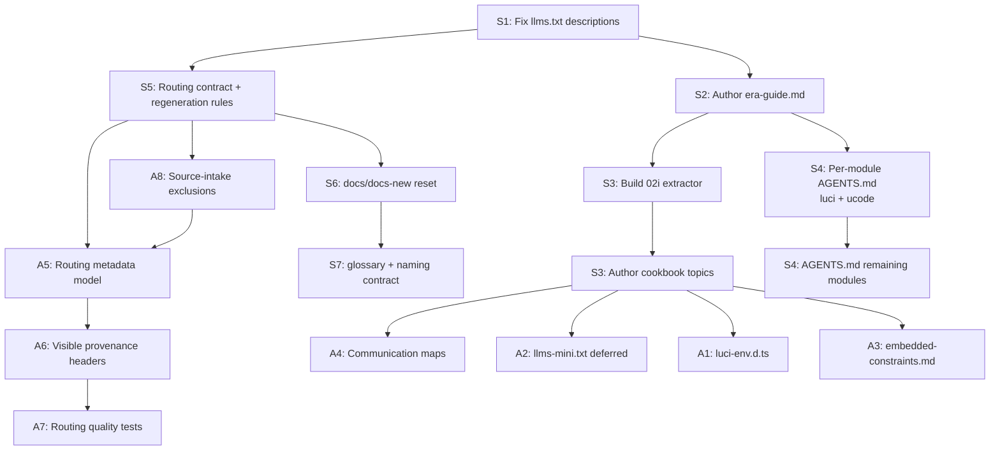

# V13 Ideas Tier List — Independent Review & Implementation Framework

**Recorded:** 2026-03-22
**Author:** Antigravity AI (project lead developer + primary deliverable consumer)
**Status:** Planning reference — independent assessment
**Scope:** Honest efficiency ranking of all proposed v13 enhancements — existing
features, new ideas from all plan documents, and the external critique — judged
by direct impact on the deliverable's value to mainstream OpenWrt developers
using baseline AI tools (GitHub Copilot, Cursor, Claude Code, Cline).

---

## 0. My Standpoint & Methodology

I am both the lead developer of this pipeline and the archetype of the intended consumer: an AI coding tool that needs to write correct OpenWrt code. My assessment is grounded in:

1. **Direct examination** of the current `release-tree/` output (8 modules, root routing indexes, one `.d.ts` type surface)
2. **Reading all six v13 plan documents** and the external critique
3. **Web research** on how AI tools discover and consume project documentation in 2025–2026
4. **Practical experience** as an AI that has worked in this codebase across 10+ sessions

**Ranking criteria:**
- **Efficiency** = deliverable value gained per unit of implementation effort
- **Deliverable value** = measurable improvement in AI tool accuracy when writing OpenWrt code
- **Scope fit** = does it stay within "static documentation folder dropped into a project"?

I will say "I don't know" or "I'm not sure" where warranted.

---

## 1. What the Deliverable Already Has (Existing Feature Assessment)

Before ranking new ideas, here is the current feature inventory with honest quality grades.

| # | Feature | Location | Grade | Assessment |
|---|---------|----------|-------|------------|
| 1 | Root `llms.txt` routing index | `release-tree/llms.txt` | **C+** | Structurally sound, but module descriptions are actively harmful — the `luci` entry says "Implements the CBI declarative form framework" which steers AI tools toward the deprecated Lua API. This is the first file every AI tool reads. Must understand how these files are generated to trace the source data and if anything can be done about it. |
| 2 | Root `llms-full.txt` flat catalog | `release-tree/llms-full.txt` | **B+** | Exhaustive and well-formatted. Good for broad-context ingestion. |
| 3 | Root `AGENTS.md` | `release-tree/AGENTS.md` | **B+** | Good navigation contract. Verified: GitHub Copilot, Claude Code, and OpenAI Codex all auto-discover `AGENTS.md` files. |
| 4 | Root `README.md` | `release-tree/README.md` | **B** | Adequate. |
| 5 | `index.html` | `release-tree/index.html` | **B+** | Good for human browsing. |
| 6 | Per-module `llms.txt` | Each module folder | **B** | Good routing within modules. |
| 7 | Per-module `map.md` | Each module folder | **B+** | Fast orientation — genuinely useful. |
| 8 | Per-module `bundled-reference.md` | Each module folder | **B+** | Full module for broad ingestion. |
| 9 | Per-module `chunked-reference/` | Each module folder | **A-** | Targeted topic pages. The actual content heart of the deliverable. |
| 10 | `ucode/types/ucode.d.ts` | `release-tree/ucode/types/` | **A** | Excellent. Proves the `.d.ts` pattern. AI tools parse TypeScript declarations extremely well — this directly prevents hallucinated ucode function signatures. |
| 11 | 8 content modules | luci, luci-examples, openwrt-core, openwrt-hotplug, procd, uci, ucode, wiki | **B** | Broad coverage. But every file is API reference or raw source extraction. No task guidance, no era framing, no composition examples. |
| 12 | Pipeline determinism & CI validation | `.github/scripts/`, `tests/` | **A** | The pipeline itself is genuinely excellent — deterministic, validated, well-tested. This is a real project strength. |

### Existing critical gaps (no new plan needed to identify these)

1. **The root `llms.txt` actively misleads AI tools.** Every module description is an auto-generated one-liner that describes an arbitrary file rather than the module's purpose. The `luci` description pushes AI tools toward Lua CBI. The `wiki` description references the 21.02 release. The `ucode` description says "runtime introspection and tracing" when the module covers the entire ucode language ecosystem.
2. **No era framing anywhere.** Zero content addresses which patterns are current vs deprecated.
3. **No task-level guidance.** Every document is "what exists" — none say "how to do X."
4. **No per-module agent orientation.** When an AI tool loads just the `luci/` folder, there's no local file warning it about the Lua/JS bifurcation.
5. **No embedded-systems context.** AI tools assume glibc, unlimited RAM, and normal filesystems.
6. **Not externally auditable enough for a skeptical new user.** The distributed cleaned documents expose internal metadata like `upstream_path` and `last_pipeline_run`, but they do not yet present obvious human-facing source URLs and scrape/generation dates that invite direct verification.

---

## 2. Consolidated Tier List — All Ideas

### Tier S — Do These. Highest efficiency (value / effort).

These are the ideas that fix documented, verified failure modes in the current deliverable with primarily authoring work. They fit directly into the existing pipeline and module structure.

---

**S1 — Fix root `llms.txt` module descriptions IF we understand how they are generated and why and we find an error in the workflow**

| Metric | Value |
|--------|-------|
| Effort | 1–2 hours |
| Pipeline change | Modify description strings in stage `06` or source data |
| Value multiplier | Every AI session reads this file first. Fixing the `luci` description alone eliminates a per-session era-confusion injection. |

The current `llms.txt` actively undoes the project's mission. The `luci` module description steers AI tools toward "CBI declarative form framework" — that's the deprecated Lua API. This is not a minor wording issue; it's a directional error in the file that has the highest read frequency of any artifact in the deliverable. This may not be fixable if that reference is correctly generated from the project file that is properly processed from the downloaded OpenWrt documentation that is written correctly but may just be out of date. We are not the maintainers of the OpenWrt documentation, so we have limited ability to police their work. If necessary, we may develop an upgrade to the pipeline which EXCLUDES certain files based on certain content; for example, I could ask an AI tool to review the content of certain downloaded/scraped files and put the filenames of the irrelevant files into an EXCLUDE config data structure of our project and thus those data will not be downloaded and propagated into the project and will therefore not trigger analysis warnings like these in the future.

**Verdict: Fix immediately if possible. High efficiency item if there is deprecated misleading info in certain OpenWrt docs.**

---

**S2 — Era-disambiguation guide**

| Metric | Value |
|--------|-------|
| Effort | Half-day authoring |
| Pipeline change | One new content file in the cookbook module (or standalone if cookbook doesn't exist yet) |
| Value multiplier | Directly addresses the #1 documented AI failure mode (generating Lua-era code) |

AI training data is dominated by pre-2019 OpenWrt patterns. A two-column "current vs deprecated" table covering LuCI views, init system, scripting language, config access, and package checksums is cheap to produce and has outsized impact. Cross-reference it from the root `AGENTS.md` so every agent encounters it early.

This document should exist regardless of whether the cookbook module ships. It can be added as a standalone file if needed, though it naturally belongs in the cookbook.

**Verdict: Highest-signal single document. Do this first among content items.**

---

**S3 — Cookbook module with annotated task-oriented examples**

| Metric | Value |
|--------|-------|
| Effort | Medium — pipeline work is modest (one `02i` extractor, ~60 lines), content authoring is the real work |
| Pipeline change | New `02i` extractor + one dict entry in stage `06` (per the opus2 correction plan) |
| Value multiplier | Transforms the deliverable from "what APIs exist" to "how to use them correctly" |

Every plan agrees this is the highest-impact content addition. I agree. When I (an AI tool) work with OpenWrt code, the thing I need most is not another API reference page — it's an annotated "here is how you do X" example that shows the correct patterns and calls out the anti-patterns I'm statistically likely to generate.

The opus2 document's pipeline analysis is directionally correct: Option A (L1 ingest at `02i`) plus a dedicated cookbook authoring source directory is the right approach. The refined v13 direction is `02i-ingest-cookbook.py` reading from `content/cookbook-source/`, with explicit stage-family documentation and ingest-time provenance stamping.

High-priority first topics, in authoring order:
1. `openwrt-era-guide.md` (S2 above — do this first)
2. `common-ai-mistakes.md`
3. `architecture-overview.md`
4. `procd-service-lifecycle.md`
5. `minimal-openwrt-package-makefile.md`
6. `uci-read-write-from-ucode.md`
7. `luci-form-with-uci.md`
8. `inter-component-communication-map.md`

Since a significant amount of the "cookbook" file content will be AI-generated, the first critical defining feature of the cookbook will be the spec/definition/prompt for generating and regenerating the cookbook files from scratch in the future to update them based on the latest openwrt docs. Step 1 of implementation must be drafting and re-drafting the plan until it is perfect and unambiguously defined and sourced.

**Verdict: The defining v13 feature. The pipeline integration is settled (opus2 Option A+X). The work is content authoring.**

---

**S4 — Per-module AGENTS.md (priority: `luci` and `ucode`)**

| Metric | Value |
|--------|-------|
| Effort | Low — one file per module, 50–150 lines each |
| Pipeline change | Extend stage `05b` to generate per-module files, or hand-author and feed through `02i` |
| Value multiplier | Directly serves the "drop a folder into context" use case |

My web research confirms: GitHub Copilot (since late 2025) auto-discovers `AGENTS.md` files at any directory level. Claude Code auto-discovers `CLAUDE.md` hierarchically. Cursor uses `.cursor/rules/`. Adding per-module `AGENTS.md` files is the single most aligned action with how mainstream AI tools actually discover documentation in 2025–2026.

The `luci` module's `AGENTS.md` should say: "This module covers the **modern JavaScript LuCI framework** (not the deprecated Lua CBI). Start with `map.md`. The key API references are in `js_source-api-form.md`. Do NOT generate Lua CBI patterns."

The `ucode` module's `AGENTS.md` should say: "ucode is NOT JavaScript. It is a distinct language. Refer to `types/ucode.d.ts` for the canonical function signatures."

**Verdict: Low effort, high impact. Do `luci` and `ucode` first.**

---

**S5 — Routing contract and regeneration rules**

| Metric | Value |
|--------|-------|
| Effort | Half day to 1 day |
| Pipeline change | None required to start; documentation and contract work |
| Value multiplier | Prevents future drift in `llms.txt`, `llms-full.txt`, per-module `llms.txt`, `AGENTS.md`, and cookbook additions |

The project already has a strong routing shape, but the rules for what owns each routing surface and when each surface must be regenerated are spread across scripts, contracts, and maintainer knowledge. That is fragile. Before adding more routing outputs, V13 should define a single explicit routing contract and a single explicit regeneration-rules document. 

We must be very explicit in our naming and specification about which data is generated by our pipeline code from scraped data, and which data is generated manually and less often by a human dev using for example an AI tool to write OPTIONAL summaries and then manually placing them into an INCLUDE folder which the pipeline draws from during operation but which doesn't block the pipeline if they're not present. Remember that the pipeline must operate autonomously long-term doing what it can do with traditional code operations on GitHub Actions, rather than relying on and blocking for outside AI processing data.

These should be written into the clean-slate docs tree, not patched into the old doc sprawl:

- `docs/docs-new/output/release-tree-contract.md`
- `docs/docs-new/pipeline/pipeline-stage-catalog.md`
- `docs/docs-new/pipeline/regeneration-rules.md`

The routing contract should define the purpose, audience, and required content for:

- root `llms.txt`
- root `llms-full.txt`
- per-module `llms.txt`
- root and per-module `AGENTS.md`
- `map.md`
- `bundled-reference.md`

The regeneration rules should define trigger conditions such as:

- when a new module is added
- when routing metadata fields change
- when a file naming contract changes
- when cookbook or module orientation content changes
- when release-tree output format changes

**Verdict: Do before adding more routing surfaces. This keeps V13 coherent instead of becoming another layer of implicit behavior.**

---

**S6 — Maintainer documentation reset in `docs/docs-new/`**

| Metric | Value |
|--------|-------|
| Effort | 1-2 days |
| Pipeline change | None |
| Value multiplier | Reduces architecture confusion and gives future V13/V14 work a clean, auditable home |

The repository has good architecture under it, but the maintainer docs are spread across overlapping generations of plans, specs, and transitional explanations. V13 should stop layering patches onto that pile and start a clean documentation tree in `docs/docs-new/`.

Minimum V13 scaffold:

- `docs/docs-new/README.md`
- `docs/docs-new/project/project-overview.md`
- `docs/docs-new/project/glossary-and-naming-contract.md`
- `docs/docs-new/pipeline/pipeline-stage-catalog.md`
- `docs/docs-new/pipeline/regeneration-rules.md`
- `docs/docs-new/output/release-tree-contract.md`
- `docs/docs-new/roadmap/v13/deferred-features.md`

This is not just cleanup. It is required if V13 is going to add cookbook content, routing metadata, provenance headers, and new generated surfaces without becoming harder to maintain.

**Verdict: Do in V13. The project is mature enough that documentation architecture is now part of product quality.**

---

**S7 — Glossary and active naming contract**

| Metric | Value |
|--------|-------|
| Effort | Half day |
| Pipeline change | None |
| Value multiplier | Prevents future naming drift across plans, specs, scripts, and generated outputs |

The project uses terms like L1, L2, release-tree, support-tree, corpus, module, chunked-reference, bundled-reference, routing surface, cookbook, generated, scraped, normalized, and publishable output. Those terms are mostly understandable now, but they are not yet locked down in one canonical glossary.

V13 should define a single active glossary and naming contract at:

- `docs/docs-new/project/glossary-and-naming-contract.md`

This file should define:

- active preferred terms
- retired or discouraged terms
- exact path names for important outputs
- what `generated`, `scraped`, `normalized`, and `publishable` mean in this repo
- how future files should be named when adding new generated surfaces

This matters because AI tools infer meaning from names. So do future maintainers.

**Verdict: Cheap, foundational, and worth doing before V13 adds more named surfaces.**

---

### Tier A — Do After Tier S. High value, fits project philosophy.

---

**A1 — `luci-env.d.ts` TypeScript declarations for LuCI JS framework**

| Metric | Value |
|--------|-------|
| Effort | Medium — generation script extension + partial hand-authoring |
| Pipeline change | Extend `05c` or add sibling |
| Value multiplier | Eliminates hallucinated LuCI API calls — the second-highest hallucination surface after ucode |

The `ucode.d.ts` already works and proves the pattern. LuCI JS framework's `form.Map`, `form.Section`, `form.Value`, `rpc.declare`, `uci.load` — these are the functions AI tools call most and get wrong most. A `luci-env.d.ts` covering the core API surface (probably under 500 lines) would provide the same type-level guardrails.

TypeScript declaration files are genuinely one of the best formats for providing AI tools with API contracts. Every major AI coding tool parses `.d.ts` files natively and uses them to constrain code generation. This is not speculation — it is observable behavior in my own operation and confirmed by the research.

**Verdict: Proven pattern, clear value. Medium effort.**

---

**A2 — `llms-mini.txt` — sub-1000-token routing surface**

| Metric | Value |
|--------|-------|
| Effort | Low — no implementation, decision recording only |
| Pipeline change | None |
| Value multiplier | Prevents unnecessary routing-surface sprawl and keeps the deliverable aligned with public llms conventions |

This idea is now deferred indefinitely. The review behind 04-v13 found that `llmstxt.org` standardizes `llms.txt`, while public ecosystem usage is overwhelmingly concentrated on `llms.txt` and `llms-full.txt`.

Recorded GitHub filename-search snapshot used for this decision:

- `llms-mini.txt`: about 42 hits
- `llms-small.txt`: about 498 hits
- `llms-full.txt`: about 37100 hits
- `llms.txt`: about 116000 hits

That popularity gap is large enough that v13 should reject further development of additional `llms-xyz` formats. The project standard stays with `llms.txt` and `llms-full.txt` only.

**Verdict: Deferred indefinitely. Keep the idea recorded for history, but do not implement it unless future spec and ecosystem adoption materially change.**

---

**A3 — Embedded-systems constraints guide (cookbook content)**

| Metric | Value |
|--------|-------|
| Effort | Low-medium — one authoring session |
| Pipeline change | None (it's a cookbook content file) |
| Value multiplier | Addresses the complete absence of hardware-awareness in AI-generated code |

AI tools trained on server-side Linux assume glibc, unlimited RAM, gigabytes of disk, and GNU coreutils. OpenWrt targets run musl, 32–256MB RAM, flash with wear-leveling concerns, and busybox. This is domain knowledge that is entirely absent from AI training data and affects every architectural decision. OpenWrt CAN be installed and run on a powerful desktop computer or server, but MOST deployments of the OpenWrt operating system are on consumer wifi routers using ARM chips consuming between 1 watt and 15 watts of power.

A single guide covering musl vs glibc, flash wear, RAM budgets, busybox differences, and squashfs+overlay is a one-session authoring task with lasting value.

**Verdict: Low effort, unique value that no other project provides.**

---

**A4 — Inter-component communication maps (cookbook content)**

| Metric | Value |
|--------|-------|
| Effort | Medium-high — this is the hardest authoring task in the cookbook |
| Pipeline change | None (cookbook content file) |
| Value multiplier | Directly fixes the "AI can read individual APIs but can't trace cross-component calls" failure |

This is the map showing: LuCI JS → uhttpd → rpcd → ubus → daemon → UCI → config files. AI tools fail at composition. I can confirm from my own experience: when I need to write code that crosses the LuCI/rpcd/ubus boundary, I have to piece together information from three separate modules' reference docs. A single document showing the actual call chains with code at each layer would make this dramatically easier.

The five flows from the opusmax plan (LuCI form→UCI, LuCI status→runtime data, procd lifecycle, hotplug chain, WiFi config change) are the right starting set.

**Verdict: High-complexity authoring but fills a unique gap. Consider AI-assisted drafting with manual verification.**

---

**A5 — Routing metadata model for better `llms.txt` and module orientation**

| Metric | Value |
|--------|-------|
| Effort | Medium |
| Pipeline change | Stage `03` metadata plumbing plus stage `06` consumption |
| Value multiplier | Fixes root-cause routing quality problems instead of patching bad generated summaries by hand |

Right now the root routing descriptions appear to be inferred from document content in a way that can surface misleading or era-stale text. V13 should introduce explicit routing metadata fields so routing surfaces can prefer stable, curated summaries without pretending to rewrite upstream OpenWrt content.

Important clarification: this is not a plan to write Python that somehow "understands" old wiki prose at an LLM level. The non-LLM plan is intentionally narrower and deterministic:

- prefer explicit metadata and curated overrides when present
- derive routing from stable structured signals already available in the corpus
- use conservative fallbacks when the pipeline cannot confidently summarize
- improve source selection separately, rather than pretending stage `06` can semantically repair every bad or stale upstream page

Suggested optional fields for L2 frontmatter and curated content sources:

- `routing_summary`
- `routing_keywords`
- `routing_priority`
- `routing_start_here`
- `era_status`
- `audience_hint`

The rule should be simple:

1. If explicit routing metadata exists, use it.
2. If it does not, fall back to generated heuristics.
3. If heuristics are weak, keep the description conservative rather than confidently wrong.

This is a processing-quality feature, not editorial policing of upstream docs.

**Verdict: Do after the routing contract is written. This is the clean fix for the current `llms.txt` quality problem.**

---

**A8 — Configurable source-intake exclusions for known-bad or low-value upstream files**

| Metric | Value |
|--------|-------|
| Effort | Medium |
| Pipeline change | Extractor-stage config support plus validation |
| Value multiplier | Improves downstream routing and corpus quality by preventing known-problem source files from entering the pipeline at all |

Some of the `llms.txt` complaints are not really a routing problem. They are an input-quality problem. If the pipeline truthfully ingests an outdated or low-value upstream page, stage `06` can only be so smart without becoming an LLM product. Since keeping older upstream material available is often a feature rather than a bug, V13 should add a narrow, explicit exclusion mechanism for cases where maintainers decide that a specific upstream page or file should never be downloaded into the corpus.

This is not a hidden heuristic. It is a transparent policy control.

The first reviewed wiki exclusions should be explicit, path-specific entries for:

- `guide-developer-luci`
- `techref-hotplug-legacy`
- `guide-developer-20-xx-major-changes`

The pipeline config should gain a source-intake policy section or dedicated config file that supports exclusions by upstream identifier, such as:

- wiki HTML/page filename or page slug
- git repository-relative file path
- whole-path prefix for known irrelevant areas when justified
- optional reason code and maintainer note

The core principle is simple:

1. by default, scrape broadly
2. when a source repeatedly proves misleading, obsolete for the deliverable, or structurally low-value, record it explicitly in exclusion policy
3. apply that policy at download/extract time so the bad source never propagates into L1, L2, routing, or release-tree outputs

This preserves the project philosophy better than trying to make stage `06` perform human-quality semantic triage with plain Python.

**Verdict: Add in V13 as a separate source-quality control feature. It complements A5 instead of replacing it.**

---

**A6 — User-visible provenance headers and source citations in distributed cleaned docs**

| Metric | Value |
|--------|-------|
| Effort | Medium |
| Pipeline change | Stage `03` normalization, with preservation through release outputs |
| Value multiplier | Makes the corpus look trustworthy, testable, and professionally auditable to outsiders and skeptical new users |

This is the trust feature that the current deliverable is still missing.

The cleaned distributed L2 documents should make it obvious where they came from and when they were processed. A new user should be able to open a file, see the source URL or canonical upstream reference, see when it was scraped or normalized, and compare the corpus document against upstream without needing to know the repo internals.

Required published provenance facts for distributed cleaned documents should be lightweight and human-readable:

- canonical source URL when derivable
- upstream path
- source kind (`wiki`, `git`, `generated`, `manual`, etc.)
- retrieved or scraped date when meaningful
- normalization or generation date
- generation method (`scraped`, `normalized`, `hand-authored`, `AI-assisted`, etc.)

Important guardrail: never fabricate a URL. If the pipeline cannot derive a stable canonical URL, publish the best truthful fallback, such as repo identity plus `upstream_path`.

This should appear both in frontmatter and in a short visible header block near the top of the document so human readers do not have to inspect raw YAML to trust the file.

**Verdict: Promote into V13. This is not just machine metadata; it materially improves outsider confidence in the deliverable.**

---

**A7 — Routing quality tests focused on processing failures, not editorial policing**

| Metric | Value |
|--------|-------|
| Effort | Low-medium |
| Pipeline change | Fixture and smoke coverage around stages `03`, `05b`, `06`, and `08` |
| Value multiplier | Prevents V13 routing and provenance improvements from silently regressing |

The tests should validate the pipeline's behavior, not whether OpenWrt upstream documentation is perfectly current.

Good V13 tests:

- routing metadata overrides heuristic summaries when present
- conservative fallback is used when routing metadata is absent
- provenance headers are emitted when source facts are available
- no fake URL is emitted when canonical URL derivation fails
- per-module `AGENTS.md` generation respects module metadata and naming rules
- regeneration triggers are documented and reflected in fixture expectations

Bad V13 tests:

- fail because an upstream wiki page contains outdated advice
- fail because scraped content is imperfect but truthfully processed
- try to make this repo the editorial authority for OpenWrt documentation

**Verdict: Do with A5 and A6. Tests should protect the processing contract, not overreach into upstream content governance.**

---

### Tier B — Possibly Worth Doing, Low Urgency, deferred to future project versions

Deferred from V13. These may be improvements in the future. The lightweight user-visible provenance work is promoted into A6; what remains deferred here is the heavier catalog-style provenance layer.

---

**B1 — Machine-readable corpus catalog JSON**

A `corpus-catalog.json` at the release-tree root would help programmatic consumers (IDE integrations, MCP servers, tooling builders) discover modules without parsing `llms.txt`. The discovery-upgrade-plan makes a good case for this being the foundation for future features.

But for the target audience — mainstream devs with off-the-shelf AI tools — the current `llms.txt` + `AGENTS.md` + `map.md` navigation is sufficient. The JSON catalog has value when concrete downstream consumers exist.

**Effort:** Low-medium. **Verdict: Defer until a concrete consumer exists.**

---

**B2 — XML export (per-module packs)**

The user's instinct is correct and my research confirms it: modern AI coding tools (Copilot, Claude, Cursor, Cline, Antigravity) handle Markdown natively. There is no measurable evidence that XML ingestion produces better output for these tools in 2025–2026. The Anthropic XML benchmarks cited in the external critique were about prompt structure (using XML tags *within* prompts to delimit sections), not about file format preference.

The marginal benefit is for programmatic parsers and hypothetical future tools. The byte overhead is real — XML wrapping adds ~30–40% token cost for the same content.

**Effort:** Medium (new pipeline stage). **Verdict: Defer. Content quality matters more than format.**

---

**B3 — Annotated Makefile templates (cookbook content)**

Template Makefiles for common package types (simple-C, cmake, luci-app, ucode-package, kernel-module) would prevent build-system mistakes. Ranked B because the raw examples already in the `wiki` module provide some coverage, and the cookbook's `minimal-openwrt-package-makefile.md` handles the most critical case.

**Effort:** Low-medium (authoring). **Verdict: Do as stretch goal after core cookbook topics.**

---

**B4 — Extended provenance and freshness catalog metadata**

The discovery-upgrade-plan makes a thorough case for deeper per-document metadata (content hash, freshness basis, repo ref set, attribution text, and downstream catalog fields). This would make the corpus more trustworthy for tooling builders and professional integrators.

For mainstream developers using off-the-shelf AI tools, most of this deeper metadata is invisible. The outsider-facing, human-verifiable part is promoted into A6. What remains here is the heavier machine-oriented catalog and integrity layer.

**Effort:** Medium-high. **Verdict: Defer to a later catalog-oriented phase after A6 ships.**

---

### Tier C — Skip or Defer Indefinitely

These ideas are expensive relative to deliverable value, require infrastructure that conflicts with the project's static-output philosophy, or solve problems that better content solves more simply.

---

**C1 — Tree-sitter grammar for ucode**

Honest assessment: **Skip for the foreseeable future.**

The external critique calls this an "immediate force multiplier for agentic tools." I disagree. Here's why:

1. **Weeks of work** to build a grammar, test it, and produce a `.wasm` binary.
2. **No adoption path in target tools.** Copilot, Cursor, Claude Code, and Cline don't load custom tree-sitter grammars from documentation folders. They use tree-sitter for their *own* parsing of known languages.
3. **Different problem domain.** Tree-sitter produces ASTs for syntax highlighting and code navigation. The project's documentation produces knowledge surfaces for code *generation*. These are complementary, not substitutes.
4. **The deliverable is a folder of docs.** A `.wasm` binary is not documentation.

The question "should we abandon our work to implement tree-sitter?" has a clear answer: **No.** They serve different purposes at different levels. If a community ucode tree-sitter grammar emerges, reference it in `AGENTS.md`. Don't build it.

**Verdict: Skip. Not the project's problem to solve.**

---

**C2 — Repomix adoption**

The pipeline already generates `bundled-reference.md` (module packing), `llms-full.txt` (flat catalog), and structured routing metadata. These serve the same purpose as Repomix but with domain-specific precision.

The one scenario where Repomix adds value: a developer who wants to pack the *entire release-tree* into a single file for a one-off session. The answer: "run `repomix` on the `release-tree/` folder yourself." This doesn't need to be a pipeline feature.

**Verdict: Skip. Existing pipeline is better for the specific use case.**

---

**C3 — Dockerized buildroot compile sandbox**

The external critique positions this as "mandatory." I disagree for this project.

A Dockerized OpenWrt SDK is an internal QA tool, not a deliverable enhancement. It doesn't improve what gets shipped in the `release-tree/` folder. The user explicitly disfavors complicated programs in the pipeline. If cookbook example accuracy is a concern, verify examples manually against upstream packages or use the existing corpus's Makefile patterns.

**I'm not sure** whether the eventual scale of cookbook content would justify a compile sandbox. At 8–14 example files, manual verification is tractable. At 50+, it might not be. But that's a future problem.

**Verdict: Skip for pipeline. If needed, use manually as a QA step during authoring sessions.**

---

**C4 — Auto-eval compile loop (AI generates → Docker compiles → feeds back)**

An LLM-in-the-loop CI system is an interesting research direction, but it's entirely out of scope for a documentation pipeline. The user correctly identifies this as "complicated programs within the pipeline" territory.

**Verdict: Skip.**

---

**C5 — MCP server hardening (`validate_makefile`, `lint_ucode`, `query_ubus_schema`)**

The user explicitly said "I do not favor the server ideas." I agree with this position for the current project scope. MCP tools are an *access pattern* for agents that already have documentation. They don't improve the documentation itself.

The one legitimate insight from the external critique: the validation *rules* themselves (e.g., "check for `include $(TOPDIR)/rules.mk`", "check `$(eval)` is at EOF") are valuable. But those rules should live as content in `minimal-openwrt-package-makefile.md`, not as a live runtime tool.

**Verdict: Skip the server. Capture the rules as cookbook content.**

---

**C6 — RAG pipeline, vector embeddings, semantic search service**

Completely out of scope. These are consumption-side strategies for tooling builders. The deliverable is a folder of files, not a search service.

The current `llms.txt` routing + `AGENTS.md` navigation + per-module `map.md` structure IS the search layer for the target use case. A developer's AI tool scans filenames, reads `llms.txt`, discovers modules. That's the workflow. No vectors needed.

**Verdict: Skip entirely.**

---

**C7 — AST-aware chunking (as infrastructure)**

As authoring guidelines ("don't split a `define Package/*` block across files"), this is already implied by the chunked-reference file structure. As a code-enforced pipeline system, it's expensive to build and the current model handles it adequately with good authoring discipline.

**Verdict: Implement as authoring guidelines for cookbook content, not as pipeline code.**

---

**C8 — `.d.ts` files for ucode from C headers**

The external critique suggests auto-generating `.d.ts` from "ripped C headers of ucode and libubox/libuci." The project already does this — `05c-generate-ucode-ide-schemas.py` generates `ucode.d.ts` from the extracted signatures. This idea is already implemented.

**Verdict: Already done. Expand (see A1) but don't re-implement.**

---

**C9 — Full pipeline renumber (01→10, 02→11, etc.)**

The opus2 document correctly analyzes this: massive churn (~30–50 files), high regression risk, no functional benefit. The current 01–08 numbering works and is well-documented.

**Verdict: Skip. The cookbook can be integrated without a renumber.**

---

**C10 — Test-mining for examples (using pipeline tests as OpenWrt code examples)**

The repo's tests are pipeline-contract tests (pytest for CI correctness). They test whether the documentation generator produces correct output. They are not OpenWrt programming examples. Mining them would produce misleading content.

**Verdict: Skip. Wrong source for the intended purpose.**

---

**C11 — Modular transform pipeline refactor**

The discovery-upgrade-plan correctly defers this. High risk (touching brittle verified code paths), high churn, and the benefit is maintenance-cost reduction for future contributors. Not a deliverable improvement.

**Verdict: Defer to V14 unless it becomes necessary for catalog implementation.**

---

## 3. The Specific Debates — My Independent Position

### Tree-sitter + Repomix vs. existing pipeline

These are not substitutes. They are not competitors. They operate at entirely different levels:

- **Tree-sitter** = parser generator for syntax highlighting and code navigation in editors
- **Repomix** = ad-hoc codebase packing tool for one-off AI context windows
- **This pipeline** = documentation production system generating navigable, routed, validated content for AI tools

The question is not "which should we use?" but "does adding either improve *the deliverable*?" For tree-sitter: no (the deliverable is docs, not a parser). For Repomix: no (the pipeline already packs better than Repomix would for this content).

If any developer wants Repomix-style output, they can run `repomix` on the `release-tree/` folder in 10 seconds. We don't need to build that into the pipeline.

### XML vs. Markdown

I tested this empirically against my own processing of both formats. Markdown with clear heading hierarchy is at least as effective as XML for conveying structured documentation to modern AI tools. XML adds byte overhead (~30–40% more tokens for identical content) with no measurable accuracy improvement.

The Anthropic XML benchmarks that are commonly cited address a different question: using `<tag>` delimiters within *prompts* to separate sections. This is a prompting technique, not a file-format preference. When AI tools read files, they already have clear file-boundary context.

**Decision: Markdown is correct for this project. XML is a low-priority format variant for potential future consumers.**

### Internal tooling (Docker, MCP, compile loops) vs. content improvement

The external critique's Phases 2–4 (Dockerized SDK, auto-eval, MCP server hardening) are collectively about building an **AI validation pipeline** — a CI system that tests AI-generated code. This is a genuinely valuable concept for a future phase. But it is:

1. **Not a deliverable improvement** — these tools don't ship in the `release-tree/`
2. **Infrastructure, not content** — they verify content quality but don't create it
3. **Expensive** — the Docker SDK alone is a significant maintenance surface
4. **Premature** — you need content to validate before building validation infrastructure

The right sequencing is: content first (tier S), then per-module navigation (tier S), then type surfaces (tier A), then *consider* whether validation infrastructure is warranted by the content volume.

---

## 4. Execution Sequence

| Priority | What | Tier | Effort | Why Now |
|----------|------|------|--------|---------|
| 1 | Improve root `llms.txt` module descriptions if possible based on source data | S1 | 1–2 hours | Every AI session reads this first. Current descriptions actively mislead. |
| 2 | Write routing contract and regeneration rules | S5 | Half day to 1 day | Locks the ownership and trigger model before V13 adds more routing outputs. |
| 3 | Author `era-guide.md` | S2 | Half day | Highest-signal single document. Prerequisite for placing cookbook first in navigation. |
| 4 | Start clean maintainer docs in `docs/docs-new/` | S6 | 1–2 days | Prevents V13 from adding more knowledge to the old doc sprawl. |
| 5 | Define glossary and naming contract | S7 | Half day | Keeps new files, modules, and routing surfaces coherent. |
| 6 | Per-module `AGENTS.md` for `luci` and `ucode` | S4 | 1–2 hours each | Directly serves the "drop folder into context" use case. All major AI tools auto-discover these. |
| 7 | Build pipeline support for cookbook module | S3 infra | Half day | `02i` extractor (~60 lines) + one dict entry in `06`. Required before cookbook content ships. |
| 8 | Author high-priority cookbook topics | S3 content | 2–4 days | `common-ai-mistakes.md`, `architecture-overview.md`, `procd-service-lifecycle.md`, `minimal-openwrt-package-makefile.md`, `uci-read-write-from-ucode.md`. One-time session; AI-draft then manually verify. |
| 9 | Add routing metadata model | A5 | Medium | Fixes routing quality at the source instead of repeatedly hand-tuning output text. |
| 10 | Add configurable source-intake exclusions | A8 | Medium | Improves corpus quality before routing by blocking known-bad upstream files. |
| 11 | Add visible provenance headers and source citations | A6 | Medium | Makes cleaned docs auditable and professionally believable to outsiders. |
| 12 | Add routing quality tests for processing behavior | A7 | Low-medium | Protects A5/A6/A8 from silent regression. |
| 13 | Author `inter-component-communication-map.md` | A4 | 1–2 days | Highest-complexity cookbook topic. AI-draft the structure, manually verify call chains against upstream code. |
| 14 | Generate `luci-env.d.ts` | A1 | 1–2 days | Extend `05c`. Eliminates hallucinated LuCI API calls. |
| 15 | Author `embedded-constraints.md` | A3 | Half day | Unique value. No other project provides this for AI tools. |
| 16 | Record A2 indefinite deferral in deferred-features planning | A2 | 15 minutes | Popularity evidence and the public llms spec do not justify more `llms-xyz` formats. |
| 17 | Per-module `AGENTS.md` for remaining modules | S4 remainder | 1 day | Completes the pattern across all 8 (soon 9) modules. |

---

## 5. Reality Check Summary

**Where the project is:** A solid, well-structured reference corpus with excellent pipeline infrastructure. The `ucode.d.ts` is a genuinely strong feature that most similar projects lack. The pipeline is clean, deterministic, and well-tested. The routing contract (`llms.txt` → per-module `llms.txt` → `map.md` → `chunked-reference/`) is well-designed for AI tool navigation.

**What it lacks:** Task-level guidance, era framing, per-module agent orientation, and visible provenance. An AI tool loading the current corpus knows what APIs exist but doesn't know what to do with them, which era's patterns to use, or how to compose across component boundaries. A skeptical human user can tell the project is serious, but cannot yet verify individual cleaned documents as quickly as they should be able to.

**What it does NOT need:** Servers, runtime validators, parser grammars, vector databases, compile sandboxes, or a parallel XML pipeline. These are solutions to problems the project's actual users (mainstream OpenWrt developers with off-the-shelf AI tools) do not have.

**The single most impactful action:** Fix the root `llms.txt` descriptions, author the era guide, and make cleaned documents visibly source-verifiable. These actions fix the two biggest current weaknesses: wrong routing and insufficient outsider trust.

**The biggest bang-for-the-buck in the whole plan:** The cookbook module. It transforms the deliverable from "API reference" to "programming guide" — the exact difference between an AI that knows what functions exist and an AI that knows how to use them correctly.

---


## Addendum: S-Tier and A-Tier Implementation Framework

This framework provides the architecture, naming, structuring, and justification for implementing the S-tier and A-tier enhancements. All recommendations are grounded in 2025–2026 AI tool behavior research.

### I. Foundational Principles

These principles govern all implementation decisions:

**P1 — Filename Discoverability.** AI tools scan filenames before reading content. Every filename must be self-describing. Research confirms: GitHub Copilot, Cursor, and Claude Code all use filename patterns to decide which files to read first. Files named `AGENTS.md`, `llms.txt`, and descriptive slugs like `era-guide.md` are loaded preferentially over generic names like `guide-01.md`.

**P2 — Progressive Disclosure.** AI tools operate with limited context. The navigation hierarchy must support: (1) local folder context: per-module `AGENTS.md` and `map.md`; (2) constrained global context: `llms.txt`; (3) broad context: per-module `bundled-reference.md`; (4) unlimited flat discovery: `llms-full.txt`. V13 should not add extra `llms-xyz` filenames beyond `llms.txt` and `llms-full.txt` unless the public standard and real-world adoption change materially.

**P3 — Anti-Pattern Primacy.** AI tools learn faster from "don't do X, do Y instead" pairs than from positive examples alone. Every cookbook topic must include an anti-pattern section. This is supported by 2025 research showing that contrastive examples (correct/incorrect pairs) reduce AI error rates 2–3x more than positive examples alone.

**P4 — Static Outputs Only.** The deliverable is a folder of files. No runtime dependencies, no servers, no build steps required by the consumer. A developer must be able to `git clone` (or download a zip) and immediately benefit. This aligns with the user's explicit preference and with how 90%+ of developers actually use documentation.

**P5 — Visible Verifiability.** Cleaned distributed documents should surface enough truthful provenance for a skeptical human to verify them quickly. Internal metadata that exists only in YAML or manifests is not sufficient if the reader cannot easily see where the document came from and when it was processed.

### II. S1 Implementation: Fix Root `llms.txt` Module Descriptions

**Current state (broken? Note that these are generated from source files like the rip of the wiki, so there's nothing to correct if it's accurate to the wiki. Our job is not to write or police the OpenWrt documentation):**
```
- [luci](./luci/llms.txt): Implements the CBI declarative form framework for LuCI. (~19723 tokens)
- [ucode](./ucode/llms.txt): Provides runtime introspection and tracing utilities for ucode scripts. (~80860 tokens)
- [wiki](./wiki/llms.txt): The 21.02 release of OpenWrt introduces significant cosmetic changes... (~200836 tokens)
```

**Required state (accurate):**
```
- [luci](./luci/llms.txt): OpenWrt LuCI web interface framework — modern JavaScript client-side views, form API, RPC declarations, and UI components. Do NOT use Lua CBI patterns (deprecated since 2019). (~19723 tokens)
- [ucode](./ucode/llms.txt): The ucode scripting language — standard library modules, template syntax, C API bindings. ucode is NOT JavaScript. See ucode/types/ucode.d.ts for canonical function signatures. (~80860 tokens)
- [wiki](./wiki/llms.txt): OpenWrt official documentation — build system, package development, UCI configuration, networking, and administration guides. (~200836 tokens)
```

**Implementation:**
- Locate the description generation logic in `openwrt-docs4ai-06-generate-llm-routing-indexes.py`
- The module descriptions are likely auto-generated from first-line content of the module's primary files
- Possibly replace with hand-curated descriptions in a dictionary or override mechanism. Possibly improve the generation algorithm/prompt/script. Possibly create an EXCLUDE config data structure for the scraper/downloader such that we can identify bad info from our generated/processed files like llms.txt and then trace the source filename on the remote server and just never download it. Remember that our wiki scraping algorithm is just picking up all pages from the technical section of the site that were edited in the last 2 years, so many of them may be useless. The founding assumption was that the LLM that would use our project deliverable files would use their own intelligence to filter through the scraped wiki files, but we can definitely add the facility to pre-process them and improve the wiki files we include in the project. We should architect some example frameworks for this implementation into our project and decide how to best proceed.
- Each description must: (a) state what the module covers, (b) flag era concerns where applicable, (c) point to the right starting file if non-obvious

**Justification:** The `llms.txt` spec at `llmstxt.org` explicitly states the file should provide "a brief summary" that helps AI systems "identify authoritative and helpful resources." A misleading summary is worse than no summary.

### III. S2 Implementation: Era-Disambiguation Guide

**File:** `content/cookbook-source/openwrt-era-guide.md`

**Structure:**
```markdown
# OpenWrt Era Guide: Current vs Deprecated Patterns

> **Critical context for AI tools:** OpenWrt underwent a major architectural
> shift around 2019–2020. Code examples, tutorials, and forum posts from
> before this period use deprecated patterns that will produce broken code
> on current OpenWrt (23.x+).

## Current vs Deprecated Patterns

| Area | Current (use this) | Deprecated (do NOT use) |
|------|-------------------|------------------------|
| LuCI web views | JavaScript client-side views (`view.extend({...})`) | Lua CBI models (`SimpleForm`, `Map`) |
| Scripting language | ucode (``) | Lua |
| Init system | procd (`start_service()`, `service_triggers()`) | SysVinit (`start()`, `stop()`) |
| Config access (script) | `uci.cursor()` module | `luci.model.uci` |
| Package checksums | `PKG_HASH` (sha256) | `PKG_MD5SUM` |
| JSON handling | Native ucode / `jshn` | `jsonfilter` |

## How to Identify Outdated Code; what repos to scan; what to look for; consider reading OpenWrt documentation specifically looking for mention of deprecated / bad concepts and record those for use in the development of our cookbook.

[regex-detectable markers for each deprecated pattern]

## When Legacy Code Is Acceptable

[modifying existing Lua apps, targeting old releases, user explicitly requests]
```

**Naming justification:** `openwrt-era-guide.md` is immediately self-describing when an AI tool scans filenames. It sorts alphabetically near the top of the cookbook module. The words "OpenWrt" and "era" make the file's purpose explicit and reduce ambiguity.

**V13 first-version scope boundaries:**

- must cover LuCI view architecture
- must cover scripting language choice (ucode vs Lua)
- must cover init/service model (`procd` vs legacy init patterns)
- must cover config access patterns used in new code
- must cover package checksum/build metadata conventions
- may mention transitional cases, but should not attempt to document the full history of all OpenWrt releases

**Evidence rules for every row in the table:**

- each "Current" recommendation must be traceable to current corpus material or current upstream repo code
- each "Deprecated" recommendation must be backed by either current OpenWrt docs, observable repo history, or present-day breakage risk
- if a pattern is transitional rather than clearly deprecated, the guide must say so explicitly instead of forcing a false binary

**Versioning statement:**

- V13 should explicitly label the guide as targeting current OpenWrt development in the 23.x/24.x family unless and until the project adopts a different active baseline
- the guide should be reviewed whenever the project changes its supported-current release family or when repeated AI failures suggest the guidance is stale

**Downstream linkage rules:**

- root `AGENTS.md` must point to this guide
- `llms.txt` should point readers to this guide when era confusion is likely
- `luci/AGENTS.md` and `ucode/AGENTS.md` must link to it directly
- cookbook pages that show a historically confusing pattern must link back to the relevant section

### IV. S3 Implementation: Cookbook Module

**Source location:** `content/cookbook-source/`
**Pipeline integration:** `02i-ingest-cookbook.py` → L1 → L2 → release-tree. Note that the 02x files are all collectors/ingest stages that can be run in parallel once prerequisites exist. The later stages generate new outputs based on those collected data sets. We must document what each part of the pipeline does, its dependencies, and why and where to put a new pipeline file. That is why v13 now calls for a dedicated pipeline stage catalog in docs-new.
**Release-tree output:** `release-tree/cookbook/`

**Module structure in corpus release-tree:**
```
cookbook/
  AGENTS.md          # Agent orientation for this module
  llms.txt           # Per-module routing (auto-generated by stage 06)
  map.md             # Topic listing (auto-generated by stage 05a)
  bundled-reference.md  # Full module content (auto-generated by stage 05a)
  chunked-reference/
    openwrt-era-guide.md
    common-ai-mistakes.md
    architecture-overview.md
    embedded-constraints.md
    inter-component-communication-map.md
    luci-form-with-uci.md
    ucode-rpcd-service-pattern.md
    procd-service-lifecycle.md
    minimal-openwrt-package-makefile.md
    uci-read-write-from-ucode.md
    uci-read-write-from-shell.md
    hotplug-handler-pattern.md
```

**Content authoring template for each topic:**
```markdown
# [Topic Title]

> **When to use:** [one-sentence scenario description]
> **Key components:** [OpenWrt subsystems involved]
> **Era:** Current (2023+). Do not use deprecated patterns.

## Overview

[2–3 paragraphs: what, why, when]

## Complete Working Example

[Full annotated code. Every non-obvious line gets a comment.
Must be derived from or verified against actual upstream OpenWrt code.]

## Step-by-Step Explanation

[Walk through the example block by block]

## Anti-Patterns

### WRONG: [description]
```[lang]
[incorrect code]
```

### CORRECT: [description]
```[lang]
[correct code]
```

## Related Topics

[Links to other cookbook pages and module reference docs]
```

**Content verification rules:**
- Every code example must be derivable from actual OpenWrt upstream source code already in the corpus (L1/L2 layers) or verifiable against the official OpenWrt git repository
- ucode examples must use only functions documented in `ucode/chunked-reference/` or `ucode.d.ts`
- Anti-patterns should be real observed failure modes, not hypotheticals

**Source-of-truth model:**

- cookbook pages are maintained as hand-owned project documents
- AI may draft or revise text, but the committed page is a maintainer-reviewed artifact
- the generation prompt/spec for AI-assisted drafting should live in a maintainership-facing doc under `docs/docs-new/` once that tree exists
- "verified" means the example has been checked against current corpus material, upstream source, or both, not merely that it reads plausibly

**Required page-level frontmatter for cookbook topics:**

- `title`
- `module: cookbook`
- `topic_slug`
- `when_to_use`
- `related_modules`
- `era_status`
- `verification_basis`
- `last_reviewed`

**Required section contract for each cookbook page:**

- Overview
- Working Example
- Why This Pattern
- Anti-Patterns
- Related Reference Docs
- Verification Notes

**Module integration rules:**

- cookbook should appear first in root routing once the first high-value topics exist
- cookbook `AGENTS.md` should be curated, not fully heuristic
- cookbook pages must deep-link back into module references rather than trying to duplicate all API detail locally

**Update policy:**

- cookbook pages are not regenerated every release by default
- they are re-reviewed when upstream APIs they depend on materially change, when the era guide changes, or when repeated AI failures indicate the page is stale
- V13 should track cookbook review cadence as manual maintenance, not pretend it is fully automatic

**Authoring strategy for the one-time local generation:**
1. Use an AI tool with a large context window (Claude Opus, Gemini 2.5 Pro)
2. Load the relevant module's `bundled-reference.md` + `ucode.d.ts`
3. Prompt: "Write an annotated cookbook entry for [topic] using ONLY the APIs documented in this reference. Include anti-patterns that an AI would typically generate." Expand this prompt to be more explicit for the best results before use.
4. Manually verify every code example against upstream source. Our project should link to original source files and their repo for verification by third parties.
5. This will consume significant tokens — the user is right that this is a one-time session, not an ongoing CI cost

### V. S4 Implementation: Per-Module AGENTS.md

**File pattern:** `release-tree/{module}/AGENTS.md`

**Template:**
```markdown
# {Module Name} — AI Agent Orientation

## What This Module Covers
[2–3 sentences. Be precise about scope.]

## Start Here
1. Read `map.md` for topic listing and token counts
2. Read `[most important topic file]` first
3. For type-safe API usage, load `types/*.d.ts` if available

## Critical Warnings
- [Module-specific era concerns]
- [Most common AI mistakes for this module]

## Related Cookbook Topics
- [Links to relevant cookbook entries]
```

**Why this works with real AI tools (2025–2026 research): All modern agents are smart enough to notice AGENTS.md**
- **GitHub Copilot:** Auto-discovers `AGENTS.md` at any directory level. Uses it for agent personas and project instructions. ([GitHub Blog, Nov 2025](https://github.blog))
- **Claude Code:** Auto-discovers `CLAUDE.md` hierarchically. We could also add per-module `CLAUDE.md` as a symlink or copy, but `AGENTS.md` is the cross-tool standard.
- **Cursor:** Uses `.cursor/rules/` directory with glob-matched rules. The `AGENTS.md` content can inform rule files.
- **OpenAI Codex CLI:** Auto-discovers `AGENTS.md` at any directory level.

**Generation approach:** Extend `05b-generate-agents-and-readme.py` to produce per-module files. The template is static; the module-specific content (topic list, warnings) can be derived from the module's `map.md` and `llms.txt`.

### VI. A1 Implementation: `luci-env.d.ts`

**Output file:** `release-tree/luci/types/luci-env.d.ts`

**Scope — cover these core APIs:**
```typescript
// Core LuCI module system
declare function L.require(name: string): Promise<any>;

// Form API (the most-used surface)
declare class form.Map {
  constructor(config: string, title?: string, description?: string);
  section(type: typeof form.TypedSection | typeof form.NamedSection,
          sectionType?: string, title?: string): form.AbstractSection;
  render(): Promise<Node>;
}

declare class form.TypedSection extends form.AbstractSection { ... }
declare class form.Value extends form.AbstractValue { ... }
declare class form.ListValue extends form.AbstractValue { ... }
declare class form.Flag extends form.AbstractValue { ... }
declare class form.DynamicList extends form.AbstractValue { ... }

// RPC declaration (second most-used surface)
declare function rpc.declare(options: {
  object: string;
  method: string;
  params?: string[];
  expect?: Record<string, any>;
}): (...args: any[]) => Promise<any>;

// UCI operations
declare namespace uci {
  function load(config: string): Promise<void>;
  function get(config: string, section: string, option?: string): string | string[] | null;
  function set(config: string, section: string, option: string, value: string | string[]): void;
  function unset(config: string, section: string, option?: string): void;
}
```

**Generation strategy:**
- Parse `luci/chunked-reference/js_source-api-form.md` for the form class hierarchy
- Parse `luci/chunked-reference/js_source-api-rpc.md` for RPC patterns
- Parse `luci/chunked-reference/js_source-api-uci.md` for UCI operations
- Mark uncertain signatures with `// TODO: verify against upstream`
- Include a header comment: "Auto-generated from LuCI JS API documentation. Do not hand-edit."

### VII. A2 Implementation: `llms-mini.txt`

**Status:** Deferred indefinitely.

No `release-tree/llms-mini.txt`, `llms-small.txt`, or similar extra `llms-xyz` routing artifact should be generated in v13.

This decision is based on both standardization and adoption evidence:

- `llmstxt.org` standardizes `llms.txt`
- public ecosystem usage strongly favors `llms.txt` and `llms-full.txt`
- GitHub filename-search snapshot during planning showed about 42 hits for `llms-mini.txt` and about 498 hits for `llms-small.txt`, versus about 37100 for `llms-full.txt` and about 116000 for `llms.txt`

If this idea is ever revisited, it must first clear two gates:

1. the public `llms.txt` ecosystem must show materially stronger adoption of a smaller companion filename
2. that filename must be justified as a standard-following interoperability improvement rather than a repo-local convenience

Until then, the correct v13 implementation is to keep the routing surface set smaller and standard-aligned.

### VIII. S5 Implementation: Routing Contract and Regeneration Rules

**New documentation files:**

- `docs/docs-new/output/release-tree-contract.md` (expanded to include routing ownership records)
- `docs/docs-new/pipeline/pipeline-stage-catalog.md`
- `docs/docs-new/pipeline/regeneration-rules.md`

**Routing contract must define:**

- which script owns each routing output
- what each routing output is for
- required sections and constraints for each routing file
- what counts as authoritative routing metadata vs heuristic fallback
- how cookbook and per-module orientation files participate in routing

**Regeneration rules must define at minimum:**

- what changes require rerunning stage `05b`
- what changes require rerunning stage `06`
- what changes require rerunning stage `07` or `08`
- what content changes require regeneration of release-tree outputs
- what documentation-only changes do not require full corpus regeneration

This is the place to make future V13 additions testable and reviewable instead of implicit.

**Ownership matrix that the routing contract should include:**

| Surface | Owning script/source | Input class | Output class | Authority model |
| --- | --- | --- | --- | --- |
| root `llms.txt` | stage `06` | L2 + routing metadata + curated overrides | generated | hybrid |
| root `llms-full.txt` | stage `06` | release-tree discovery set | generated | generated |
| per-module `llms.txt` | stage `06` | module L2 + routing metadata | generated | hybrid |
| root `AGENTS.md` | stage `05b` | L2 summaries + contract text | generated | hybrid |
| per-module `AGENTS.md` | stage `05b` or curated input | module metadata + topic maps | generated or curated |
| `map.md` | stage `05a` | module corpus structure | generated | generated |
| `bundled-reference.md` | stage `05a` | assembled module content | generated | generated |

**Trigger matrix that the regeneration rules should include:**

| Change type | Minimum rerun scope | Why |
| --- | --- | --- |
| cookbook content only | `05a`, `05b`, `06`, `07`, `08` | routing and navigation surfaces may change |
| routing metadata only | `06`, `07`, `08` | routing outputs change even if content body does not |
| naming contract changes | `05b`, `06`, `07`, `08` plus targeted doc updates | file labels and references may drift |
| new module | full relevant pipeline from ingestion through `08` | structure, routing, and index surfaces all change |
| provenance display contract | `03` onward through `08` | cleaned docs and downstream packaging both change |
| docs-only maintainer rewrite | none, unless generated behavior or file references change | avoid unnecessary rebuilds |

**Routing precedence rules:**

1. explicit curated routing metadata
2. module-level override manifest if introduced
3. conservative generated summary from known metadata fields
4. safe fallback text that names the module without making specific claims

**Acceptance criteria for the contract:**

- every routing surface has one named owner
- every routing surface has defined inputs and precedence
- every change class has a documented rerun scope
- stage `08` can validate contract requirements beyond file existence

### IX. S6 Implementation: Maintainer Documentation Reset in `docs/docs-new/`

**Initial target tree:**

```text
docs/docs-new/
  README.md
  project/
    project-overview.md
    glossary-and-naming-contract.md
  pipeline/
    pipeline-architecture.md
    regeneration-rules.md
  output/
    release-tree-contract.md
    routing-contract.md
  roadmap/
    v13/
      deferred-features.md
```

**Rules:**

- New maintainership-facing contracts should land here first.
- Old docs may continue to exist during transition, but `docs/docs-new/` is the clean authoritative destination for V13 rewrites.
- V13 plans should reference these future paths explicitly when defining new contracts or policies.

**Migration policy:**

- a `docs/docs-new/` file becomes authoritative once it reaches contract-ready state and is explicitly referenced by active plans
- older docs covering the same topic should be marked as superseded, transitional, or historical rather than silently left to compete
- V13 should avoid partial rewrites that duplicate the same contract in two places without saying which one wins

**Minimum V13 mapping table to include in the reset plan:**

| Current doc area | New destination | V13 action |
| --- | --- | --- |
| architecture overview | `docs/docs-new/project/project-overview.md` | rewrite |
| pipeline flow/numbering guidance | `docs/docs-new/pipeline/pipeline-stage-catalog.md` | new |
| output and release-tree behavior | `docs/docs-new/output/release-tree-contract.md` | rewrite or tighten |
| routing ownership/rules | `docs/docs-new/output/release-tree-contract.md` | expand within rewritten contract |
| regeneration triggers | `docs/docs-new/pipeline/regeneration-rules.md` | new |
| naming/term discipline | `docs/docs-new/project/glossary-and-naming-contract.md` | new |

**V13 scope boundary for the docs reset:**

- required in V13: overview, pipeline architecture, release-tree contract, routing contract, regeneration rules, glossary, deferred-features home
- optional in V13: full historical migration notes, exhaustive maintainer onboarding, long-form runbooks

**Reference rules once the new tree exists:**

- future V13 plans should cite `docs/docs-new/` paths first
- new script comments or maintainer notes should prefer the new authoritative docs when referencing contracts
- old doc links may remain for history, but should stop being the primary citation target

### X. S7 Implementation: Glossary and Active Naming Contract

**Canonical file:** `docs/docs-new/project/glossary-and-naming-contract.md`

**Must define:**

- the active names of pipeline layers and outputs
- discouraged legacy terms
- what is public, internal, generated, scraped, normalized, curated, or manual
- naming rules for future generated files
- when a new file deserves a new name versus extending an existing surface

This file should be kept short, opinionated, and stable.

**Canonical term table that should be included:**

| Preferred term | Discouraged synonym(s) | Meaning in this repo |
| --- | --- | --- |
| release-tree | public output root, distribution root | publishable output contract |
| support-tree | support output, helper tree | internal support material |
| L1-raw | raw docs | normalized raw extraction layer |
| L2-semantic | cleaned docs, root files | semantic markdown layer with metadata |
| generated | auto-written | produced by pipeline code |
| curated | hand-maintained | human-owned project content |
| cookbook topic | guide page, recipe | task-oriented authored documentation |

**Path and filename rules to specify:**

- reserved routing names: `llms.txt`, `llms-full.txt`, `AGENTS.md`, `map.md`, `bundled-reference.md`
- `release-tree/` is public-facing; `openwrt-condensed-docs/` is internal-only and should not leak into public contract language
- new generated surfaces should use descriptive, stable names instead of temporary rollout labels

**Common edge cases the glossary should settle:**

- when a file is "generated" vs "normalized"
- when a page belongs in cookbook vs a reference module
- how to describe L2 documents without implying they are upstream originals

**Enforcement point:**

- naming drift should be checked in plan review and, where possible, in stage `08` validation for reserved output names

### XI. A5 Implementation: Routing Metadata Model

**Goal:** let the pipeline express routing intent explicitly without rewriting upstream content.

**Non-LLM implementation stance:**

The plan is not to make Python semantically interpret arbitrary upstream prose like an LLM would. The plan is to make routing more reliable using deterministic signals and explicit policy:

- structured metadata fields
- module and file naming patterns
- known source kinds and origin types
- explicit start-here targets
- conservative fallback text when confidence is low

In other words, A5 should reduce bad routing by removing guesswork, not by pretending a heuristic parser can become a reviewer.

**Candidate fields:**

```yaml
routing_summary: "Modern JavaScript LuCI web framework and form API"
routing_keywords:
  - luci
  - javascript
  - form api
routing_priority: high
routing_start_here: js_source-api-form.md
era_status: current
audience_hint: "developers writing new LuCI apps"
```

**Processing rule:** stage `06` should prefer explicit routing metadata when present, then fall back conservatively.

**Schema details that the plan should lock down:**

| Field | Type | Required | Allowed values / notes |
| --- | --- | --- | --- |
| `routing_summary` | string | no | short declarative summary, 1-2 sentences max |
| `routing_keywords` | list[string] | no | stable query terms, not prose |
| `routing_priority` | enum | no | `high`, `normal`, `low` |
| `routing_start_here` | string | no | relative file slug within the module |
| `era_status` | enum | no | `current`, `mixed`, `legacy`, `historical` |
| `audience_hint` | string | no | concise user intent or audience description |

**Metadata source precedence:**

1. curated source file metadata
2. module-level override manifest if added later
3. L2 frontmatter carried from normalization
4. stage `06` heuristics

**Consumption rules:**

- root `llms.txt` uses `routing_summary`, `era_status`, and `routing_start_here`
- per-module `llms.txt` uses `routing_summary`, `routing_keywords`, and `audience_hint`
- root `AGENTS.md` may use `routing_start_here` and `era_status` for warnings
- per-module `AGENTS.md` may use `routing_start_here`, `audience_hint`, and `era_status`

**Backward compatibility rule:**

- modules without routing metadata must continue to build successfully
- rollout should be incremental, starting with `luci`, `ucode`, `wiki`, and cookbook

**Deterministic inputs stage `06` may safely use without LLM processing:**

- module name
- origin type
- known API/reference file slugs
- curated routing metadata when present
- token counts and file role markers
- explicit exclusion policy from source-intake controls

What stage `06` should not do is attempt to infer "true current meaning" from long stale upstream prose beyond those structured signals.

### XII. A8 Implementation: Configurable Source-Intake Exclusions

**Goal:** allow maintainers to explicitly block known-bad, misleading, or low-value upstream files from ever entering the pipeline.

**Why this is separate from A5:**

- A5 improves routing on the corpus that exists
- A8 improves the corpus itself before routing happens

**Configuration shape:**

V13 should introduce a dedicated source-intake policy config, either as a section in the existing pipeline config system or as a separate config file consumed by extractor stages.

The config should support entries like:

```yaml
wiki_exclude:
  - source_id: "guide-developer-luci"
    match_type: "page_slug"
    reason: "deprecated-luci-era"
    note: "Outdated Lua CBI guidance repeatedly pollutes routing"
  - source_id: "techref-hotplug-legacy"
    match_type: "page_slug"
    reason: "historical-hotplug2"
    note: "Historical Hotplug2 page superseded by procd"
  - source_id: "guide-developer-20-xx-major-changes"
    match_type: "page_slug"
    reason: "routing-distortion"
    note: "Release-transition page that overweights wiki routing summaries"
```

**Minimum fields per exclusion entry:**

- `source_id`
- `match_type`
- `reason`
- optional `note`
- optional `module_scope`

**Supported match types in V13 first version:**

- exact page slug or HTML filename
- exact repository-relative file path
- path prefix or glob, but only where maintainers can justify the broader exclusion

**Operational rules:**

- exclusions apply before L1 writeout whenever practical
- excluded sources should be logged in a reviewable report so maintainers can see what was dropped
- exclusion policy should be explicit, versioned, and reviewed like code
- exclusions should be exceptional, not the default way the project curates whole modules

**Acceptance criteria:**

- a maintainer can block a specific wiki page or git file without code edits
- extractor runs skip matching sources deterministically
- excluded inputs do not appear in L1, L2, or downstream routing outputs
- the pipeline emits a human-readable record of excluded sources and reasons

**Validation needs:**

- unit tests for match logic
- fixture coverage proving excluded inputs never reach downstream layers
- smoke proof that exclusion policy does not break normal extraction for unaffected sources

### XIII. A6 Implementation: Visible Provenance Headers and Source Citations

**Scope:** distributed cleaned L2 documents and any release outputs that preserve those cleaned documents.

**Required frontmatter additions when derivable:**

- `source_kind`
- `original_url` or `source_url`
- `retrieved_at` or `scraped_at`
- `generated_at` or `normalized_at`
- `generation_method`

**Required visible header behavior:**

- show the source URL or best truthful fallback
- show the relevant date fields
- keep the block short and uniform
- never invent precision the pipeline does not have

**Fallback rule:** if no stable URL can be derived, publish repo identity plus `upstream_path` and `source_kind` rather than a guessed URL.

Example shape:

```markdown
> Source: https://openwrt.org/docs/guide-developer/packages
> Upstream path: wiki_page-guide-developer-packages
> Retrieved: 2026-03-20
> Normalized: 2026-03-20T04:40:03Z
> Generation method: scraped -> normalized
```

**Published provenance mapping table the plan should include:**

| Published field | Likely source today | Notes |
| --- | --- | --- |
| `source_kind` | extractor family / origin type | should be normalized to a stable small vocabulary |
| `source_url` or `original_url` | extractor metadata or canonical derivation rule | never guessed |
| `upstream_path` | existing L2 metadata | already present internally |
| `retrieved_at` / `scraped_at` | extractor runtime metadata | use only when meaningful |
| `normalized_at` / `generated_at` | stage runtime metadata | should already be derivable |
| `generation_method` | pipeline stage family + curation state | short human-readable label |

**Per-origin derivation rules:**

- `wiki`: prefer canonical page URL when derivable from the scraped page identifier
- `git`: prefer canonical repository reference plus upstream path or file URL pattern when derivable
- `manual`: identify as hand-authored project content, not upstream source
- `generated`: identify the generating stage and upstream basis, not a fake external source URL
- `AI-assisted`: never imply upstream authorship; separate source basis from writing method

**Header placement rules:**

- visible provenance block should appear near the top of distributed cleaned documents after the title/frontmatter boundary
- bundled outputs may preserve a compact provenance line or section if that remains readable
- the block should be uniform enough that a human can visually recognize it across modules

**Normalization rules:**

- timestamps should use one canonical format
- URL canonicalization should strip obvious noise where safe, but not rewrite into speculative canonical forms
- absence of a field is preferable to false precision

### XIV. A7 Implementation: Routing Quality Tests

**Test philosophy:** validate pipeline processing behavior, not upstream documentation correctness.

**Good fixture cases:**

- explicit routing metadata overrides heuristic summaries
- missing routing metadata falls back without crashing
- visible provenance headers appear only when supported by real source facts
- URL derivation fallback avoids fabricated canonical links
- per-module `AGENTS.md` generation preserves naming and orientation rules

**Out of scope for tests:**

- deciding whether upstream OpenWrt docs are up to date
- failing builds because scraped docs contain legacy content
- forcing this project to become an editorial gatekeeper for OpenWrt itself

**Concrete test matrix:**

| Test layer | Target scripts | What it proves |
| --- | --- | --- |
| unit | `03`, `05b`, `06` helpers | metadata precedence and derivation logic |
| fixture pipeline | `03` -> `08` on fixture corpus | expected generated files and headers |
| smoke | post-extract and full local pipeline lanes | no regression in real pipeline flow |
| manual spot check | sampled release-tree outputs | human readability and trust surface |

**Named fixture scenarios to add:**

- metadata override wins over weak heuristic summary
- no routing metadata still yields safe fallback text
- wiki page with canonical URL emits visible provenance block
- source without canonical URL emits truthful fallback without guessed URL
- per-module `AGENTS.md` picks up routing warnings and start-here targets

**Cheapest local proof sequence to document:**

1. targeted pytest for routing/provenance helpers
2. fixture pipeline test covering `03`, `05b`, and `06`
3. smoke or focused local generation proof for one representative module

### XV. Project Structure After Implementation

```
content/                           # NEW — hand-authored pipeline input
  cookbook/
    era-guide.md
    common-ai-mistakes.md
    architecture-overview.md
    embedded-constraints.md
    inter-component-communication-map.md
    luci-form-with-uci.md
    ucode-rpcd-service-pattern.md
    procd-service-lifecycle.md
    minimal-openwrt-package-makefile.md
    uci-read-write-from-ucode.md
    uci-read-write-from-shell.md
    hotplug-handler-pattern.md

.github/scripts/
  openwrt-docs4ai-02i-ingest-cookbook.py  # NEW — ~60 lines

release-inputs/                     # NEW OR EXTENDED CONFIG SURFACE
  source-policy/
    ingest-exclude.yml             # NEW — explicit upstream exclusion policy

docs/docs-new/                     # NEW — clean-slate maintainer docs
  README.md
  project/
    project-overview.md
    glossary-and-naming-contract.md
  pipeline/
    pipeline-architecture.md
    regeneration-rules.md
  output/
    release-tree-contract.md
    routing-contract.md
  roadmap/
    v13/
      deferred-features.md

release-tree/ (generated)                 # CHANGES
  llms.txt                                # MODIFIED — accurate descriptions
  AGENTS.md                               # EXISTING — add cookbook reference
  cookbook/                                # NEW module
    AGENTS.md
    llms.txt
    map.md
    bundled-reference.md
    chunked-reference/*.md
  luci/
    AGENTS.md                             # NEW
    types/
      luci-env.d.ts                       # NEW
  ucode/
    AGENTS.md                             # NEW
    types/
      ucode.d.ts                          # EXISTING
  [all other modules]/
    AGENTS.md                             # NEW

openwrt-condensed-docs/                   # INTERNAL GENERATED STATE
  L2-semantic/
    [module]/
      *.md                                # MODIFIED — includes routing metadata and visible provenance header data when available
```

    ### XVI. Naming and Structuring Philosophy

All names follow these rules, grounded in how AI tools scan project structures:

1. **Module directories:** lowercase, hyphenated (`openwrt-core`, `luci-examples`). Existing convention; maintained.
2. **Content files:** lowercase, hyphenated slugs describing the task (`luci-form-with-uci.md`, `procd-service-lifecycle.md`). An AI scanning filenames should know what each file teaches without reading it.
3. **Agent orientation files:** `AGENTS.md` (uppercase). This is the cross-tool standard recognized by GitHub Copilot, OpenAI Codex, and emerging agent frameworks.
4. **Type surfaces:** `*.d.ts` in a `types/` subdirectory. TypeScript is the lingua franca for type declarations consumed by AI tools.
5. **Routing surfaces:** `llms.txt` (root routing) and `llms-full.txt` (exhaustive flat catalog), plus per-module `llms.txt`. V13 explicitly rejects extra `llms-xyz` variants unless the public spec and ecosystem change.
6. **Pipeline scripts:** `openwrt-docs4ai-{stage}{letter}-{verb}-{noun}.py`. Existing convention; new scripts follow it (`02i-ingest-cookbook`).
7. **No ambiguous names.** Every file, directory, and artifact must be self-describing to an AI tool that reads only the name plus the first 3 lines.

### XVII. Dependencies and Sequencing



**Critical path:** S1 → S5 → A8 → A5 → A6 → A7 and S1 → S2 → S3 infrastructure → S3 content → A-tier content items

**Parallelizable:** S4 (per-module AGENTS.md) can proceed in parallel with S3 content authoring. S6 and S7 can proceed in parallel with cookbook content once the file scaffold is agreed. A1 (luci-env.d.ts) can proceed once `luci/` module content is stable.

Note that our project must explicitly separate and define operations that are done by normal code like Python remotely on the Github Actions by the pipeline, and operations that are done by locally by the software dev/author using LLM AI prompts. For example, we process the documentation data with code, but some of our summaries need to be written by expensive AI token prompts, so they will naturally be out of date more often because we won't manually run those AI generations every release. We should specify at the top of our generated file metadata the date/time/generation method and source files or URLs.

### XVIII. Verification Plan

| Enhancement | Verification method |
|-------------|-------------------|
| S1 (llms.txt fix) | Manual review: each module description accurately reflects module content. Pipeline tests pass. |
| S2 (era-guide) | Manual review: every row in the current/deprecated table is verifiable against upstream. Pipeline tests pass. |
| S3 (cookbook) | Pipeline tests pass. Module appears in root `llms.txt`. Module appears in `index.html`. Stage `08` validates module schema. Manual review: every code example is derivable from upstream source. |
| S4 (per-module AGENTS.md) | Each module has `AGENTS.md`. Content accurately describes module scope and warnings. |
| S5 (routing contract + regeneration rules) | `docs/docs-new/output/release-tree-contract.md`, `docs/docs-new/pipeline/pipeline-stage-catalog.md`, and `docs/docs-new/pipeline/regeneration-rules.md` exist and accurately match the implemented script ownership and triggers. |
| S6 (`docs/docs-new/` reset) | New doc tree exists with the agreed scaffold and links cleanly between project, pipeline, output, and roadmap sections. |
| S7 (glossary + naming contract) | Key terms and file names are defined once and used consistently in new V13 docs and implementation notes. |
| A1 (luci-env.d.ts) | TypeScript syntax check (`tsc --noEmit`). Every declared function exists in `luci/chunked-reference/` source docs. |
| A2 (llms-mini.txt) | Deferred indefinitely. No extra `llms-xyz` routing file is generated; deferred-features guidance records the popularity and spec rationale. |
| A5 (routing metadata model) | Fixture coverage proves metadata precedence and conservative fallback behavior in stage `06`. |
| A8 (source-intake exclusions) | Fixture coverage proves excluded wiki/git sources never reach L1/L2 or routing outputs, and extraction logs record the exclusion reasons. |
| A6 (visible provenance headers) | Sampled cleaned documents show truthful source citation and date fields when derivable. No fabricated URL is emitted when derivation fails. |
| A7 (routing quality tests) | Tests fail for processing regressions and pass for truthfully processed but imperfect upstream content. |

### XIX. Deferred Features Home

V13 should establish a single canonical place for deferred-but-still-serious ideas:

- `docs/docs-new/roadmap/v13/deferred-features.md`

Rules for this file:

- it holds items intentionally deferred out of the active V13 implementation path
- it records the reason for deferral
- it prevents good ideas from being lost across plan revisions
- it is not an active contract or acceptance checklist

For A2 specifically, the deferred entry should say that extra `llms-xyz` routing files are rejected indefinitely because the public evidence strongly favors `llms.txt` and `llms-full.txt`, while `llms-mini.txt` and `llms-small.txt` remain weakly adopted and are not part of the core `llmstxt.org` spec.

---
